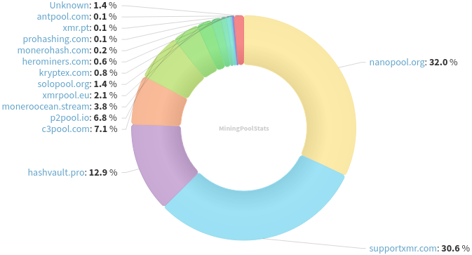
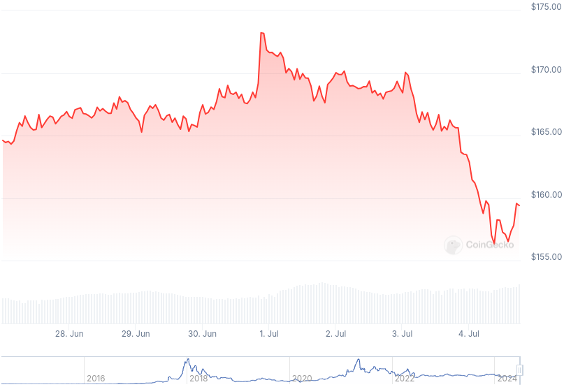

### Table of Contents:

- [Recent News](#news)
- [Upcoming Events](#events)
- [CCS Proposals](#proposals)
- [Price & Blockchain Stats](#stats)
- [Volunteer Opportunities](#volunteer)
- [Donate](#donate)

### Recent News

{}
Stack Wallet [v2.1.1](https://github.com/cypherstack/stack_wallet/releases/tag/build_235) adding Tor support; and other coins' enhancements. Stack Duo [v1.2.0](https://github.com/cypherstack/stack_duo/releases/tag/build_20) with refactored XMR and BTC implementations; merges code with Stack Wallet.
{}

{}
PSA: P2Pool is hard-forking with [v4.0](https://github.com/SChernykh/p2pool/releases/tag/v4.0) on October 12, 2024 at 20:00 UTC to enable merge mining. Note: it is P2Pool that is hard-forking, not Monero. Miners are encouraged to upgrade before then.
{}

{}
Reddit user HardenedSteelX published a GitHub repository, Help4XMR, for people who would like to contribute to the project but don't know how to code and don't know where to start. GitHub [repository](https://github.com/HardenedSteel/Help4XMR); Reddit [thread](https://l.opnxng.com/r/Monero/comments/1dt2di4/would_you_like_to_contribute_and_even_earn_monero/).
{}

{}
[Monero Observer Blitz #31](https://monero.observer/monero-observer-blitz-june-2024/) - June 2024.
{}

{}
Monero Talk had anarchist Sterlin Lujan and XMR legend, Matt Roach, live at Porcfest 2024 discussing the importance of privacy; first-hand experiencies on crypto crackdown; and much more. Peep it: [Video](https://iv.datura.network/watch?v=62SL3nWC5-g); [Audio](https://www.monerotalk.live/monerotalk-316).
{}

### Upcoming Events

{}
Community Workgroup Meeting - [#monero-community](irc://irc.libera.chat/#monero-community) IRC channel; Matrix [room](https://matrix.to/#/#monero-community:monero.social).
{}

{}
Seraphis Wallet Workgroup Meeting - [#no-wallet-left-behind](irc://irc.libera.chat/#no-wallet-left-behind) IRC channel; Matrix [room](https://matrix.to/#/#no-wallet-left-behind:monero.social).
{}

{}
Cuprate Workgroup Meeting - [#cuprate](irc://irc.libera.chat/#cuprate) IRC channel; Matrix [room](https://matrix.to/#/#cuprate:monero.social).
{}

{}
Research Lab Meeting - [#monero-research-lab](irc://irc.libera.chat/#monero-research-lab) IRC channel; Matrix [room](https://matrix.to/#/#monero-research-lab:monero.social).
{}

### CCS Proposal Ideas

Below you can find some CCS proposal ideas open for discussion.

{}
help out the project
{}

{}
Remake Introductory "What Is Monero?" Video
{}

{}
Pago Payment Processor
{}

Find more [here](https://ccs.getmonero.org/ideas/). Posting comments in favor of, or against proposals is encouraged.

### CCS Proposals Need Funding

{}
full time work on Cuprate (3 months)
{}

### Price & Blockchain Stats

###### Blockchain Stats



###### XMR Blocks Distribution in last 1000 blocks

###### Price & Performance



###### XMR Price Graph

Sources: [miningpoolstats.stream](https://miningpoolstats.stream/monero); [bitinfocharts.com](https://bitinfocharts.com/monero/); [coingecko.com](https://www.coingecko.com/en/coins/monero); [localmonero.co blocks](https://localmonero.co/blocks); [monero.boats](https://monero.boats/).


{}
Anyone with moderate technical ability is encouraged to try to build and run Monero nightlies. Do not trust it with your Monero, but feel free to open an Issue on GitHub as problems arise. Instructions to build on your OS of choice can be found here. 
{}



