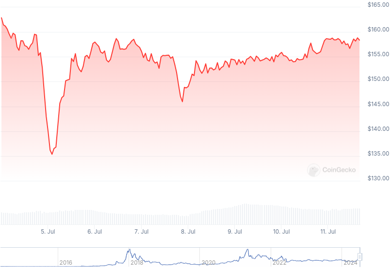

### Table of Contents:

- [Recent News](#news)
- [Upcoming Events](#events)
- [CCS Proposals](#proposals)
- [Price & Blockchain Stats](#stats)
- [Volunteer Opportunities](#volunteer)
- [Donate](#donate)

### Recent News

{}
Cake v4.19.0 and Monero.com v1.16.0 [released](https://github.com/cake-tech/cake_wallet/releases/tag/v4.19.0) with Monero enhancements; bug fixes; and generic improvements for other coins.
{}

{}
Stack Wallet [v2.1.2](https://github.com/cypherstack/stack_wallet/releases/tag/build_237).
{}

{}
Gupax [v1.3.9](https://github.com/hinto-janai/gupax/releases/tag/v1.3.9).
{}

{}
AcceptXMR [v0.14.0](https://github.com/busyboredom/acceptxmr/releases/tag/v0.14.0). AcceptXMR Server [v0.1.0](https://github.com/busyboredom/acceptxmr/releases/tag/acceptxmr-server-v0.1.0); AcceptXMR Server [Docs](https://github.com/busyboredom/acceptxmr/tree/main/server). What is [AcceptXMR](https://busyboredom.com/projects/acceptxmr)?
{}

{}
Gift and prepaid cards merchant, CoinCards, had Monero as their number one *worldwide* payment method used during the month of June for the first time ever, with 34.4% of sales settled in XMR. Twitter [thread](https://nitter.poast.org/CoinCards/status/1809702144288882870).
{}

### Upcoming Events

{}
Seraphis Wallet Workgroup Meeting - [#no-wallet-left-behind](irc://irc.libera.chat/#no-wallet-left-behind) IRC channel; Matrix [room](https://matrix.to/#/#no-wallet-left-behind:monero.social).
{}

{}
Cuprate Workgroup Meeting - [#cuprate](irc://irc.libera.chat/#cuprate) IRC channel; Matrix [room](https://matrix.to/#/#cuprate:monero.social).
{}

{}
Research Lab Meeting - [#monero-research-lab](irc://irc.libera.chat/#monero-research-lab) IRC channel; Matrix [room](https://matrix.to/#/#monero-research-lab:monero.social).
{}

### CCS Proposal Ideas

Below you can find some CCS proposal ideas open for discussion.

{}
help out the project
{}

{}
Remake Introductory "What Is Monero?" Video
{}

{}
Pago Payment Processor
{}

Find more [here](https://ccs.getmonero.org/ideas/). Posting comments in favor of, or against proposals is encouraged.

### CCS Proposals Need Funding

None; all funded for now.

### Price & Blockchain Stats

###### Blockchain Stats



###### XMR Blocks Distribution in last 1000 blocks

###### Price & Performance



###### XMR Price Graph

Sources: [miningpoolstats.stream](https://miningpoolstats.stream/monero); [bitinfocharts.com](https://bitinfocharts.com/monero/); [coingecko.com](https://www.coingecko.com/en/coins/monero); [localmonero.co blocks](https://localmonero.co/blocks); [monero.boats](https://monero.boats/).


{}
Anyone with moderate technical ability is encouraged to try to build and run Monero nightlies. Do not trust it with your Monero, but feel free to open an Issue on GitHub as problems arise. Instructions to build on your OS of choice can be found here. 
{}



