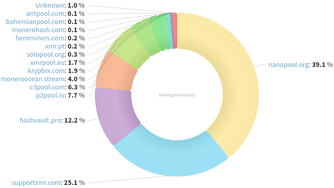
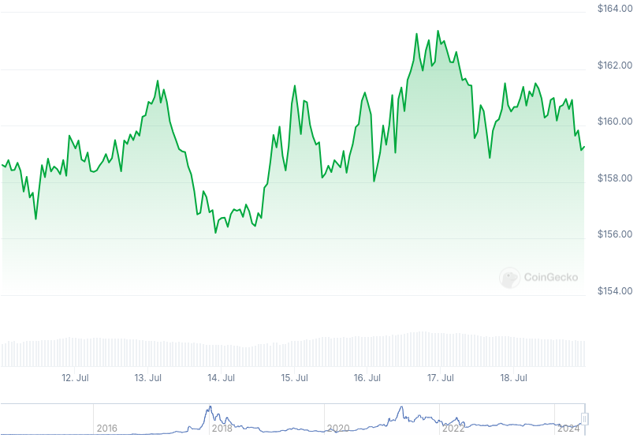

### Table of Contents:

- [Recent News](#news)
- [Upcoming Events](#events)
- [CCS Proposals](#proposals)
- [Price & Blockchain Stats](#stats)
- [Volunteer Opportunities](#volunteer)
- [Donate](#donate)

### Recent News

{}
COMIT XMR<->BTC atomic swap [v0.13.3](https://github.com/comit-network/xmr-btc-swap/releases/tag/0.13.3).
{}

{}
Matrix user starlingfarchecker [launched](https://matrix.to/#/!sNrxfoVvIjswyJhtXE:monero.social/$zpNNGI2_0Je71_PfbjzxBmPqcANcpvCV2WoxfE5FDT8?via=kernal.eu&via=matrix.org&via=monero.social) a site called [AnonHelp](https://anonhelp.pages.dev/), a directory for mental health providers that accept payments in XMR. Mental health providers wanted!
{}

{}
Haveno Reto, the first fully functional Haveno DEX mainnet instance, has launched their [haveno-reto.com](https://haveno-reto.com/) website. While we are at it... Haveno Mobile [soon](https://nitter.poast.org/rottenwheel1/status/1812412616146297197)(tm)^?
{}

{}
Looks like CoinCards won't be the only merchant printing XMR as the #1 payment method these days; [Silent Link](https://nitter.poast.org/silentlink1/status/1811879159938879795) and [ShopinBit](https://nitter.poast.org/shopinbit/status/1811651225005195471) join the party!
{}

{}
Community member k4r4b3y released the complete Turkish translation of [monero.garden](https://monero.garden/). You can find it at [monerobahce.com](https://monerobahce.com/). GitHub [repository](https://github.com/k4r4b3y/monerobahcesi).
{}

{}
Reddit user /u/monerodice_pro announced [monerodice.pro](https://monerodice.pro/), simple XMR dice game. 'Choose your win multiplier, odds, & bet amount, and roll the dice by sending Monero.' Reddit [thread](https://l.opnxng.com/r/Monero/comments/1e3nitz/monerodice_announcement/).
{}

{}
Community member Untraceable published 'Redefining Money for the Digital Age: The New Monetary Properties of Cryptocurrency', a blog [post](https://libereco.xyz/monetary-properties-of-cryptocurrency/) covering money's history; properties; and a comparison of different types of money, including BTC and XMR. X [thread](https://nitter.poast.org/DontTraceMeBruh/status/1813509481525137821).
{}

{}
Monero Talk posted a conversation between Sterlin Lujan, Kenny Palentano and Dan O’Neil on debunking myths about Ross Ulbricht, live at Porcfest 2024. Peep it: [Video](https://iv.datura.network/watch?v=mPhRepnev1k); [Audio](https://www.monerotalk.live/monerotalk-318).
{}

### Upcoming Events

{}
Community Workgroup Meeting - [#monero-community](irc://irc.libera.chat/#monero-community) IRC channel; Matrix [room](https://matrix.to/#/#monero-community:monero.social).
{}

{}
Seraphis Wallet Workgroup Meeting - [#no-wallet-left-behind](irc://irc.libera.chat/#no-wallet-left-behind) IRC channel; Matrix [room](https://matrix.to/#/#no-wallet-left-behind:monero.social).
{}

{}
Cuprate Workgroup Meeting - [#cuprate](irc://irc.libera.chat/#cuprate) IRC channel; Matrix [room](https://matrix.to/#/#cuprate:monero.social).
{}

{}
Research Lab Meeting - [#monero-research-lab](irc://irc.libera.chat/#monero-research-lab) IRC channel; Matrix [room](https://matrix.to/#/#monero-research-lab:monero.social).
{}

### CCS Proposal Ideas

Below you can find some CCS proposal ideas open for discussion.

{}
monerobull for website workgroup
{}

{}
From Prototype to Marketplace: Maturing the XMR-BTC Atomic Swaps Ecosystem
{}

{}
full-time work on Cuprate (3 months)
{}

### CCS Proposals Need Funding

None; all funded for now.

### Price & Blockchain Stats

###### Blockchain Stats



###### XMR Blocks Distribution in last 1000 blocks

###### Price & Performance



###### XMR Price Graph

Sources: [miningpoolstats.stream](https://miningpoolstats.stream/monero); [bitinfocharts.com](https://bitinfocharts.com/monero/); [coingecko.com](https://www.coingecko.com/en/coins/monero); [localmonero.co blocks](https://localmonero.co/blocks); [monero.boats](https://monero.boats/).


{}
Anyone with moderate technical ability is encouraged to try to build and run Monero nightlies. Do not trust it with your Monero, but feel free to open an Issue on GitHub as problems arise. Instructions to build on your OS of choice can be found here. 
{}



