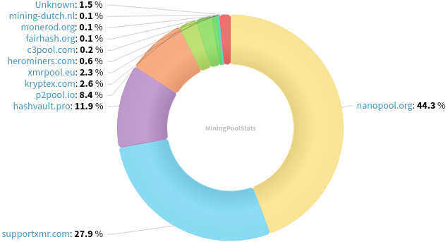
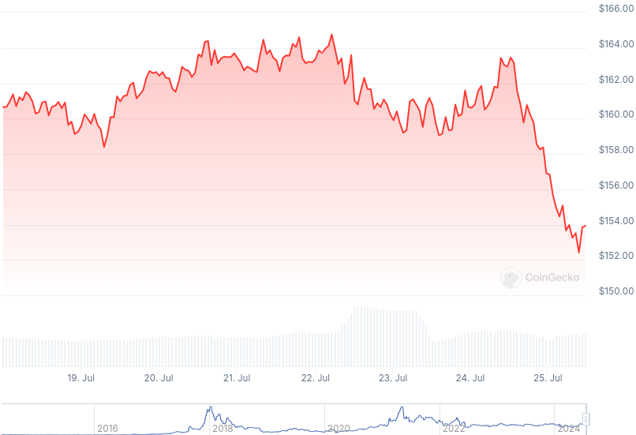

### Table of Contents:

- [Recent News](#news)
- [Upcoming Events](#events)
- [CCS Proposals](#proposals)
- [Price & Blockchain Stats](#stats)
- [Volunteer Opportunities](#volunteer)
- [Donate](#donate)

### Recent News

{}
Stack Wallet [v2.1.3](https://github.com/cypherstack/stack_wallet/releases/tag/build_242) with tx. history screen improvements and miscellaneous enhancements.
{}

{}
Cake v4.19.1 and Monero.com v1.16.1 [released](https://github.com/cake-tech/cake_wallet/releases/tag/v4.19.1) with XMR and ETH enhancements; exchange flow improvements; ledger and general bug fixes.
{}

{}
Haveno DEX [v1.0.9](https://github.com/haveno-dex/haveno/releases/tag/1.0.9) with connectivity improvements; IPv6 support; and bug fixes. Haveno Reto [v1.0.9](https://github.com/retoaccess1/haveno-reto/releases/tag/v1.0.9) now listed in GitHub Releases, you don't need a GitHub account to download binaries any longer. Hey, it's the new Haveno Reto logo, Haveno logo likely getting swapped with this one for v1.0.10 or the next point release. Have a [look](https://github.com/retoaccess1/haveno-reto/pull/14).
{}

{}
**Exclusive**: Haveno DEX Mobile might be around the corner, as teased in this [tweet](https://nitter.poast.org/rottenwheel1/status/1812412616146297197) from last week's issue. The good news is that you may be able to test such stagenet build this weekend! Read more and stay tuned to this GitHub [repository](https://github.com/KewbitXMR/haveno-plus) for future .apk releases; iOS build not planned yet, unfortunately.
{}

{}
AntiDarknet, a collective dedicated to disrupt darknet operators and their websites, has claimed responsibility over the recent spam "Black Marble" attack XMR suffered recently. Reddit [thread](https://redlib.zaggy.nl/r/Monero/comments/1ebshvh/we_now_know_who_was_behind_the_recent_spam_attack/); Blog post in their [forum](https://antidark.net/board/viewtopic.php?t=10).
{}

{}
We are happy to host moner.ooo in our site moving forward. Find a crypto-to-XMR and fiat-to-XMR conversion tool at [calc.revuo-xmr.com](https://calc.revuo-xmr.com/); hidden [service](http://calc.revuo75joezkbeitqmas4ab6spbrkr4vzbhjmeuv75ovrfqfp47mtjid.onion/).
{}

### Upcoming Events

{}
Seraphis Wallet Workgroup Meeting - [#no-wallet-left-behind](irc://irc.libera.chat/#no-wallet-left-behind) IRC channel; Matrix [room](https://matrix.to/#/#no-wallet-left-behind:monero.social).
{}

{}
Cuprate Workgroup Meeting - [#cuprate](irc://irc.libera.chat/#cuprate) IRC channel; Matrix [room](https://matrix.to/#/#cuprate:monero.social).
{}

{}
Research Lab Meeting - [#monero-research-lab](irc://irc.libera.chat/#monero-research-lab) IRC channel; Matrix [room](https://matrix.to/#/#monero-research-lab:monero.social).
{}

### CCS Proposal Ideas

Below you can find some CCS proposal ideas open for discussion.

{}
Remake Introductory "What Is Monero?" Video
{}

{}
FCMP Animated Explainer Video
{}

{}
full-time work on Cuprate (3 months)
{}

### CCS Proposals Need Funding

None; all funded for now.

### Price & Blockchain Stats

###### Blockchain Stats



###### XMR Blocks Distribution in last 1000 blocks

###### Price & Performance



###### XMR Price Graph

Sources: [miningpoolstats.stream](https://miningpoolstats.stream/monero); [bitinfocharts.com](https://bitinfocharts.com/monero/); [coingecko.com](https://www.coingecko.com/en/coins/monero); [localmonero.co blocks](https://localmonero.co/blocks); [monero.boats](https://monero.boats/).


{}
Anyone with moderate technical ability is encouraged to try to build and run Monero nightlies. Do not trust it with your Monero, but feel free to open an Issue on GitHub as problems arise. Instructions to build on your OS of choice can be found here. 
{}



