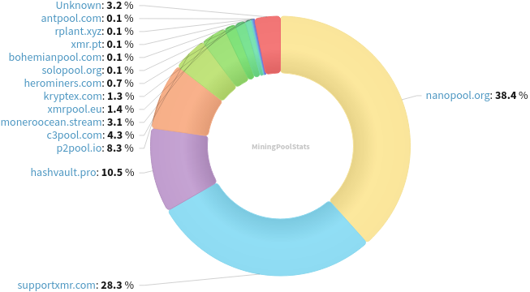
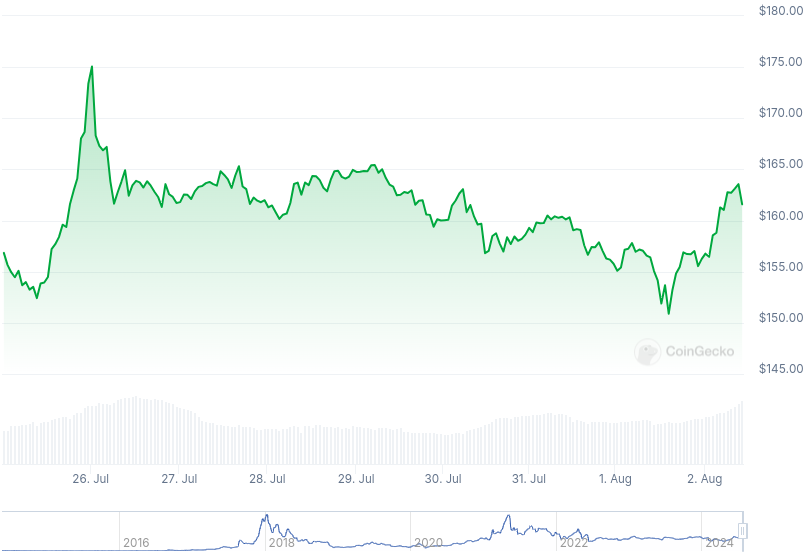

### Table of Contents:

- [Recent News](#news)
- [Upcoming Events](#events)
- [CCS Proposals](#proposals)
- [Price & Blockchain Stats](#stats)
- [Volunteer Opportunities](#volunteer)
- [Support](#support)

### Recent News {#news}

{}
Monero contributor jeffro256 posted the first draft for CARROT (Cryptonote Address on Rerandomizable-RingCT-Output Transactions) addressing protocol. Offering backwards compatibility and outgoing view keys. Find it on [GitHub](https://github.com/jeffro256/carrot/blob/master/release/carrot_0.1.md).
{}

{}
COMIT XMR<->BTC atomic swap ASB [v0.13.4](https://github.com/UnstoppableSwap/xmr-btc-swap/releases/tag/0.13.4) with an important fix where the ASB would fail to lock the XMR, which would force the user (CLI) to refund. Please upgrade as soon as possible. As well, Unstoppable Swap GUI [v0.6.3](https://github.com/UnstoppableSwap/unstoppableswap-gui/releases/tag/v0.6.3) is out; it will show a message if there's a newer version available moving forward.
{}

{}
Monerica's storm has passed and the project's newfound stability is thanks to GitHub Pages. You can submit new entries too. [monerica.com](https://monerica.com/); Unofficial mirror: [monerica.net](https://monerica.net/)
{}

{}
[Monero Observer Blitz #32](https://monero.observer/monero-observer-blitz-july-2024/) - July 2024.
{}

{}
There is a grocery store in Long Island, New York that accepts Monero directly. Douglas and Sunita from Monero Talk swung by and scooped some goodies. X [thread](https://xcancel.com/DontTraceMeBruh/status/1817469115990159448).
{}

{}
Community member foojay published a blog post on fungibility. Have a read at 'What is fungibility?' [here](https://cryptogrinders.us/?p=248).
{}

{}
Monero Talk chatted with investigative journalist, Derrick Broze. Is bitcoin the new petrodollar? Parallel economies, the power of big tech, importance of opting out from centralized hierarchies and more. Peep it: [Video](https://iv.datura.network/watch?v=LfLibFaXldQ); [Audio](https://www.monerotalk.live/monerotalk-320).
{}

### Upcoming Events {#events}

{}
Community Workgroup Meeting - [#monero-community](irc://irc.libera.chat/#monero-community) IRC channel; Matrix [room](https://matrix.to/#/#monero-community:monero.social).
{}

{}
Seraphis Wallet Workgroup Meeting - [#no-wallet-left-behind](irc://irc.libera.chat/#no-wallet-left-behind) IRC channel; Matrix [room](https://matrix.to/#/#no-wallet-left-behind:monero.social).
{}

{}
Cuprate Workgroup Meeting - [#cuprate](irc://irc.libera.chat/#cuprate) IRC channel; Matrix [room](https://matrix.to/#/#cuprate:monero.social).
{}

{}
Research Lab Meeting - [#monero-research-lab](irc://irc.libera.chat/#monero-research-lab) IRC channel; Matrix [room](https://matrix.to/#/#monero-research-lab:monero.social).
{}

### CCS Proposal Ideas {#proposals}

Below you can find some CCS proposal ideas open for discussion.

{}
New Monero Website
{}

{}
Part-time + Flexible Work on getmonero.org (1 Month) 
{}

{}
support, docs, site, meta++ (totw pt3)
{}

Find more [here](https://ccs.getmonero.org/ideas/). Posting comments in favor of, or against proposals is encouraged.

### CCS Proposals Need Funding

None; all funded for now. [Support](https://www.revuo-xmr.com/support/) Revuo.

### Price & Blockchain Stats {#stats}

###### Blockchain Stats



###### XMR Blocks Distribution in last 1000 blocks

###### Price & Performance



###### XMR Price Graph

Sources: [miningpoolstats.stream](https://miningpoolstats.stream/monero); [bitinfocharts.com](https://bitinfocharts.com/monero/); [coingecko.com](https://www.coingecko.com/en/coins/monero); [localmonero.co blocks](https://localmonero.co/blocks); [monero.boats](https://monero.boats/).


{}
Anyone with moderate technical ability is encouraged to try to build and run Monero nightlies. Do not trust it with your Monero, but feel free to open an Issue on GitHub as problems arise. Instructions to build on your OS of choice can be found [here](https://github.com/monero-project/monero#compiling-monero-from-source). 
{}



