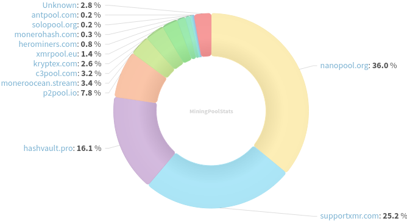
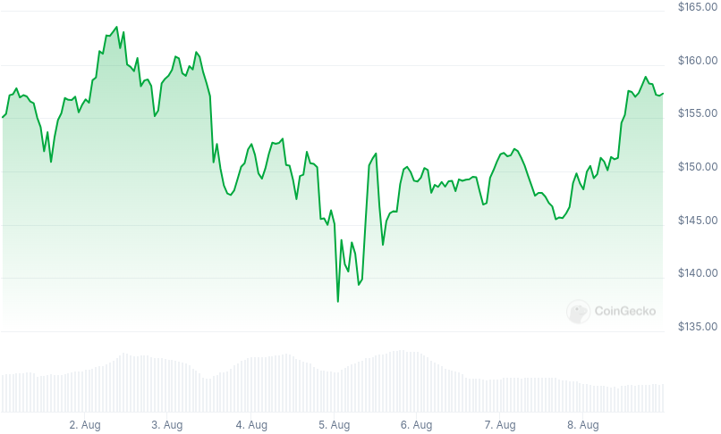

### Table of Contents:

- [Recent News](#news)
- [Upcoming Events](#events)
- [CCS Proposals](#proposals)
- [Price & Blockchain Stats](#stats)
- [Volunteer Opportunities](#volunteer)
- [Support](#support)

### Recent News {#news}

{}
Haveno DEX [v1.0.10](https://github.com/haveno-dex/haveno/releases/tag/1.0.10) with Tor's Proof-of-Work DDoS defensive implementation (RandomX, is that you?). *Note*: To mitigate the ongoing denial of service attack, please apply proof of work defense to your seed nodes if you run any: [Seed nodes with Proof of Work (PoW)](https://github.com/haveno-dex/haveno/blob/master/docs/deployment-guide.md#seed-nodes-with-proof-of-work-pow); a slew of other bug fixes and stability improvements, check release notes for further information. Haveno Reto will release v1.0.10 binaries on Sunday or early next week as one administrator is currently on vacation.
{}

{}
Stack Wallet [v2.1.4](https://github.com/cypherstack/stack_wallet/releases/tag/build_243) adding support for scanning QR codes using webcams when using Stack Wallet Desktop builds. As usual, a few bug fixes and enhancements came with this release, check GitHub's release notes to learn more.
{}

{}
*Tread with caution*: An unknown entity has launched a LocalMonero's clone under the [localmonero.me](https://localmonero.me/) domain. When we reached out to Alex from original LocalMonero's website, he said: "Trademark infringement. Fake. Probably a scam. Nothing to do with us."
{}

{}
Big shout out to all readers and generous supporters, last Kuno's [fundraiser](https://kuno.anne.media/fundraiser/kaib/) has met its goal. We've been just fixing some last quirks with the Jekyll/raw HTML-to-Hugo/Markdown/HTML migration for Revuo; as usual, you can check for yourself by going through the commit history in any of our git repositories listed at [source](https://www.revuo-xmr.com/source/) It was possible to start hosting [calc.revuo-xmr.com](https://calc.revuo-xmr.com/) and improve upon upstream code considerably. We are pretty content with the rebranding, backend code enhancements and the new tool, are you? Let us know!
{}

### Upcoming Events {#events}

{}
Community Workgroup Meeting - [#monero-community](irc://irc.libera.chat/#monero-community) IRC channel; Matrix [room](https://matrix.to/#/#monero-community:monero.social).
{}

{}
Monero Website Workgroup Meeting - [#monero-community](irc://irc.libera.chat/#monero-community) IRC channel; Matrix [room](https://matrix.to/#/#monero-community:monero.social).
{}

{}
Dev Meeting - [#no-wallet-left-behind](irc://irc.libera.chat/#no-wallet-left-behind) IRC channel; Matrix [room](https://matrix.to/#/#no-wallet-left-behind:monero.social).
{}

{}
Cuprate Workgroup Meeting - [#cuprate](irc://irc.libera.chat/#cuprate) IRC channel; Matrix [room](https://matrix.to/#/#cuprate:monero.social).
{}

{}
Research Lab Meeting - [#monero-research-lab](irc://irc.libera.chat/#monero-research-lab) IRC channel; Matrix [room](https://matrix.to/#/#monero-research-lab:monero.social).
{}

### CCS Proposal Ideas {#proposals}

Below you can find some CCS proposal ideas open for discussion.

{}
selsta part-time monero development (3 months) 
{}

{}
From Prototype to Marketplace: Maturing the XMR-BTC Atomic Swaps Ecosystem
{}

{}
FCMP Animated Explainer Video & Remake Introductory Video
{}

Find more [here](https://ccs.getmonero.org/ideas/). Posting comments in favor of, or against proposals is encouraged.

### CCS Proposals Need Funding

None; all funded for now. Consider [supporting](https://www.revuo-xmr.com/support/) Revuo Monero!

### Price & Blockchain Stats {#stats}

###### Blockchain Stats



###### XMR Blocks Distribution in last 1000 blocks

###### Price & Performance



###### XMR Price Graph

Sources: [miningpoolstats.stream](https://miningpoolstats.stream/monero); [bitinfocharts.com](https://bitinfocharts.com/monero/); [coingecko.com](https://www.coingecko.com/en/coins/monero); [localmonero.co blocks](https://localmonero.co/blocks); [monero.boats](https://monero.boats/).


{}
Anyone with moderate technical ability is encouraged to try to build and run Monero nightlies. Do not trust it with your Monero, but feel free to open an Issue on GitHub as problems arise. Instructions to build on your OS of choice can be found [here](https://github.com/monero-project/monero#compiling-monero-from-source). 
{}



