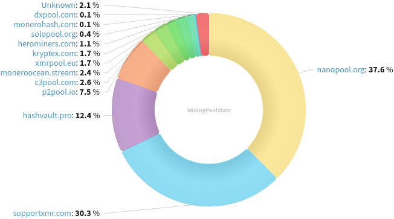

### Table of Contents:

- [Recent News](#news)
- [Upcoming Events](#events)
- [CCS Proposals](#proposals)
- [Price & Blockchain Stats](#stats)
- [Volunteer Opportunities](#volunteer)
- [Support](#support)

### Recent News {#news}

{}
Monero contributor spackleXMR posted a Reddit thread [The Stressnet So Far](https://l.opnxng.com/r/Monero/comments/1eoana8/the_stressnet_so_far/) where they share updates on ongoing efforts running a separate Monero network to run stress tests, resulting in great improvements for Monero Core's code for the past couple months. Monero Stressnet Node, Release [v251.18.3.3.0](https://github.com/spackle-xmr/monero/releases/tag/v251.18.3.3.0). Visit [monitor.stressnet.net](https://monitor.stressnet.net/) to see the number of incoming node connections.
{}

{}
As predicted in issue 206, Haveno Reto [v1.0.10](https://github.com/retoaccess1/haveno-reto/releases/tag/v1.0.10) was released, merging upstream recent release's changes. Github user boldsuck added a couple more seed nodes, specifically *anon3* and *anon6* from this [list](https://github.com/boldsuck/haveno-retodev/blob/master/core/src/main/resources/xmr_mainnet.seednodes), find their addresses there. Haveno Reto has now a new X profile from which they plan on posting updates and giving tips to onboard new users. Give them a follow at [@RetoChan__](https://xcancel.com/RetoChan__).
{}

{}
XMRig [v6.22.0](https://github.com/xmrig/xmrig/releases/tag/v6.22.0). Check release notes for changes.
{}

{}
Feather Wallet [v2.6.8](https://featherwallet.org/download/), upgrading to Monero v0.18.3.4 point release; upgrading dependencies; removing deprecated plugins; and miscellaneous enhancements.
{}

{}
XMRSigner [v0.9](https://github.com/DiosDelRayo/MoneroSigner/releases/tag/v0.9). XMRSigner milestone 3 update posted on GitLab. Have a [read](https://repo.getmonero.org/monero-project/ccs-proposals/-/merge_requests/465#note_25707).
{}

{}
Woodser, Haveno DEX lead developer has put up a call for help with Haveno's wiki (docs). Pull requests welcome in *haveno-docs* [repository](https://github.com/haveno-dex/haveno-docs). Open issues to work [on](https://github.com/haveno-dex/haveno/issues?q=is%3Aopen+is%3Aissue+label%3Awiki).
{}

{}
[!!] We interrupt our regularly scheduled news reporting to bring you this *important* [message](https://xcancel.com/monerotopia/status/1823334204895039515): come join us for MoneroTopia 2024 down in Roma, Mexico City, November 14-17, 2024. Get your tickets now at [monerotopia.com](https://monerotopia.com/) and use discount code: "Revuo24" to get 10% off!
{}

### Upcoming Events {#events}

{}
Monero Website Workgroup Meeting - [#monero-site](irc://irc.libera.chat/#monero-site) IRC channel; Matrix [room](https://matrix.to/#/#monero-site:monero.social).
{}

{}
Monero Tech Meeting - [#no-wallet-left-behind](irc://irc.libera.chat/#no-wallet-left-behind) IRC channel; Matrix [room](https://matrix.to/#/#no-wallet-left-behind:monero.social).
{}

{}
Cuprate Workgroup Meeting - [#cuprate](irc://irc.libera.chat/#cuprate) IRC channel; Matrix [room](https://matrix.to/#/#cuprate:monero.social).
{}

{}
Research Lab Meeting - [#monero-research-lab](irc://irc.libera.chat/#monero-research-lab) IRC channel; Matrix [room](https://matrix.to/#/#monero-research-lab:monero.social).
{}

### CCS Proposal Ideas {#proposals}

Below you can find some CCS proposal ideas open for discussion.

{}
full-time work on Cuprate (3 months)
{}

{}
support, docs, site, meta++ (totw pt3) 
{}

{}
3 months full-time dev
{}

Find more [here](https://ccs.getmonero.org/ideas/). Posting comments in favor of, or against proposals is encouraged.

### CCS Proposals Need Funding

{}
FCMP Animated Explainer Video and Remake Introductory Video
{}

### Price & Blockchain Stats {#stats}

###### Blockchain Stats



###### XMR Blocks Distribution in last 1000 blocks

###### Price & Performance



###### XMR Price Graph

Sources: [miningpoolstats.stream](https://miningpoolstats.stream/monero); [bitinfocharts.com](https://bitinfocharts.com/monero/); [coingecko.com](https://www.coingecko.com/en/coins/monero); [localmonero.co blocks](https://localmonero.co/blocks); [monero.boats](https://monero.boats/).


{}
Anyone with moderate technical ability is encouraged to try to build and run Monero nightlies. Do not trust it with your Monero, but feel free to open an Issue on GitHub as problems arise. Instructions to build on your OS of choice can be found [here](https://github.com/monero-project/monero#compiling-monero-from-source). 
{}



