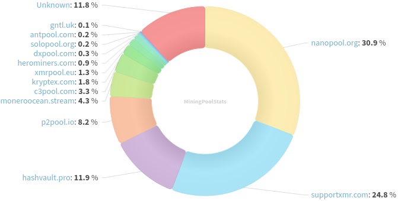
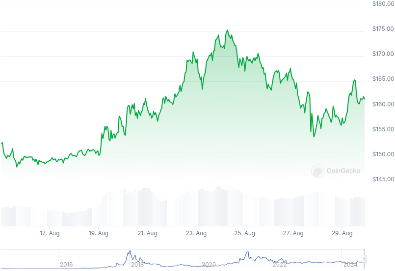

### Table of Contents:

- [Recent News](#news)
- [Upcoming Events](#events)
- [CCS Proposals](#proposals)
- [Price & Blockchain Stats](#stats)
- [Volunteer Opportunities](#volunteer)
- [Support](#support)

### Recent News {#news}

{}
ICYMI, Monero v0.18.3.4 point release binaries for [CLI](https://web.getmonero.org/2024/08/20/monero-0.18.3.4-released.html) and [GUI](https://web.getmonero.org/2024/08/20/monero-GUI-0.18.3.4-released.html) are available. Wallet developers, node operators and miners are encouraged to upgrade.
{}

{}
Cake v4.19.5 and Monero.com v1.16.5 [released](https://github.com/cake-tech/cake_wallet/releases/tag/v4.19.5) with bug fixes and improvements; Bitcoin BIP39 support.
{}

{}
Gupaxx [v1.4.0](https://github.com/Cyrix126/gupaxx/releases/tag/v1.4.0).
{}

### Upcoming Events {#events}

{}
Community Workgroup Meeting - [#monero-community](irc://irc.libera.chat/#monero-community) IRC channel; Matrix [room](https://matrix.to/#/#monero-community:monero.social).
{}

{}
Monero Website Workgroup Meeting - [#monero-site](irc://irc.libera.chat/#monero-site) IRC channel; Matrix [room](https://matrix.to/#/#monero-site:monero.social).
{}

{}
Monero Tech Meeting - [#no-wallet-left-behind](irc://irc.libera.chat/#no-wallet-left-behind) IRC channel; Matrix [room](https://matrix.to/#/#no-wallet-left-behind:monero.social).
{}

{}
Cuprate Workgroup Meeting - [#cuprate](irc://irc.libera.chat/#cuprate) IRC channel; Matrix [room](https://matrix.to/#/#cuprate:monero.social).
{}

{}
Research Lab Meeting - [#monero-research-lab](irc://irc.libera.chat/#monero-research-lab) IRC channel; Matrix [room](https://matrix.to/#/#monero-research-lab:monero.social).
{}

### CCS Proposal Ideas {#proposals}

Below you can find some CCS proposal ideas open for discussion.

{}
Modularize Monero
{}

{}
Haveno Multi-Platform Native App For Every OS
{}

### CCS Proposals Need Funding

{}
From Prototype to Marketplace: Maturing the XMR-BTC Atomic Swaps Ecosystem
{}

{}
FCMP Animated Explainer Video and Remake Introductory Video
{}

{}
Support, docs, site, meta++ (totw pt3)
{}

{}
Full-time work on Cuprate (3 months)
{}

{}
From Prototype to Marketplace: Maturing the XMR-BTC Atomic Swaps Ecosystem
{}

{}
Full-time feather + core development (3 months)
{}

{}
Full-time development (3 months)
{}

### Price & Blockchain Stats {#stats}

###### Blockchain Stats



###### XMR Blocks Distribution in last 1000 blocks

###### Price & Performance



###### XMR Price Graph

Sources: [miningpoolstats.stream](https://miningpoolstats.stream/monero); [bitinfocharts.com](https://bitinfocharts.com/monero/); [coingecko.com](https://www.coingecko.com/en/coins/monero); [localmonero.co blocks](https://localmonero.co/blocks); [monero.boats](https://monero.boats/).


{}
Anyone with moderate technical ability is encouraged to try to build and run Monero nightlies. Do not trust it with your Monero, but feel free to open an Issue on GitHub as problems arise. Instructions to build on your OS of choice can be found [here](https://github.com/monero-project/monero#compiling-monero-from-source). 
{}



