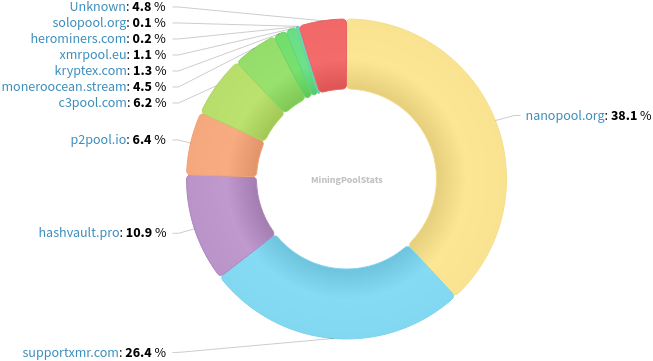
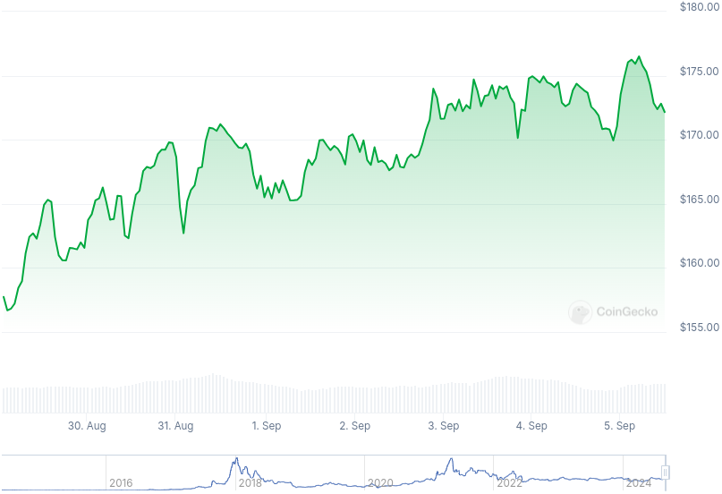

### Table of Contents:

- [Recent News](#news)
- [Upcoming Events](#events)
- [CCS Proposals](#proposals)
- [Price & Blockchain Stats](#stats)
- [Volunteer Opportunities](#volunteer)
- [Support](#support)

### Recent News {#news}

{}
Monero contributor xmrack posted a Chainalysis video in the Monero Research Lounge Matrix [room](https://matrix.to/#/!zxoYuvZdPYtIuWSQnn:monero.social/$wY1X8eEilFIZ-xJCC2IQsvlh7hKyZ_7t0eec_o3A18s?via=matrix.org&via=monero.social&via=xmr.mx). X [thread](https://xcancel.com/Thankful_fr_tdy/status/1830706777140117790#m). Direct link to video on Chainalysis website has been taken down. Watch and download link thanks to archive.org [here](https://archive.org/details/chainalysis_XMR). Couple quotes from the presentation shared in the Matrix room: “A lot of how we do our monero tracing is IP observation” - Chainalysis. "Fingerprinting wallet software seems to be one of their important heuristics besides RPC IP addresses." Discussion ongoing.
{}

{}
Diego "rehrar" Salazar shared a sneak peek of his forthcoming [getmonero.org](https://www.getmonero.org/) design proposal in the Monero Website Workgroup Matrix [room](https://matrix.to/#/!pBnQQFvuFhLffbKZpY:haveno.network/$bQBRLS8yEEJY4g0VQ-J_tzCEVeRkpITjT01FUp0fx3k?via=cypherstack.com&via=matrix.org&via=monero.social). Direct [link](https://rimgo.hostux.net/K7Cb9cD.png) (Rimgo, Imgur privacy-frontend.) Revuo [mirror](https://qu.ax/qBut.png). Feedback welcome on Matrix/IRC/Reddit/Lemmy.
{}

{}
Haveno DEX [v1.0.11](https://github.com/haveno-dex/haveno/releases/tag/1.0.11), small release with minor bug fixes. Haveno Reto [v1.0.11](https://github.com/retoaccess1/haveno-reto/releases/tag/v1.0.11).
{}

{}
Unfortunately, our source for XMR street price is down this week, so skipping that metric for this issue until there's clarification with what happened to the VPS that [monero.boats](https://monero.boats/) runs on. X [thread](https://xcancel.com/kawaiicrypto/status/1831035047262179749#m).
{}

### Upcoming Events {#events}

{}
Monero Website Workgroup Meeting - [#monero-site](irc://irc.libera.chat/#monero-site) IRC channel; Matrix [room](https://matrix.to/#/#monero-site:monero.social).
{}

{}
Monero Tech Meeting - [#no-wallet-left-behind](irc://irc.libera.chat/#no-wallet-left-behind) IRC channel; Matrix [room](https://matrix.to/#/#no-wallet-left-behind:monero.social).
{}

{}
Cuprate Workgroup Meeting - [#cuprate](irc://irc.libera.chat/#cuprate) IRC channel; Matrix [room](https://matrix.to/#/#cuprate:monero.social).
{}

{}
Research Lab Meeting - [#monero-research-lab](irc://irc.libera.chat/#monero-research-lab) IRC channel; Matrix [room](https://matrix.to/#/#monero-research-lab:monero.social).
{}

### CCS Proposal Ideas {#proposals}

Below you can find some CCS proposal ideas open for discussion.

{}
Haveno Multi-Platform Native App For Every OS
{}

{}
Offline Signing Library for XmrSigner Production
{}

{}
Revuo Monero Maintenance (2024 Q4)
{}

Find more [here](https://ccs.getmonero.org/ideas/). Posting comments in favor of, or against proposals is encouraged.

### CCS Proposals Need Funding

{}
From Prototype to Marketplace: Maturing the XMR-BTC Atomic Swaps Ecosystem
{}

{}
FCMP Animated Explainer Video and Remake Introductory Video
{}

{}
Full-time work on Cuprate (3 months)
{}

### Price & Blockchain Stats {#stats}

###### Blockchain Stats



###### XMR Blocks Distribution in last 1000 blocks

###### Price & Performance



###### XMR Price Graph

Sources: [miningpoolstats.stream](https://miningpoolstats.stream/monero); [bitinfocharts.com](https://bitinfocharts.com/monero/); [coingecko.com](https://www.coingecko.com/en/coins/monero); [localmonero.co blocks](https://localmonero.co/blocks); [monero.boats](https://monero.boats/).


{}
Anyone with moderate technical ability is encouraged to try to build and run Monero nightlies. Do not trust it with your Monero, but feel free to open an Issue on GitHub as problems arise. Instructions to build on your OS of choice can be found [here](https://github.com/monero-project/monero#compiling-monero-from-source). 
{}



