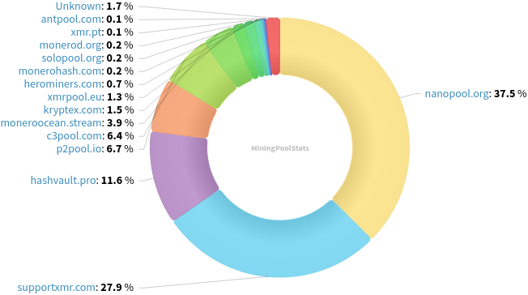
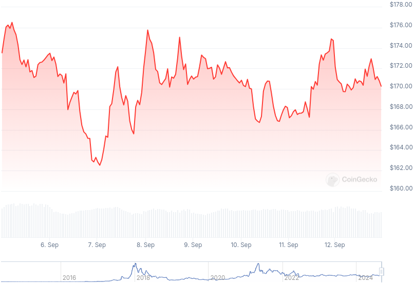

### Table of Contents:

- [Recent News](#news)
- [Upcoming Events](#events)
- [CCS Proposals](#proposals)
- [Price & Blockchain Stats](#stats)
- [Volunteer Opportunities](#volunteer)
- [Support](#support)

### Recent News {#news}

{}
How to install Haveno DEX video [tutorial](https://www.youtube.com/watch?v=sqy741YvCEo) by Sovereign Syndicate.
{}

{}
GitHub user Im-Beast and unnamed XMR wallet coder MrCyjaneK soft launched Monero TUI, a terminal user interface to manage your XMR wallet, from the terminal, with a graphic user interface. Written in Deno and uses FFI bindings to monero_c to communicate with Monero APIs. GitHub [repository](https://github.com/Im-Beast/monero-tui); [v1.0.0-alpha.6](https://github.com/Im-Beast/monero-tui/releases/tag/1.0.0-alpha.6).
{}

{}
Josh Babb posed the question: "Does anyone here know off the top of their head a reasonable churn tx. frequency?" in MRL Matrix room, to which Matrix user *chester-* replied: "I am actually working on that now. I will have an answer in a month or so." Matrix [messsage](https://matrix.to/#/!zxoYuvZdPYtIuWSQnn:monero.social/$3_0O-PbIyiVI6k0uzUO1kbx1rcHae9zSF2kjHZmjizE?via=kernal.eu&via=matrix.org&via=monero.social). No Monero Logs link (browser), as it happened in Lounge, not Lab.
{}

{}
Digilol published a blog post on recent Chainalysis XMR tracing video. Have a read *[How Chainalysis Made Their Way into Popular Monero Wallets](https://www.digilol.net/blog/chainanalysis-malicious-xmr.html)*. 
{}

{}
Guess who is back? That's right, Monono boats are back, and so is our street price! [monero.boats](https://monero.boats/) is on a new server from here on. X [thread](https://xcancel.com/kawaiicrypto/status/1834620606374928582#m).
{}

{}
Monero Talk had Monero Core Team member, Francisco 'ArticMine' Cabañas on to talk about whether XMR is traceable and his bread and butter, scalability of the chain. You don't want to miss this one. Peep it: [Video](https://www.youtube.com/watch?v=VJysnTpj048); No audio file available on [monerotalk.live](https://www.monerotalk.live/) yet.
{}

### Upcoming Events {#events}

{}
Community Workgroup Meeting - [#monero-community](irc://irc.libera.chat/#monero-community) IRC channel; Matrix [room](https://matrix.to/#/#monero-community:monero.social).
{}

{}
Monero Tech Meeting - [#no-wallet-left-behind](irc://irc.libera.chat/#no-wallet-left-behind) IRC channel; Matrix [room](https://matrix.to/#/#no-wallet-left-behind:monero.social).
{}

{}
Cuprate Workgroup Meeting - [#cuprate](irc://irc.libera.chat/#cuprate) IRC channel; Matrix [room](https://matrix.to/#/#cuprate:monero.social).
{}

{}
Research Lab Meeting - [#monero-research-lab](irc://irc.libera.chat/#monero-research-lab) IRC channel; Matrix [room](https://matrix.to/#/#monero-research-lab:monero.social).
{}

### CCS Proposal Ideas {#proposals}

Below you can find some CCS proposal ideas open for discussion.

{}
Haveno Multi-Platform Native App For Every OS
{}

{}
Offline Signing Library for XmrSigner Production
{}

{}
Revuo Monero Maintenance (2024 Q4)
{}

### CCS Proposals Need Funding

{}
FCMP Animated Explainer Video and Remake Introductory Video
{}

{}
Full-time work on Cuprate (3 months)
{}
### Price & Blockchain Stats {#stats}

###### Blockchain Stats



###### XMR Blocks Distribution in last 1000 blocks

###### Price & Performance



###### XMR Price Graph

Sources: [miningpoolstats.stream](https://miningpoolstats.stream/monero); [bitinfocharts.com](https://bitinfocharts.com/monero/); [coingecko.com](https://www.coingecko.com/en/coins/monero); [localmonero.co blocks](https://localmonero.co/blocks); [monero.boats](https://monero.boats/).


{}
Anyone with moderate technical ability is encouraged to try to build and run Monero nightlies. Do not trust it with your Monero, but feel free to open an Issue on GitHub as problems arise. Instructions to build on your OS of choice can be found [here](https://github.com/monero-project/monero#compiling-monero-from-source). 
{}



