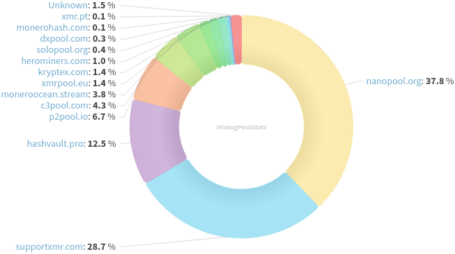
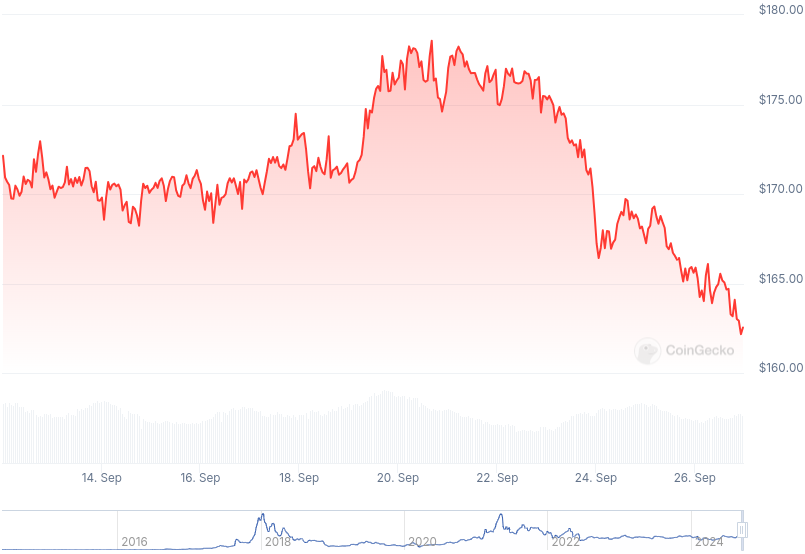

### Table of Contents:

- [Recent News](#news)
- [Upcoming Events](#events)
- [CCS Proposals](#proposals)
- [Price & Blockchain Stats](#stats)
- [Volunteer Opportunities](#volunteer)
- [Support](#support)

### Recent News {#news}

{}
Monerujo officially launches SideKick complimentary application [presented](https://www.youtube.com/watch?v=l7SuVqfbKR4) at MoneroKon 4 in Prague earlier this year. SideKick [v1.0.4](https://github.com/m2049r/sidekick/releases/tag/v1.0.4). Reddit [thread](https://l.opnxng.com/r/Monero/comments/1fo1jbi/soon_is_now_sidekick_is_officially_out_in_the).
{}

{}
Unstoppable Swap GUI [v0.6.4](https://github.com/UnstoppableSwap/unstoppableswap-gui/releases/tag/v0.6.4).
{}

{}
Feather special nugget: initial bug bounty program for Feather is live on [GitHub](https://github.com/feather-wallet/feather/blob/master/SECURITY.md), let's make Feather more resilient. There is a Feather multisig alpha [build](https://featherwallet.org/files/temp/multisig_DO_NOT_USE_IN_PRODUCTION/) (👀). plowsof recorded a short [video](https://github.com/plowsof/feather-nodes/blob/ms-vid/README.md) of himself testing it. Some [tips](https://paste.debian.net/plainh/be005d80). Found bugs? Report in Matrix or open a new issue on GitHub. *Remember*: this is unreviewed alpha software, some things are broken, no stability is guaranteed, use insignificant amounts of XMR for testing.
{}

{}
noosphere888, Samourai XMR<->BTC atomic swap contributor posted on SimpleX room: "Samourai Swaps is shutting down. Thank you for the support." Find the latest available code in this GitHub [repository](https://github.com/noosphere888/samourai-swaps).
{}

{}
Popular public XMR node moneroworld.com has been deprecated amidst Chainalysis video concerns. Reddit [thread](https://l.opnxng.com/r/Monero/comments/1fm2ahi/nodemoneroworld_is_shutting_down); GitHub [issue](https://github.com/monero-project/meta/issues/1079), chime in if you think you have something to contribute. Thanks for providing the community with the node for so long, gingeropolous!
{}

{}
Community member Douglas McSqueaky published a new blog post '[Exit the Road to Serfdom with Monero](https://douglasmcsqueaky.github.io/2024-09-21-roadtoserfdom/)', a great read for all Monero, Austrian economics and freedom enthusiasts alike; don't miss it! Reddit [thread](https://l.opnxng.com/r/Monero/comments/1fmlckb/exit_the_road_to_serfdom_with_monero/).
{}

{}
Community member AlexAnarcho released a new interview with Douglas Tuman from Monero Talk to discuss their entrepreneurship experiences with XMR. Great couple buddies. Peep it [here](https://www.youtube.com/watch?v=FOqLdTpgU78). 
{}

{}
Crypto and web 3 educational group shared a cool intro to Monero clip on X. Have a [look](https://xcancel.com/cryptotipsreal/status/1835272359705809001) and share with friends!
{}

{}
Monero Talk had Alaskanon, regular MoneroTopia show, to talk about how to achieve a circular economy with Monero. Have a look: [Video](https://www.youtube.com/watch?v=m_VMSovBh4g); No audio file available on [monerotalk.live](https://www.monerotalk.live/) yet.
{}

### Upcoming Events {#events}

{}
Monero Tech Meeting - [#no-wallet-left-behind](irc://irc.libera.chat/#no-wallet-left-behind) IRC channel; Matrix [room](https://matrix.to/#/#no-wallet-left-behind:monero.social).
{}

{}
Cuprate Workgroup Meeting - [#cuprate](irc://irc.libera.chat/#cuprate) IRC channel; Matrix [room](https://matrix.to/#/#cuprate:monero.social).
{}

{}
Research Lab Meeting - [#monero-research-lab](irc://irc.libera.chat/#monero-research-lab) IRC channel; Matrix [room](https://matrix.to/#/#monero-research-lab:monero.social).
{}

### CCS Proposal Ideas {#proposals}

Below you can find some CCS proposal ideas open for discussion.

{}
Part-time Work on getmonero.org (2 Month)
{}

{}
full-time dev work 2024Q4
{}

{}
Robust and modular wallet-rpc library
{}

### CCS Proposals Need Funding

{}
FCMP Animated Explainer Video and Remake Introductory Video
{}

{}
Revuo Monero maintenance (2024 Q4)
{}

{}
CCS Coordinator
{}

### Price & Blockchain Stats {#stats}

###### Blockchain Stats



###### XMR Blocks Distribution in last 1000 blocks

###### Price & Performance



###### XMR Price Graph

Sources: [miningpoolstats.stream](https://miningpoolstats.stream/monero); [bitinfocharts.com](https://bitinfocharts.com/monero/); [coingecko.com](https://www.coingecko.com/en/coins/monero); [localmonero.co blocks](https://localmonero.co/blocks); [monero.boats](https://monero.boats/).


{}
Anyone with moderate technical ability is encouraged to try to build and run Monero nightlies. Do not trust it with your Monero, but feel free to open an Issue on GitHub as problems arise. Instructions to build on your OS of choice can be found [here](https://github.com/monero-project/monero#compiling-monero-from-source). 
{}



