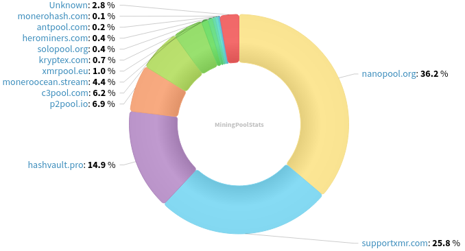
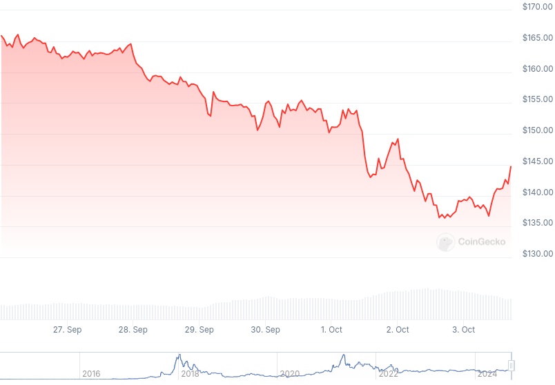

### Table of Contents:

- [Recent News](#news)
- [Upcoming Events](#events)
- [CCS Proposals](#proposals)
- [Price & Blockchain Stats](#stats)
- [Volunteer Opportunities](#volunteer)
- [Support](#support)

### Recent News {#news}

{}
Community member everoddandeven shared their public GitHub repository for a Monero daemon GUI. See what it looks like in the following screenshots: [[1](https://qu.ax/Gskp.png)]; [[2](https://qu.ax/dLjx.png)]; and [[3](https://qu.ax/GXmi.png)]. Monerod-GUI GitHub [repository](https://github.com/everoddandeven/monerod-gui).
{}

{}
Kraken EU is delisting XMR, you have until December 31, 2024 at 15:00 PM UTC to withdraw all your sweet piconeros from custodial Kraken wallet(s). Find out more [here](https://support.kraken.com/hc/en-us/articles/support-for-monero-xmr-in-europe). Haveno DEX go brrr!
{}

{}
P2Pool [v4.1.1](https://github.com/SChernykh/p2pool/releases/tag/v4.1.1). Keep in mind P2Pool v3.x versions and below will not be operating in the same chain as everyone else, as there'll be a *P2Pool* hard fork taking place October 12th, 2024.
{}

{}
Mrs. Crypto Tips mentioned Haveno DEX and Serai as promising, future Monero on/off ramps for XMR amidst Kraken EU delisting news. Peep the new video [here](https://www.youtube.com/watch?v=xK5KFXU3srI).
{}

{}
[Monero Observer Blitz #34](https://monero.observer/monero-observer-blitz-september-2024/) - September 2024.
{}

{}
Community member and current Haveno DEX mobile companion application developer, kewbit, published a blog post explaining what is forthcoming XMR address improvement, CARROT, by jeffro256, and explaining the why it is important for the project as a whole. Have a read [here](https://kewbit.org/what-is-carrot-and-why-its-important-for-monero/) and share with friends!
{}

### Upcoming Events {#events}

{}
Monero Tech Meeting - [#no-wallet-left-behind](irc://irc.libera.chat/#no-wallet-left-behind) IRC channel; Matrix [room](https://matrix.to/#/#no-wallet-left-behind:monero.social).
{}

{}
Cuprate Workgroup Meeting - [#cuprate](irc://irc.libera.chat/#cuprate) IRC channel; Matrix [room](https://matrix.to/#/#cuprate:monero.social).
{}

{}
Research Lab Meeting - [#monero-research-lab](irc://irc.libera.chat/#monero-research-lab) IRC channel; Matrix [room](https://matrix.to/#/#monero-research-lab:monero.social).
{}

### CCS Proposal Ideas {#proposals}

Below you can find some CCS proposal ideas open for discussion.

{}
Offline Signing Library for XmrSigner Production
{}

{}
Carrot animated video
{}

### CCS Proposals Need Funding

{}
CCS Coordinator
{}

{}
FCMP Animated Explainer Video and Remake Introductory Video
{}

{}
Robust and modular wallet-rpc library
{}

Find more proposals currently in need of funding [here](https://ccs.getmonero.org/funding-required/).

### Price & Blockchain Stats {#stats}

###### Blockchain Stats



###### XMR Blocks Distribution in last 1000 blocks

###### Price & Performance



###### XMR Price Graph

Sources: [miningpoolstats.stream](https://miningpoolstats.stream/monero); [bitinfocharts.com](https://bitinfocharts.com/monero/); [coingecko.com](https://www.coingecko.com/en/coins/monero); [localmonero.co blocks](https://localmonero.co/blocks); [monero.boats](https://monero.boats/).


{}
Anyone with moderate technical ability is encouraged to try to build and run Monero nightlies. Do not trust it with your Monero, but feel free to open an Issue on GitHub as problems arise. Instructions to build on your OS of choice can be found [here](https://github.com/monero-project/monero#compiling-monero-from-source). 
{}



