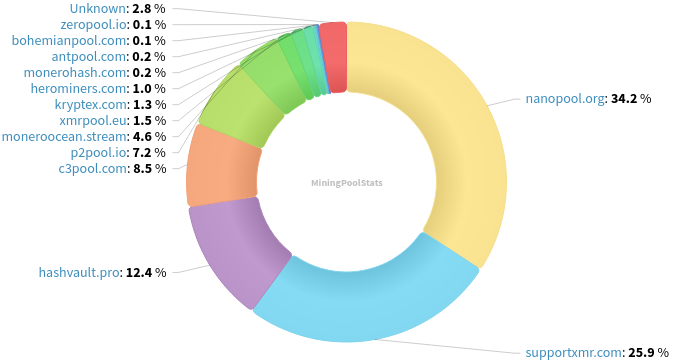
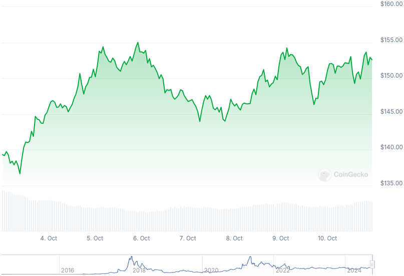

### Table of Contents:

- [Recent News](#news)
- [Upcoming Events](#events)
- [CCS Proposals](#proposals)
- [Price & Blockchain Stats](#stats)
- [Volunteer Opportunities](#volunteer)
- [Support](#support)

### Recent News {#news}

{}
Gupaxx [v1.5.1](https://github.com/Cyrix126/gupaxx/releases/tag/v1.5.1) with important bug fixes.
{}

{}
Haveno Plus developer, kewbit, published a new blog post on FCMP++ aimed at newbies. Have a look [here](https://kewbit.org/in-simple-terms-monero-fcmp-explained/); as well, he posted a walkthrough Jamtis, a new addressing scheme for [Monero](https://kewbit.org/understanding-jamtis-a-new-address-format-for-monero/).
{}

{}
RINO wallet is shutting down on October 31, 2024; please withdraw your XMR by then. Users will still have access to their funds, they'll just have to restore manually in some other wallet using the generated file upon wallet creation at RINO. Reddit [thread](https://redlib.zaggy.nl/r/Monero/comments/1fwmhto/rino_wallet_closing_down_end_of_october/).
{}

{}
Monero miners or mining curious folks, brief wiki on steps to start mining XMR now available at [secondcreek.ca](https://secondcreek.ca/xmr/).
{}

{}
Recent stressnet network has been deprecated; there will likely be another one for FCMP++, likely next year.
{}

{}
There is a new place to hire or sell freelance services. Introduce Monecrow: a platform to allow darknet users to buy and sell services anonymously. Hidden [service](http://monecrowruqdvzh7spxlyyq5ze7ytoetk4r7yb2pshbqvtrtpvcvtwyd.onion/).
{}

{}
According to everoddandeven, Monerod-GUI has received a few important updates and changes. Check them out on this GitHub [repository](https://github.com/everoddandeven/monerod-gui); Commit [history](https://github.com/everoddandeven/monerod-gui/commits/main/).
{}

### Upcoming Events {#events}

{}
Monero Tech Meeting - [#no-wallet-left-behind](irc://irc.libera.chat/#no-wallet-left-behind) IRC channel; Matrix [room](https://matrix.to/#/#no-wallet-left-behind:monero.social).
{}

{}
Cuprate Workgroup Meeting - [#cuprate](irc://irc.libera.chat/#cuprate) IRC channel; Matrix [room](https://matrix.to/#/#cuprate:monero.social).
{}

{}
Research Lab Meeting - [#monero-research-lab](irc://irc.libera.chat/#monero-research-lab) IRC channel; Matrix [room](https://matrix.to/#/#monero-research-lab:monero.social).
{}

### CCS Proposal Ideas {#proposals}

Below you can find some CCS proposal ideas open for discussion.

{}
Add CypherStack Carrot Spec Review
{}

{}
Offline Signing Library for XmrSigner Production
{}

{}
SNeedlewoods-01_part-time dev work (1 month)
{}

### CCS Proposals Need Funding

{}
FCMP Animated Explainer Video
{}

### Price & Blockchain Stats {#stats}

###### Blockchain Stats



###### XMR Blocks Distribution in last 1000 blocks

###### Price & Performance



###### XMR Price Graph

Sources: [miningpoolstats.stream](https://miningpoolstats.stream/monero); [bitinfocharts.com](https://bitinfocharts.com/monero/); [coingecko.com](https://www.coingecko.com/en/coins/monero); [localmonero.co blocks](https://localmonero.co/blocks); [monero.boats](https://monero.boats/).


{}
Anyone with moderate technical ability is encouraged to try to build and run Monero nightlies. Do not trust it with your Monero, but feel free to open an Issue on GitHub as problems arise. Instructions to build on your OS of choice can be found [here](https://github.com/monero-project/monero#compiling-monero-from-source). 
{}



