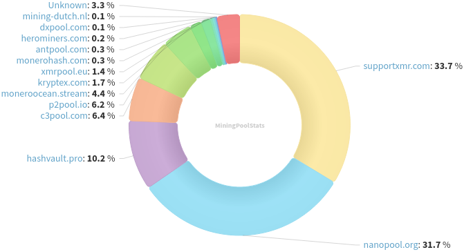
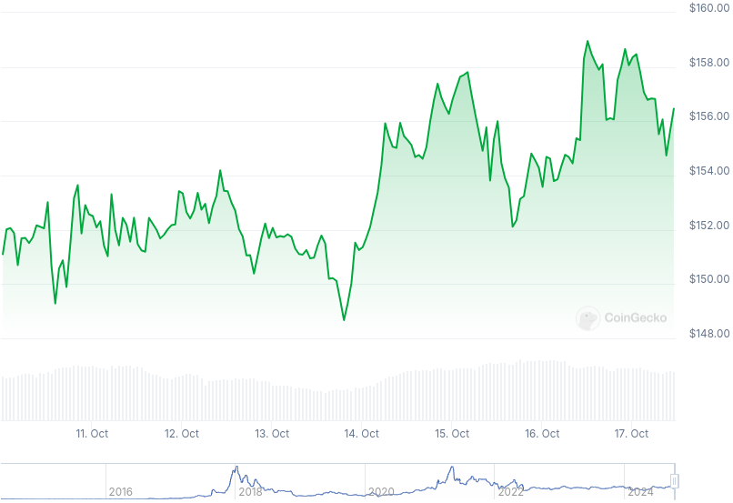

### Table of Contents:

- [Recent News](#news)
- [Upcoming Events](#events)
- [CCS Proposals](#proposals)
- [Price & Blockchain Stats](#stats)
- [Volunteer Opportunities](#volunteer)
- [Support](#support)

### Recent News {#news}

{}
We welcome [haveno.markets](https://haveno.markets/) as our new source for XMR Street Price. Check their website for further information. Gitea [repository](http://gg6zxtreajiijztyy5g6bt5o6l3qu32nrg7eulyemlhxwwl6enk6ghad.onion/wireless_purple/haveno-markets) with source code on a hidden service (.onion). [xmrprice.fyi](https://www.xmrprice.fyi/) will likely become a clearnet mirror, read more about it on their website. 
{}

{}
Feather Wallet [v2.7.0](https://featherwallet.org/download/) with new default nodes; 'send to self' now sends to a subaddress instead of primary; upgrading dependencies; memory leak fixes; and much more. Full [changelog](https://featherwallet.org/changelog/).
{}

{}
Haveno DEX [v1.0.12](https://github.com/haveno-dex/haveno/releases/tag/1.0.12) upgrading Monero to v0.18.3.4 point release; adding support for flatpak and AppImage; several bug fixes and enhancements. Haveno Reto [v1.0.12](https://github.com/retoaccess1/haveno-reto/releases/tag/v1.0.12).
{}

{}
Monerujo "SideKick" [v4.0.8](https://github.com/m2049r/xmrwallet/releases/tag/v4.0.8) with support for SideKick companion application; new default nodes list; fixes Ledger connectivity issues; and Android 14/15 bug fixes.
{}

{}
Did we... just had an ATH in overall network hashrate with 3.53 GH/s printed on chart? Looks like. Reddit [thread](https://l.opnxng.com/r/Monero/comments/1g52h1p/new_alltime_high_hashrate_for_monero/). Monero hashrate graph on [CoinWarz](https://www.coinwarz.com/mining/monero/hashrate-chart).
{}

{}
Community member monerobull posted a thread on Reddit, breaking down Haveno DEX concepts, how to install and more. Have a read on [Reddit](https://l.opnxng.com/r/Monero/comments/1g42umh/haveno_is_live_on_mainnet_how_to_install/) or [Lemmy](https://monero.town/post/4646052).
{}

{}
Community member xenu is attempting to reboot the 'Breaking Monero' series by going over different technical concepts of Monero and analyzing possible flaws in the implementation. Anti Moonboy YouTube [channel](https://invidious.ducks.party/channel/UCiOpJdeI87TBu8FJNgRdUVA); Odysee [channel](https://lbry.ramondia.net/@anti_moonboy); Rumble [channel](https://rumble.com/user/AntiMoonboy).
{}

{}
Monero Talk brough Tor Ekel and Mike Hassardl, to discuss why the Tornado Cash free speech defense got rejected in court; first-hand experiencies on crypto crackdown; and much more. Peep it: [Video](https://invidious.ducks.party/watch?v=9vC7R4F22yU); Audio-only version isn't live on [monerotalk.live](https://www.monerotalk.live/) at this time.
{}

### Upcoming Events {#events}

{}
Monero Tech Meeting - [#no-wallet-left-behind](irc://irc.libera.chat/#no-wallet-left-behind) IRC channel; Matrix [room](https://matrix.to/#/#no-wallet-left-behind:monero.social).
{}

{}
Cuprate Workgroup Meeting - [#cuprate](irc://irc.libera.chat/#cuprate) IRC channel; Matrix [room](https://matrix.to/#/#cuprate:monero.social).
{}

{}
Research Lab Meeting - [#monero-research-lab](irc://irc.libera.chat/#monero-research-lab) IRC channel; Matrix [room](https://matrix.to/#/#monero-research-lab:monero.social).
{}

### CCS Proposal Ideas {#proposals}

Below you can find some CCS proposal ideas open for discussion.

{}
Carrot animated video
{}

{}
Offline Signing Library for XmrSigner Production
{}

### CCS Proposals Need Funding

{}
FCMP Animated Explainer Video
{}

### Price & Blockchain Stats {#stats}

###### Blockchain Stats



###### XMR Blocks Distribution in last 1000 blocks

###### Price & Performance



###### XMR Price Graph

Sources: [miningpoolstats.stream](https://miningpoolstats.stream/monero); [bitinfocharts.com](https://bitinfocharts.com/monero/); [coingecko.com](https://www.coingecko.com/en/coins/monero); [localmonero.co blocks](https://localmonero.co/blocks); [haveno.markets](https://haveno.markets/).


{}
Anyone with moderate technical ability is encouraged to try to build and run Monero nightlies. Do not trust it with your Monero, but feel free to open an Issue on GitHub as problems arise. Instructions to build on your OS of choice can be found [here](https://github.com/monero-project/monero#compiling-monero-from-source). 
{}



