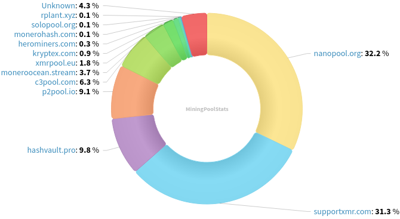
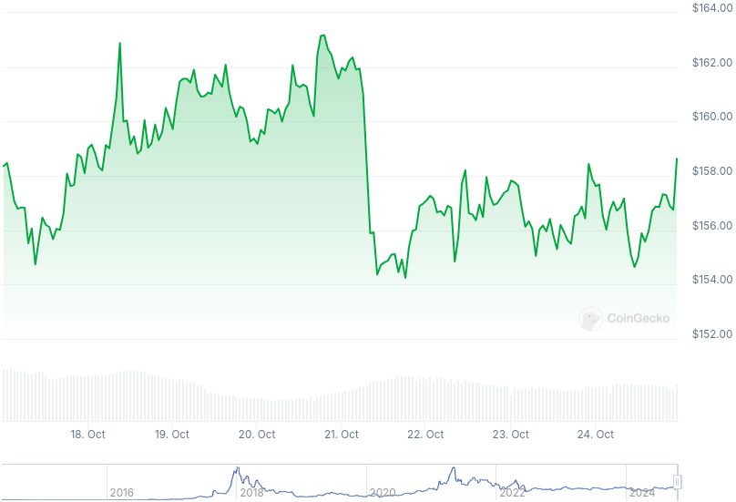

### Table of Contents:

- [Recent News](#news)
- [Upcoming Events](#events)
- [CCS Proposals](#proposals)
- [Price & Blockchain Stats](#stats)
- [Volunteer Opportunities](#volunteer)
- [Support](#support)

### Recent News {#news}

{}
XMRig [v6.22.1](https://github.com/xmrig/xmrig/releases/tag/v6.22.1).
{}

{}
Monero contributor jeffro256 has published a MRL issue calling for discussion on the possiblity of retroactively ignoring the `unlock_time` field of transactions past some future block height, making the migration to FCMP++ tree building easier. GitHub [issue](https://github.com/monero-project/research-lab/issues/125); Lemmy [thread](https://monero.town/post/4726596).
{}

{}
Cake v4.20.1 and Monero.com [v1.17.0](https://github.com/cake-tech/cake_wallet/releases/tag/v4.20.0) with LTC mimblewimble support; BIP32 wallet groups; XMR address handling refactor; and many more improvements under the hood.
{}

{}
monerod GUI [v0.1.1-rc](https://github.com/everoddandeven/monerod-gui/releases/tag/v0.1.1-rc) with autostart/start at boot; native `.deb` package; general bug fixes; and upgraded dependencies.
{}

{}
[!!] In just three (3) weeks, MoneroTopia is taking place! Join us for MoneroTopia 2024 down in Roma, Mexico City, November 14-17, 2024. Check the schedule and get your tickets over at [monerotopia.com](https://monerotopia.com/). Psst! You may use discount code: **Revuo24** to get 10% off your order!
{}

### Upcoming Events {#events}

{}
Community Workgroup Meeting - [#monero-community](irc://irc.libera.chat/#monero-community) IRC channel; Matrix [room](https://matrix.to/#/#monero-community:monero.social).
{}

{}
Monero Website Workgroup Meeting - [#monero-community](irc://irc.libera.chat/#monero-community) IRC channel; Matrix [room](https://matrix.to/#/#monero-community:monero.social).
{}

{}
Monero Tech Meeting - [#no-wallet-left-behind](irc://irc.libera.chat/#no-wallet-left-behind) IRC channel; Matrix [room](https://matrix.to/#/#no-wallet-left-behind:monero.social).
{}

{}
Cuprate Workgroup Meeting - [#cuprate](irc://irc.libera.chat/#cuprate) IRC channel; Matrix [room](https://matrix.to/#/#cuprate:monero.social).
{}

{}
Research Lab Meeting - [#monero-research-lab](irc://irc.libera.chat/#monero-research-lab) IRC channel; Matrix [room](https://matrix.to/#/#monero-research-lab:monero.social).
{}

### CCS Proposal Ideas {#proposals}

Below you can find some CCS proposal ideas open for discussion.

{}
Carrot animated video
{}

{}
Offline Signing Library for XmrSigner Production
{}

### CCS Proposals Need Funding

{}
FCMP Animated Explainer Video
{}

### Price & Blockchain Stats {#stats}

###### Blockchain Stats



###### XMR Blocks Distribution in last 1000 blocks

###### Price & Performance



###### XMR Price Graph

Sources: [miningpoolstats.stream](https://miningpoolstats.stream/monero); [bitinfocharts.com](https://bitinfocharts.com/monero/); [coingecko.com](https://www.coingecko.com/en/coins/monero); [localmonero.co blocks](https://localmonero.co/blocks); [haveno.markets](https://haveno.markets/).


{}
Anyone with moderate technical ability is encouraged to try to build and run Monero nightlies. Do not trust it with your Monero, but feel free to open an Issue on GitHub as problems arise. Instructions to build on your OS of choice can be found [here](https://github.com/monero-project/monero#compiling-monero-from-source). 
{}



