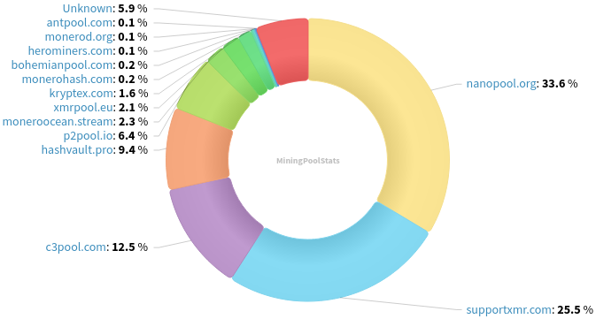
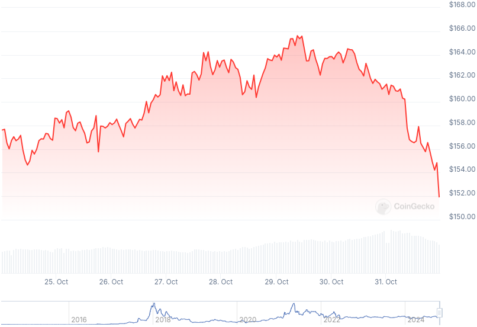

### Table of Contents:

- [Recent News](#news)
- [Upcoming Events](#events)
- [CCS Proposals](#proposals)
- [Price & Blockchain Stats](#stats)
- [Volunteer Opportunities](#volunteer)
- [Support](#support)

### Recent News {#news}

{}
Bit2Me CEX delisted XMR on October, 31st. Official [announcement](https://blog.bit2me.com/en/status-update-delisting-xmr/). Meanwhile, Haveno Reto's monthly volume candle printed a whopping [*1,000* XMR](https://xcancel.com/haveno_reto/status/1851540920698884371)! ...because what doesn't kill you, _makes you stronger_.
{}

{}
Monero Research Lab contributor Rucknium reviewed recent Cypher Stack paper on churning Monero. Ruck's [review](https://github.com/cypherstack/churn/issues/2); final Cypher Stack [paper](https://github.com/cypherstack/churn/releases/download/final/Churn-final.pdf) (.pdf format).
{}

{}
Reddit user OverEducation6572 released a Monero Churning timing tool. Reddit [thread](https://redlib.zaggy.nl/r/Monero/comments/1gcp4t3/i_created_a_churn_timing_tool_for_anyone_looking); GitHub [repository](https://github.com/m-a-x-c/Monero-Churn-Timer); live site with [tool](https://m-a-x-c.github.io/Monero-Churn-Timer/churn.html). Use with caution, as this has not been reviewed yet; feedback welcome.
{}

{}
'Official' getmonero.org website to get a new look using Astro's framework in the next few months, thanks to Diego 'rehrar' Salazar and others' contributions. Reddit [thread](https://redlib.zaggy.nl/r/Monero/comments/1gdk7ay); WIP GitHub [repository](https://github.com/SyntheticBird45/monero-site-astro). Live [demo](http://xi2nhkuzm2hzgyedprs3n65wmudrq4rekbzire67oomiwk5x5h6w7nqd.onion/) (.onion). New design layout [preview](https://www.figma.com/design/OuY892nD4zD1CEQDvC2Kty/Monero-Website-Redesign-2024-(Copy)?node-id=0-1&node-type=canvas).
{}

{}
Cuprate contributor Boog900 posted a CCS [update](https://repo.getmonero.org/monero-project/ccs-proposals/-/merge_requests/469#note_26940) and started a new discussion thread to figure out ways to prevent P2P [proxy nodes](https://github.com/monero-project/research-lab/issues/126). As well, there is an 'unofficial' IP ban list for node runners to deter nodes that aren't actual nodes, just proxies to grab XMR network users' IP addresses. GitHub [repository](https://github.com/Boog900/monero-ban-list). If you want to inspect his method to come up with this ban list, reach out by private messaging Boog900 on Matrix at [@boog900:monero.social](https://matrix.to/#/@boog900:monero.social).
{}

{}
MoneroKon has started a brand-new bounty for creating a XMR FLOSS point of sale for Android. Have a [look](https://bounties.monero.social/posts/159/5-000m-foss-monero-point-of-sale-android-app); GitHub [repository](https://github.com/MoneroKon/XMRpos) where people would submit their pull requests to complete project.
{}

{}
LocalMonero-like peer-to-peer CEX solution to go from fiat-to-XMR and from XMR-to-fiat was just announced, introduce [bitrica.com](https://bitrica.com/). Reddit [thread](https://redlib.zaggy.nl/r/Monero/comments/1gftlel/new_p2p_exchange_just_dropped_trade_xmr_btc_with). Owner is supposedly a prominent LocalMonero [vendor](https://localmonero.co/user/wiefix). Tread with caution and bring feedback to them if you decide to give it a whirl!
{}

### Upcoming Events {#events}

{}
Monero Tech Meeting - [#no-wallet-left-behind](irc://irc.libera.chat/#no-wallet-left-behind) IRC channel; Matrix [room](https://matrix.to/#/#no-wallet-left-behind:monero.social).
{}

{}
Cuprate Workgroup Meeting - [#cuprate](irc://irc.libera.chat/#cuprate) IRC channel; Matrix [room](https://matrix.to/#/#cuprate:monero.social).
{}

{}
Research Lab Meeting - [#monero-research-lab](irc://irc.libera.chat/#monero-research-lab) IRC channel; Matrix [room](https://matrix.to/#/#monero-research-lab:monero.social).
{}

### CCS Proposal Ideas {#proposals}

Below you can find some CCS proposal ideas open for discussion.

{}
Carrot animated video
{}

### CCS Proposals Need Funding

{}
Offline Signing Library for XmrSigner to Production
{}

### Price & Blockchain Stats {#stats}

###### Blockchain Stats



###### XMR Blocks Distribution in last 1000 blocks

###### Price & Performance



###### XMR Price Graph

Sources: [miningpoolstats.stream](https://miningpoolstats.stream/monero); [bitinfocharts.com](https://bitinfocharts.com/monero/); [coingecko.com](https://www.coingecko.com/en/coins/monero); [localmonero.co blocks](https://localmonero.co/blocks); [haveno.markets](https://haveno.markets/).


{}
Anyone with moderate technical ability is encouraged to try to build and run Monero nightlies. Do not trust it with your Monero, but feel free to open an Issue on GitHub as problems arise. Instructions to build on your OS of choice can be found [here](https://github.com/monero-project/monero#compiling-monero-from-source). 
{}



