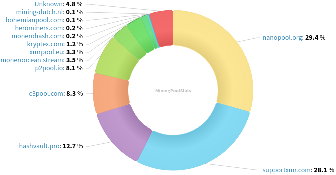
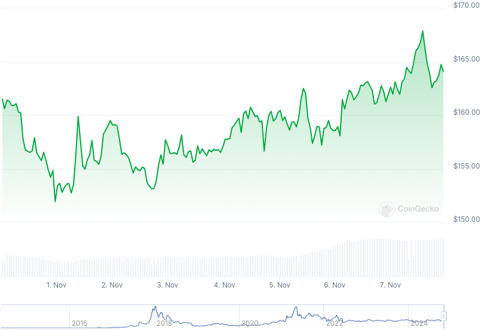

### Table of Contents:

- [Recent News](#news)
- [Upcoming Events](#events)
- [CCS Proposals](#proposals)
- [Price & Blockchain Stats](#stats)
- [Volunteer Opportunities](#volunteer)
- [Support](#support)

### Recent News {#news}

{}
Monerujo [v4.1.5](https://github.com/m2049r/xmrwallet/releases/tag/v4.1.5) upgrading Monero to v0.18.3.4 point release; bringing back the in-app coin swapping service by partnering with Exolix; minor bug fixes; and some refactoring. Reddit [thread](https://redlib.zaggy.nl/r/Monerujo/comments/1gn8d5o/inapp_exchanges_are_back/).
{}

{}
P2Pool [v4.2](https://github.com/SChernykh/p2pool/releases/tag/v4.2) with a couple new features and bug fixes.
{}

{}
Gupaxx [v1.5.3](https://github.com/Cyrix126/gupaxx/releases/tag/v1.5.3) bumping P2Pool version to latest; and a couple bug fixes.
{}

{}
XMRig [v6.22.2](https://github.com/xmrig/xmrig/releases/tag/v6.22.2).
{}

{}
Monerod-GUI [v0.1.2-rc](https://github.com/everoddandeven/monerod-gui/releases/tag/v0.1.2-rc) with the ability to export/import monerod-GUI configuration; native Windows portable executable and installer; several bug fixes; and more.
{}

{}
New Haveno DEX network? New Haveno DEX network. Introduce [Haveno Aloha](https://haveno-aloha.com/) with zero (0!) fees. They are looking for testers and feedback from the community. Reddit [thread](https://redlib.zaggy.nl/r/Monero/comments/1gmei8g/launching_haveno_aloha_new_haveno_network/); Warning Reddit [thread](https://redlib.zaggy.nl/r/Monero/comments/1gln8b9/warning_aioha_haveno_network_shady_hotheads/) on some Aloha inconsistencies and community sentiment thus far.
{}

{}
[Monero Observer Blitz #35](https://monero.observer/monero-observer-blitz-october-2024/) - October 2024.
{}

{}
Looking to contribute in MoneroTopia's buildathon to produce a quality, sound Monero plugin for BTCPayServer v2.0? Say no more. Find all the details in this Reddit [thread](https://redlib.zaggy.nl/r/Monero/comments/1gh5zfh/monerotopia24_hackathon_all_4_days_of_conference/). If you aren't a developer, no big deal, Doug and Sunita are looking for presencial and remote volunteers too. More information [here](https://redlib.zaggy.nl/r/Monero/comments/1ghenez/monerotopia24_conference_in_mexico_city_needs/).
{}

{}
MoneroTopia is set to take place over the course of 4 days, starting this next Thursday, November 14, ending Sunday November 17 in Roma, Mexico City. Grab your tickets over at [monerotopia.com](https://monerotopia.com/) using discount code _Revuo24_ for 10% off your order!
{}

{}
Mark your calendars, MoneroKon 5's dates and location have been announced. We all shall hang out at Second Culture (previously known as Paralelni Polis) in Prague, Czech Republic, June 20-22, 2025. Be sure to join MoneroKon's mailing [list](https://monerokon.org/) to stay in the know. X [thread](https://xcancel.com/MoneroKon/status/1855490013334491189).
{}

### Upcoming Events {#events}

{}
Monero Tech Meeting - [#no-wallet-left-behind](irc://irc.libera.chat/#no-wallet-left-behind) IRC channel; Matrix [room](https://matrix.to/#/#no-wallet-left-behind:monero.social).
{}

{}
Cuprate Workgroup Meeting - [#cuprate](irc://irc.libera.chat/#cuprate) IRC channel; Matrix [room](https://matrix.to/#/#cuprate:monero.social).
{}

{}
Research Lab Meeting - [#monero-research-lab](irc://irc.libera.chat/#monero-research-lab) IRC channel; Matrix [room](https://matrix.to/#/#monero-research-lab:monero.social).
{}

{}
MoneroKon 5 Meeting - [#monerokon](irc://irc.libera.chat/#monerokon) IRC channel; Matrix [room](https://matrix.to/#/#monerokon:matrix.org).
{}

### CCS Proposal Ideas {#proposals}

Below you can find some CCS proposal ideas open for discussion.

{}
Carrot animated video
{}

{}
CryptoCheckout WordPress plugin (for WooCommerce) & Shopify app 
{}

{}
Monerotopia 2024 Marketing and Publicity 
{}

### CCS Proposals Need Funding

{}
Offline Signing Library for XmrSigner to Production
{}

### Price & Blockchain Stats {#stats}

###### Blockchain Stats



###### XMR Blocks Distribution in last 1000 blocks

###### Price & Performance



###### XMR Price Graph

Sources: [miningpoolstats.stream](https://miningpoolstats.stream/monero); [bitinfocharts.com](https://bitinfocharts.com/monero/); [coingecko.com](https://www.coingecko.com/en/coins/monero); [localmonero.co blocks](https://localmonero.co/blocks); [haveno.markets](https://haveno.markets/).


{}
Anyone with moderate technical ability is encouraged to try to build and run Monero nightlies. Do not trust it with your Monero, but feel free to open an Issue on GitHub as problems arise. Instructions to build on your OS of choice can be found [here](https://github.com/monero-project/monero#compiling-monero-from-source). 
{}



