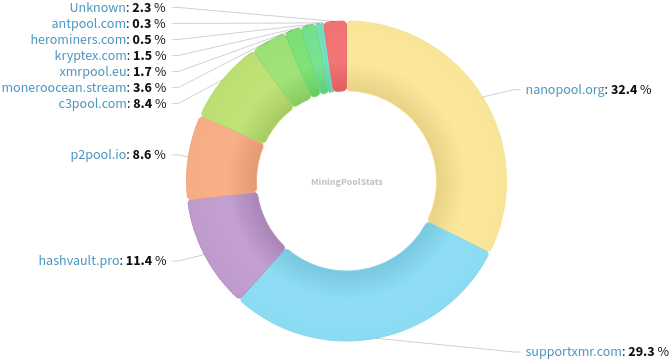
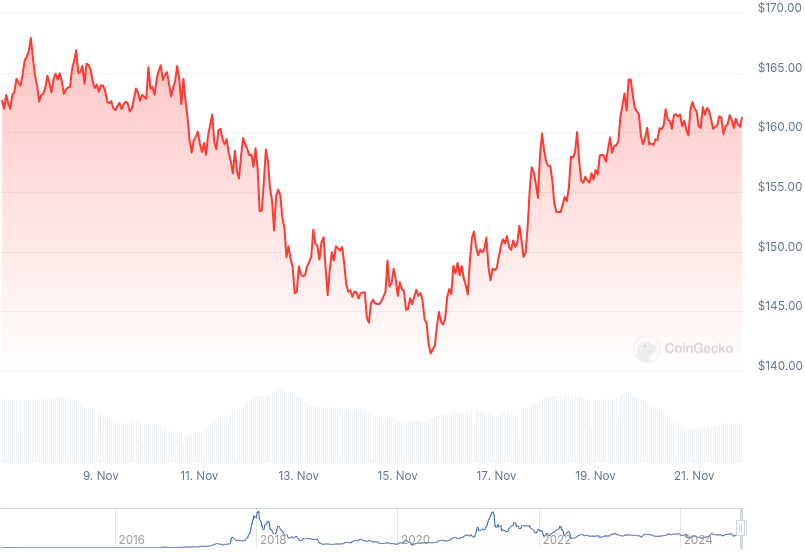

### Table of Contents:

- [Recent News](#news)
- [Upcoming Events](#events)
- [CCS Proposals](#proposals)
- [Price & Blockchain Stats](#stats)
- [Volunteer Opportunities](#volunteer)
- [Support](#support)

### Recent News {#news}

{}
UnstoppableSwap GUI [v1.0.0-rc1](https://github.com/UnstoppableSwap/unstoppableswap-gui/releases/tag/v1.0.0-rc.1). If you are running an ASB: please upgrade as soon as possible. The update has already been rolled out to GUI users. They will not be able to initiate swaps with you until you do, since it introduces breaking changes on the network level.
{}

{}
Cake v4.21.0 and Monero.com v1.18.0 [released](https://github.com/cake-tech/cake_wallet/releases/tag/v4.21.0); as well, they've published Cupcake v0.1.0, a companion application to have the ability to set up airgapped XMR wallets; a slew of bug fixes; and a new buy/sell workflow have been implemented. Worth noting: Cupcake is in beta and should be used with caution. Feedback is more than welcome! Cupcake's GitHub [repository](https://github.com/cake-tech/cupcake).
{}

{}
Haveno DEX [v1.0.14](https://github.com/haveno-dex/haveno/releases/tag/1.0.14) with a few bug fixes; and offering the ability to reopen disputes until payout has been confirmed. Haveno Reto [v1.0.14](https://github.com/retoaccess1/haveno-reto/releases/tag/v1.0.14).
{}

{}
Speaking of Haveno Reto... seems like moving forward we'll know them as [Reto Swap](https://nitter.poast.org/Reto_Swap/status/1859903768164532588) and v1.0.14 was the last release as Haveno Reto? We shall see.
{}

{}
Monerod-GUI 'Tenacity' [v1.0.2](https://github.com/everoddandeven/monerod-gui/releases/tag/v1.0.2) deploying UI/UX fixes and enhancements; and upgrading/installing daemons effectively.
{}

{}
[MoneroTopia](https://monerotopia.com/) was a success last weekend. Thanks to everyone who made it out to Huerto Roma Verde in Mexico city; congratulations to Douglas Tuman, Sunita, volunteers and everyone involved with the event.
{}

### Upcoming Events {#events}

{}
Community Workgroup Meeting - [#monero-community](irc://irc.libera.chat/#monero-community) IRC channel; Matrix [room](https://matrix.to/#/#monero-community:monero.social).
{}

{}
MoneroKon 5 Meeting - [#monerokon](irc://irc.libera.chat/#monerokon) IRC channel; Matrix [room](https://matrix.to/#/#monerokon:matrix.org).
{}

{}
Monero Tech Meeting - [#no-wallet-left-behind](irc://irc.libera.chat/#no-wallet-left-behind) IRC channel; Matrix [room](https://matrix.to/#/#no-wallet-left-behind:monero.social).
{}

{}
Cuprate Workgroup Meeting - [#cuprate](irc://irc.libera.chat/#cuprate) IRC channel; Matrix [room](https://matrix.to/#/#cuprate:monero.social).
{}

{}
Research Lab Meeting - [#monero-research-lab](irc://irc.libera.chat/#monero-research-lab) IRC channel; Matrix [room](https://matrix.to/#/#monero-research-lab:monero.social).
{}

### CCS Proposal Ideas {#proposals}

Below you can find some CCS proposal ideas open for discussion.

{}
monerotopia 2024 voiceovers and working on xmr.ru
{}

{}
1TB MRC upgrade 
{}

{}
Carrot animated video
{}

### CCS Proposals Need Funding

{}
Audit monero-serai and monero-wallet
{}

### Price & Blockchain Stats {#stats}

###### Blockchain Stats



###### XMR Blocks Distribution in last 1000 blocks

###### Price & Performance



###### XMR Price Graph

Sources: [miningpoolstats.stream](https://miningpoolstats.stream/monero); [bitinfocharts.com](https://bitinfocharts.com/monero/); [coingecko.com](https://www.coingecko.com/en/coins/monero); [localmonero.co blocks](https://localmonero.co/blocks); [haveno.markets](https://haveno.markets/).


{}
Anyone with moderate technical ability is encouraged to try to build and run Monero nightlies. Do not trust it with your Monero, but feel free to open an Issue on GitHub as problems arise. Instructions to build on your OS of choice can be found [here](https://github.com/monero-project/monero#compiling-monero-from-source). 
{}



