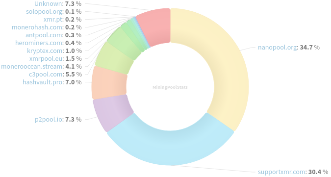
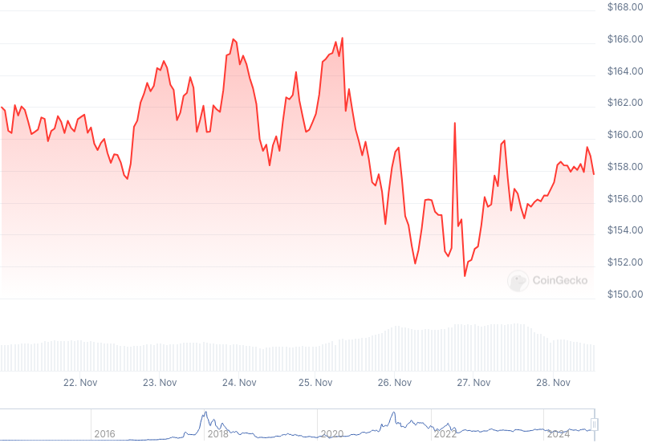

### Table of Contents:

- [Recent News](#news)
- [Upcoming Events](#events)
- [CCS Proposals](#proposals)
- [Price & Blockchain Stats](#stats)
- [Volunteer Opportunities](#volunteer)
- [Support](#support)

### Recent News {#news}

{}
Public remote nodes aggregator and monitor [xmr.ditatompel.com](https://xmr.ditatompel.com/) has implemented a slew of important changes to source code, such as: changing license from GLWTS to BSD-3-Clause, hoping to make it more accesible for others to use it and contribute to development; front-end layout improvements; support for IPv6 and I2P monitoring of remote nodes; and a hidden service for the web UI. GitHub [repository]; [.onion](http://xmrlist2ug5ypisuhsvsi2req4bc3uiv3nc24yzibbaztslqprchvcad.onion/) hidden service.
{}

{}
MoneroPay [v2.7.0](https://gitlab.com/moneropay/moneropay/-/blob/master/CHANGELOG.md#270---2024-11-24) with wallet auto-creation if one has not been created while setting up; 0-confirmation fulfilled invoice support; and other miscellaneous improvements.
{}

{}
Gupax [v1.3.10](https://github.com/hinto-janai/gupax/releases/tag/v1.3.10) removing some remote nodes; and making some UI enhancements.
{}

{}
CypherStack published a review of the forthcoming XMR address scheme, CARROT. GitHub [repository](https://github.com/cypherstack/carrot-audit); [Carrot-final.pdf](https://github.com/cypherstack/carrot-audit/blob/main/latex/Carrot-final.pdf).
{}

{}
MoneroKon C3 call for workshops/presentations is running! Deadline December 7th. Apply [today](https://pretalx.riat.at/38c3/submit/PVr4DB/info/), select *MoneroKon* as the `Track`. X [thread](https://xcancel.com/MoneroKon/status/1860321346380533986).
{}

### Upcoming Events {#events}

{}
MoneroKon 5 Meeting - [#monerokon](irc://irc.libera.chat/#monerokon) IRC channel; Matrix [room](https://matrix.to/#/#monerokon:matrix.org).
{}

{}
Monero Tech Meeting - [#no-wallet-left-behind](irc://irc.libera.chat/#no-wallet-left-behind) IRC channel; Matrix [room](https://matrix.to/#/#no-wallet-left-behind:monero.social).
{}

{}
Cuprate Workgroup Meeting - [#cuprate](irc://irc.libera.chat/#cuprate) IRC channel; Matrix [room](https://matrix.to/#/#cuprate:monero.social).
{}

{}
Research Lab Meeting - [#monero-research-lab](irc://irc.libera.chat/#monero-research-lab) IRC channel; Matrix [room](https://matrix.to/#/#monero-research-lab:monero.social).
{}

### CCS Proposal Ideas {#proposals}

Below you can find some CCS proposal ideas open for discussion.

{}
monerotopia 2024 voiceovers and working on xmr.ru
{}

{}
Carrot animated video
{}

### CCS Proposals Need Funding

{}
Audit monero-serai and monero-wallet
{}

{}
1TB MRC upgrade
{}

### Price & Blockchain Stats {#stats}

###### Blockchain Stats



###### XMR Blocks Distribution in last 1000 blocks

###### Price & Performance



###### XMR Price Graph

Sources: [miningpoolstats.stream](https://miningpoolstats.stream/monero); [bitinfocharts.com](https://bitinfocharts.com/monero/); [coingecko.com](https://www.coingecko.com/en/coins/monero); [localmonero.co blocks](https://localmonero.co/blocks); [haveno.markets](https://haveno.markets/).


{}
Anyone with moderate technical ability is encouraged to try to build and run Monero nightlies. Do not trust it with your Monero, but feel free to open an Issue on GitHub as problems arise. Instructions to build on your OS of choice can be found [here](https://github.com/monero-project/monero#compiling-monero-from-source). 
{}



