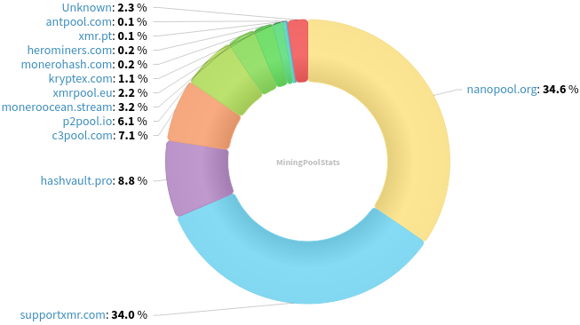
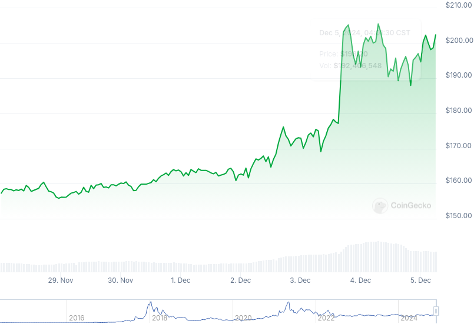

### Table of Contents:

- [Recent News](#news)
- [Upcoming Events](#events)
- [CCS Proposals](#proposals)
- [Price & Blockchain Stats](#stats)
- [Volunteer Opportunities](#volunteer)
- [Support](#support)

### Recent News {#news}

{}
Stack Wallet [v2.1.8](https://github.com/cypherstack/stack_wallet/releases/tag/build_254) with Monero churning options; a slew of bug fixes for different other chains; view-only wallet capabilities for XMR and more. ~~Stack Duo update wen, CypherStack?~~
{}

{}
Happy birthday, RandomX! 5 years enforcing CPU-only mining and keeping ASICs at bay. Thanks tevador, hyc, sech1 and many other #monero-pow contributors. Reddit [thread](https://redlib.zaggy.nl/r/Monero/comments/1h6e4nk/randomx_5_year_anniversary/).
{}

{}
Monero Research Lab contributor Rucknium published a draft to urge node operators to enable Cuprate contributor boog900's IP ban list. Peep the gist [here](https://gist.github.com/Rucknium/76edd249c363b9ecf2517db4fab42e88). *Note*: subject to changes and further peer-review by other XMR contributors.
{}

{}
Consequently, Seth for Privacy has updated his Simple Monerod Docker [image](https://github.com/sethforprivacy/simple-monerod-docker/commit/cea9d8c83738f8164f8d8e09648c916c571c1571) for all to upgrade their nodes to and effectively enable the rogue IP node ban list. Do note, however, it came with a [note](https://libera.monerologs.net/monero/20241205#c468980) to bear in mind moving forward.
{}

{}
Monero Research Lab veteran Brandon Goodell posted a Generalized Bulletproofs security [review](https://repo.getmonero.org/-/project/54/uploads/b2d5c8198f55d72b588f1ef138126850/GBP_Security_Review.pdf) per ongoing FCMP++ Research CCS [proposal](https://repo.getmonero.org/monero-project/ccs-proposals/-/merge_requests/449#note_27508); followed by jberman's *+1* [comment](https://repo.getmonero.org/monero-project/ccs-proposals/-/merge_requests/449#note_27519).
{}

{}
Do you want to look at a spreadsheet keeping a tally with links to all recent (and forthcoming) reviews and reports? Justin Berman got you; follow along with this CryptPad [link](https://cryptpad.fr/sheet/#/2/sheet/view/yPVIUywwA9-deE9VF6GYm9bXbPdCerdST3UDEEfBxcM/embed/).
{}

{}
MRL was on a roll with this week's meeting: the effect of the suspected spy nodes on the privacy provided by Dandelion++ is estimated [here](https://github.com/monero-project/research-lab/issues/126#issuecomment-2460261864) under "Empirical privacy impact."
{}

{}
Graphic designer agency VOSTOEMISIO released all their XMR explainer videos along with an AI dub of Monero Means Money, the movie, into seven (7!) different languages. Find out which ones in the Reddit [thread](https://redlib.zaggy.nl/r/Monero/comments/1h5dp6a/unlocking_monero_knowledge_now_accessible_to/); find them all on the Monero Community Workgroup YouTube [channel](https://inv.nadeko.net/@MoneroCommunityWorkgroup/videos). Enjoy and share away!
{}

{}
A brand-new peer-to-peer website to buy and sell XMR for fiat currencies has joined the community. Meet [XMRGlobal](https://xmrglobal.com/). PGP sign-up and sign-in, like certain sites on The Open Router network. Stylish! Yet, tread with caution: brand-new service, only risk what you are open to lose. [.onion](http://xmrglobalbtadqwzhwohwlonc252y5zfdv3ssoob35n5pb3wrghsvvyd.onion/); Reddit [thread](https://redlib.zaggy.nl/r/Monero/comments/1h5peos/xmrglobal_now_live/).
{}

### Upcoming Events {#events}

{}
Community Workgroup Meeting - [#monero-community](irc://irc.libera.chat/#monero-community) IRC channel; Matrix [room](https://matrix.to/#/#monero-community:monero.social).
{}

{}
MoneroKon 5 Meeting - [#monerokon](irc://irc.libera.chat/#monerokon) IRC channel; Matrix [room](https://matrix.to/#/#monerokon:matrix.org).
{}

{}
Monero Tech Meeting - [#no-wallet-left-behind](irc://irc.libera.chat/#no-wallet-left-behind) IRC channel; Matrix [room](https://matrix.to/#/#no-wallet-left-behind:monero.social).
{}

{}
Cuprate Workgroup Meeting - [#cuprate](irc://irc.libera.chat/#cuprate) IRC channel; Matrix [room](https://matrix.to/#/#cuprate:monero.social).
{}

{}
Research Lab Meeting - [#monero-research-lab](irc://irc.libera.chat/#monero-research-lab) IRC channel; Matrix [room](https://matrix.to/#/#monero-research-lab:monero.social).
{}

### CCS Proposal Ideas {#proposals}

Below you can find some CCS proposal ideas open for discussion.

{}
Part-time monero development (3 months)
{}

{}
monerotopia 2024 voiceovers and working on xmr.ru
{}

{}
Carrot animated video
{}

### CCS Proposals Need Funding

{}
1TB MRC upgrade
{}

### Price & Blockchain Stats {#stats}

###### Blockchain Stats



###### XMR Blocks Distribution in last 1000 blocks

###### Price & Performance



###### XMR Price Graph

Sources: [miningpoolstats.stream](https://miningpoolstats.stream/monero); [bitinfocharts.com](https://bitinfocharts.com/monero/); [coingecko.com](https://www.coingecko.com/en/coins/monero); [localmonero.co blocks](https://localmonero.co/blocks); [haveno.markets](https://haveno.markets/).


{}
Anyone with moderate technical ability is encouraged to try to build and run Monero nightlies. Do not trust it with your Monero, but feel free to open an Issue on GitHub as problems arise. Instructions to build on your OS of choice can be found [here](https://github.com/monero-project/monero#compiling-monero-from-source). 
{}



