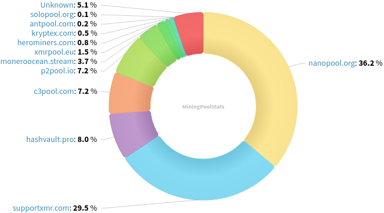
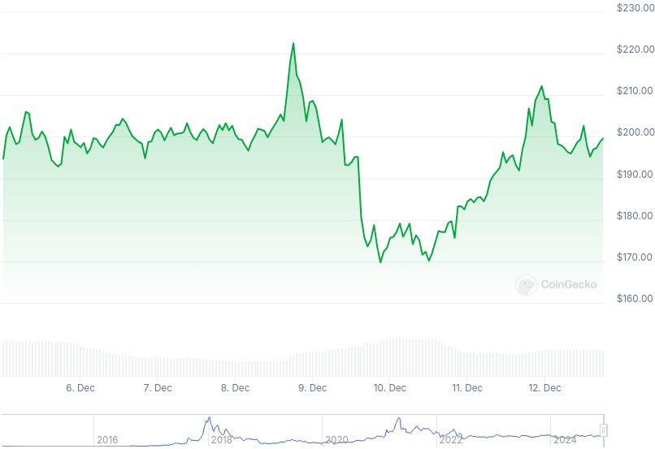

### Table of Contents:

- [Recent News](#news)
- [Upcoming Events](#events)
- [CCS Proposals](#proposals)
- [Price & Blockchain Stats](#stats)
- [Volunteer Opportunities](#volunteer)
- [Support](#support)

### Recent News {#news}

{}
Stack Wallet [v2.1.9](https://github.com/cypherstack/stack_wallet/releases/tag/build_256) with option to show XMR/WOW private key; Wallet Backup fixes; and more. Our request was heard, Stack Duo [v1.2.4](https://github.com/cypherstack/stack_duo/releases/tag/build_26) syncing all major new features and bug fixes from upstream. *Note*: some users have reported issues connecting to their BTC/XMR/WOW `.onion` nodes. This [commit](https://github.com/cypherstack/stack_wallet/commit/937550cb041482565d504c087fe3435471cae092) aims to fix that in a future update! X [thread](https://nitter.poast.org/stack_wallet/status/1864796942573723787).
{}

{}
A community member published a technical deep dive into Monero's features, algorithms and math behind the project. Have a read at [*Privacy and Anonymity in Monero*](https://risencrypto.github.io/Monero/) by /u/HenryDaHorse on Risen Crypto blog. Reddit [thread](https://redlib.zaggy.nl/r/Monero/comments/1h7ye8e/privacy_and_anonymity_in_monero_pedersen/).
{}

{}
X user @iAnonymous3000, also known as Sooraj Sathyanarayanan, posted a Monero with FCMP++ vs. ZCash shielded txs. comparison [thread](https://xcancel.com/iAnonymous3000/status/1867117434718568747). Monero is opt-out, optional transparency, default privacy; ZCash is opt-in, optional privacy. Reddit [thread](https://redlib.zaggy.nl/r/Monero/comments/1hcv37n/a_comparison_of_moneros_privacy_with_fcmp_versus/).
{}

{}
VOSTOEMISIO and Xenu released the new FCMP++ explainer video on [YouTube](https://invidious.nikkosphere.com/watch?v=jc8Kc0WogAI). Reddit [thread](https://redlib.zaggy.nl/r/Monero/comments/1h80qnr/fullchain_membership_proofs_fcmp_explainer_video/).
{}

{}
Apply to be on the MAGIC Monero Fund committee, or to be a voter in the forthcoming elections! Blog [post](https://magicgrants.org/2024/12/05/Monero-Fund-2025-Election.html); Reddit [thread](https://redlib.zaggy.nl/r/Monero/comments/1h7pk9z/apply_to_be_on_the_magic_monero_fund_committee_or/).
{}

### Upcoming Events {#events}

{}
MoneroKon 5 Meeting - [#monerokon](irc://irc.libera.chat/#monerokon) IRC channel; Matrix [room](https://matrix.to/#/#monerokon:matrix.org).
{}

{}
Monero Tech Meeting - [#no-wallet-left-behind](irc://irc.libera.chat/#no-wallet-left-behind) IRC channel; Matrix [room](https://matrix.to/#/#no-wallet-left-behind:monero.social).
{}

{}
Cuprate Workgroup Meeting - [#cuprate](irc://irc.libera.chat/#cuprate) IRC channel; Matrix [room](https://matrix.to/#/#cuprate:monero.social).
{}

{}
Research Lab Meeting - [#monero-research-lab](irc://irc.libera.chat/#monero-research-lab) IRC channel; Matrix [room](https://matrix.to/#/#monero-research-lab:monero.social).
{}

### CCS Proposal Ideas {#proposals}

Below you can find some CCS proposal ideas open for discussion.

{}
NoShore: Groundwork for on-the-go offline payments
{}

{}
XMRChat - a service for content creators to receive messages and tips in Monero
{}

{}
Carrot animated video
{}

### CCS Proposals Need Funding

{}
1TB MRC upgrade
{}

{}
monerotopia 2024 voiceovers and working on xmr.ru
{}

### Price & Blockchain Stats {#stats}

###### Blockchain Stats



###### XMR Blocks Distribution in last 1000 blocks

###### Price & Performance



###### XMR Price Graph

Sources: [miningpoolstats.stream](https://miningpoolstats.stream/monero); [bitinfocharts.com](https://bitinfocharts.com/monero/); [coingecko.com](https://www.coingecko.com/en/coins/monero); [localmonero.co blocks](https://localmonero.co/blocks); [haveno.markets](https://haveno.markets/).


{}
Anyone with moderate technical ability is encouraged to try to build and run Monero nightlies. Do not trust it with your Monero, but feel free to open an Issue on GitHub as problems arise. Instructions to build on your OS of choice can be found [here](https://github.com/monero-project/monero#compiling-monero-from-source). 
{}



