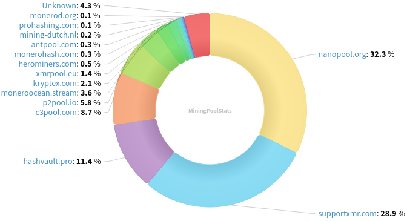
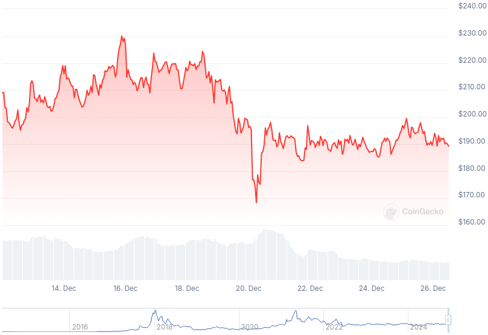

### Table of Contents:

- [Recent News](#news)
- [Upcoming Events](#events)
- [CCS Proposals](#proposals)
- [Price & Blockchain Stats](#stats)
- [Volunteer Opportunities](#volunteer)
- [Support](#support)

### Recent News {#news}

{}
Gupaxx [v1.6.0](https://github.com/Cyrix126/gupaxx/releases/tag/v1.6.0) with a slew of UI/UX enhancements and bug fixes.
{}

{}
Cake v4.22.0 and Monero.com v1.19.0 [released](https://github.com/cake-tech/cake_wallet/releases/tag/v4.22.0) with full Monero Ledger support; mnemonic seed verification; and tap-to-hide balance UI feature. Reddit [thread](https://redlib.zaggy.nl/r/Monero/comments/1hi2734/cake_wallet_v4220_maximize_monero_security_with/).
{}

{}
PiNodeXMR [v6.24.12](https://github.com/shermand100/PiNodeXMR) with recent MRL-recommended rogue node IP ban list. Reddit [thread](https://redlib.zaggy.nl/r/Monero/comments/1hhyn4a/pinodexmr_v62412_update_available_ban_lists/).
{}

{}
Haveno DEX adds support to buy Monero without the need for a security deposit as long as they are lower than 1 XMR with Haveno DEX [v1.0.17](https://github.com/haveno-dex/haveno/releases/tag/1.0.17); RetoSwap [v1.0.17](https://github.com/retoaccess1/haveno-reto/releases/tag/v1.0.17).
{}

### Upcoming Events {#events}

{}
MoneroKon 5 Meeting - [#monerokon](irc://irc.libera.chat/#monerokon) IRC channel; Matrix [room](https://matrix.to/#/#monerokon:matrix.org).
{}

{}
Monero Tech Meeting - [#no-wallet-left-behind](irc://irc.libera.chat/#no-wallet-left-behind) IRC channel; Matrix [room](https://matrix.to/#/#no-wallet-left-behind:monero.social).
{}

{}
Research Lab Meeting - [#monero-research-lab](irc://irc.libera.chat/#monero-research-lab) IRC channel; Matrix [room](https://matrix.to/#/#monero-research-lab:monero.social).
{}

### CCS Proposal Ideas {#proposals}

Below you can find some CCS proposal ideas open for discussion.

{}
full-time feather + core development (3 months)
{}

{}
full-time development (4 months)
{}

{}
dmvp2p: Donate Monero Via P2Pool
{}

### CCS Proposals Need Funding

{}
1TB MRC upgrade
{}

{}
monerotopia 2024 voiceovers and working on xmr.ru
{}

### Price & Blockchain Stats {#stats}

###### Blockchain Stats



###### XMR Blocks Distribution in last 1000 blocks

###### Price & Performance



###### XMR Price Graph

Sources: [miningpoolstats.stream](https://miningpoolstats.stream/monero); [bitinfocharts.com](https://bitinfocharts.com/monero/); [coingecko.com](https://www.coingecko.com/en/coins/monero); [localmonero.co blocks](https://localmonero.co/blocks); [haveno.markets](https://haveno.markets/).


{}
Anyone with moderate technical ability is encouraged to try to build and run Monero nightlies. Do not trust it with your Monero, but feel free to open an Issue on GitHub as problems arise. Instructions to build on your OS of choice can be found [here](https://github.com/monero-project/monero#compiling-monero-from-source). 
{}



