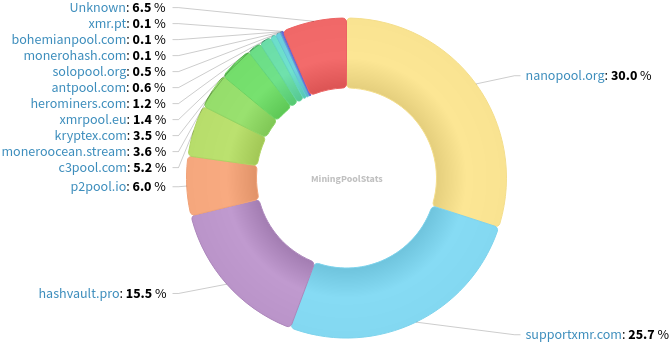
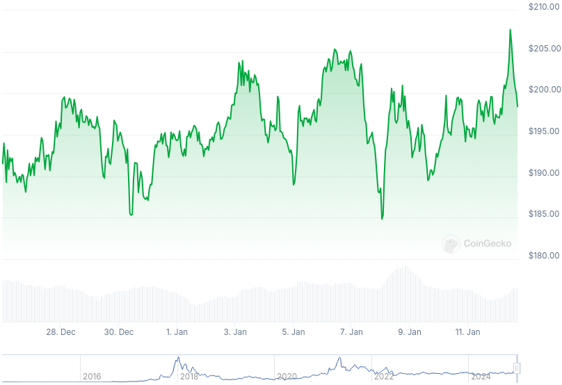

### Table of Contents:

- [Recent News](#news)
- [Upcoming Events](#events)
- [CCS Proposals](#proposals)
- [Price & Blockchain Stats](#stats)
- [Volunteer Opportunities](#volunteer)
- [Support](#support)

### Recent News {#news}

{}
MoneroPay [v2.7.1](https://gitlab.com/moneropay/moneropay/-/blob/master/CHANGELOG.md#271---2024-12-28) with a minor hot fix from a regression introduced with v2.7.0 release. 
{}

{}
Monero Daemon GUI [v1.1.0](https://github.com/everoddandeven/monerod-gui/releases/tag/v1.1.0) with UI bug fixes and improvements; daemon settings fixes; minor code refactoring; and dependencies upgrades across the board.
{}

{}
Cake v4.22.1 and Monero.com v1.19.1 [released](https://github.com/cake-tech/cake_wallet/releases/tag/v4.22.1) with bug fixes and enhancements. Forum [thread](https://forum.cakewallet.com/t/cake-wallet-v4-22-1-public-release-live/67).
{}

{}
P2Pool [v4.3](https://github.com/SChernykh/p2pool/releases/tag/v4.3) with miscellaneous bug fixes and improvements.
{}

{}
Gupaxx [v1.7.2](https://github.com/Cyrix126/gupaxx/releases/tag/v1.7.2).
{}

{}
[Monero Observer Blitz #37](https://monero.observer/monero-observer-blitz-december-2024/) - December 2024.
{}

### Upcoming Events {#events}

{}
Monero Tech Meeting - [#no-wallet-left-behind](irc://irc.libera.chat/#no-wallet-left-behind) IRC channel; Matrix [room](https://matrix.to/#/#no-wallet-left-behind:monero.social).
{}

{}
Cuprate Workgroup Meeting - [#cuprate](irc://irc.libera.chat/#cuprate) IRC channel; Matrix [room](https://matrix.to/#/#cuprate:monero.social).
{}

{}
Research Lab Meeting - [#monero-research-lab](irc://irc.libera.chat/#monero-research-lab) IRC channel; Matrix [room](https://matrix.to/#/#monero-research-lab:monero.social).
{}

### CCS Proposal Ideas {#proposals}

Below you can find some CCS proposal ideas open for discussion.

{}
Btcpayserver plugin
{}

{}
NoShore: Groundwork for on-the-go offline payments
{}

{}
dmvp2p: Donate Monero Via P2Pool
{}

### CCS Proposals Need Funding

{}
monerotopia 2024 voiceovers and working on xmr.ru
{}

### Price & Blockchain Stats {#stats}

###### Blockchain Stats



###### XMR Blocks Distribution in last 1000 blocks

###### Price & Performance



###### XMR Price Graph

Sources: [miningpoolstats.stream](https://miningpoolstats.stream/monero); [bitinfocharts.com](https://bitinfocharts.com/monero/); [coingecko.com](https://www.coingecko.com/en/coins/monero); [localmonero.co blocks](https://localmonero.co/blocks); [haveno.markets](https://haveno.markets/).


{}
Anyone with moderate technical ability is encouraged to try to build and run Monero nightlies. Do not trust it with your Monero, but feel free to open an Issue on GitHub as problems arise. Instructions to build on your OS of choice can be found [here](https://github.com/monero-project/monero#compiling-monero-from-source). 
{}



