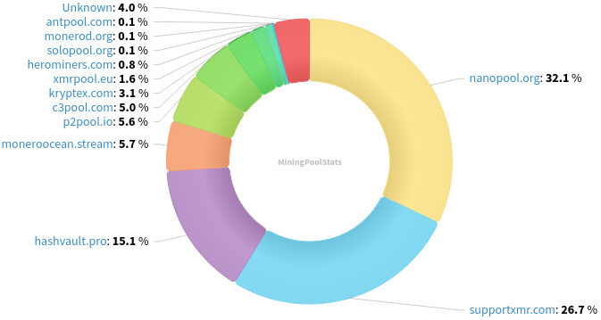
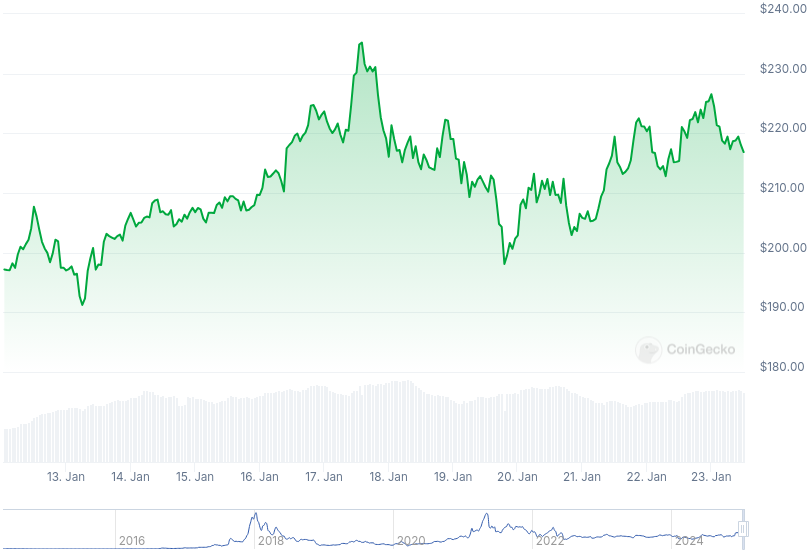

### Table of Contents:

- [Recent News](#news)
- [Upcoming Events](#events)
- [CCS Proposals](#proposals)
- [Price & Blockchain Stats](#stats)
- [Volunteer Opportunities](#volunteer)
- [Support](#support)

### Recent News {#news}

{}
Pesky scammers are around! Supposedly some of the users in the Reddit [thread](https://redlib.zaggy.nl/r/CryptoScams/comments/1i2916v/warning_notorious_cryptoscammer_is_phishing_users/) have been running phishing websites for years. Stay cautious out there. 
{}

{}
Haveno DEX [v1.0.18](https://github.com/haveno-dex/haveno/releases/tag/1.0.18) reducing space usage by 98%, wallets are saved less often; upgrades to Tor binaries; increases trade limit of no deposit offers to 1.5 XMR; bug fixes and improvements. RetoSwap v1.0.18 to follow shortly.
{}

{}
Anyone remember OSPEAD by Rucknium? We do! Milestone 2 has been completed and Ruck's analysis has been passed to a few contributors for [review](https://repo.getmonero.org/monero-project/ccs-proposals/-/merge_requests/255#note_28250). All documents and code to be released publicly by February 20th, per [Rucknium](https://matrix.to/#/!toFcRZtpaiwiyapgVO:matrix.org/$0n_LL_WRRqBofNwwW0kVsGJU2u1BeYsPtg4HWqZAnxA?via=matrix.org&via=monero.social&via=envs.net).
{}

{}
MAGIC Monero Fund 2025 election [results](https://magicgrants.org/2025/01/21/Monero-Fund-2025-Election-Results.html) are out. I am happy to be joining the committee for one year starting on January 31, 2025.
{}

{}
Monero Talk had full-time Monero contributor, Justin Berman to talk all about the future of FCMP++ XMR; CARROT; substantial improvements for wallet synchronization; and more. Not short on technicalities! Peep it: [Video](https://inv.nadeko.net/watch?v=vdotJfl8JLU); [Audio](https://www.monerotalk.live/monerotalk-337).
{}

### Upcoming Events {#events}

{}
MoneroKon 5 Meeting - [#monerokon](irc://irc.libera.chat/#monerokon) IRC channel; Matrix [room](https://matrix.to/#/#monerokon:matrix.org).
{}

{}
Monero Tech Meeting - [#no-wallet-left-behind](irc://irc.libera.chat/#no-wallet-left-behind) IRC channel; Matrix [room](https://matrix.to/#/#no-wallet-left-behind:monero.social).
{}

{}
Cuprate Workgroup Meeting - [#cuprate](irc://irc.libera.chat/#cuprate) IRC channel; Matrix [room](https://matrix.to/#/#cuprate:monero.social).
{}

{}
Research Lab Meeting - [#monero-research-lab](irc://irc.libera.chat/#monero-research-lab) IRC channel; Matrix [room](https://matrix.to/#/#monero-research-lab:monero.social).
{}

### CCS Proposal Ideas {#proposals}

Below you can find some CCS proposal ideas open for discussion.

{}
dmvp2p: Donate Monero Via P2Pool
{}

{}
Revuo Monero Maintenance (2025 Q1)
{}

{}
Btcpayserver plugin
{}

### CCS Proposals Need Funding

{}
monerotopia 2024 voiceovers and working on xmr.ru
{}

### Price & Blockchain Stats {#stats}

###### Blockchain Stats



###### XMR Blocks Distribution in last 1000 blocks

###### Price & Performance



###### XMR Price Graph

Sources: [miningpoolstats.stream](https://miningpoolstats.stream/monero); [bitinfocharts.com](https://bitinfocharts.com/monero/); [coingecko.com](https://www.coingecko.com/en/coins/monero); [localmonero.co blocks](https://localmonero.co/blocks); [haveno.markets](https://haveno.markets/).


{}
Anyone with moderate technical ability is encouraged to try to build and run Monero nightlies. Do not trust it with your Monero, but feel free to open an Issue on GitHub as problems arise. Instructions to build on your OS of choice can be found [here](https://github.com/monero-project/monero#compiling-monero-from-source). 
{}



