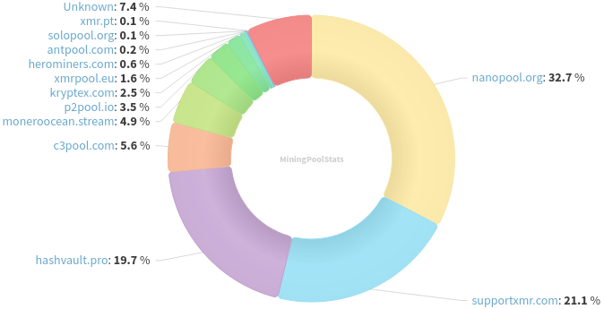
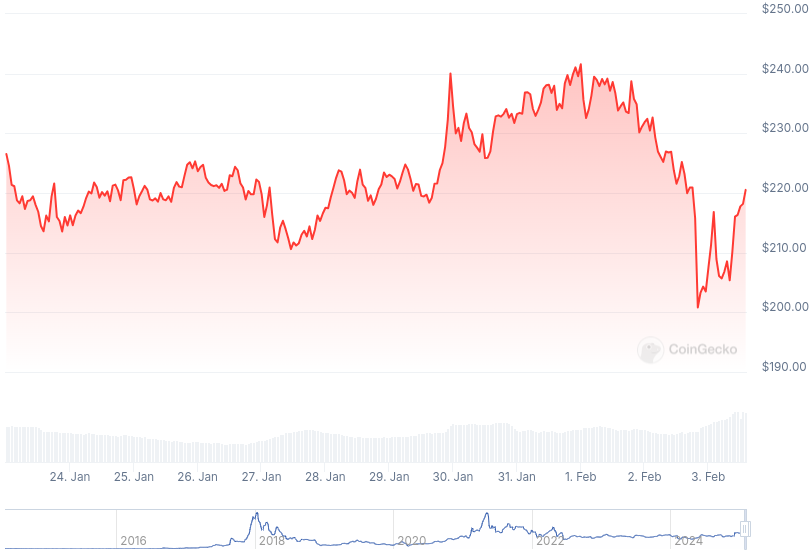

### Table of Contents:

- [Recent News](#news)
- [Upcoming Events](#events)
- [CCS Proposals](#proposals)
- [Price & Blockchain Stats](#stats)
- [Volunteer Opportunities](#volunteer)
- [Support](#support)

### Recent News {#news}

{}
RetoSwap [v1.0.8](https://github.com/retoaccess1/haveno-reto/releases/tag/v1.0.18) with important usability fixes; translation updates; and miscellaneous bug fixes. Boldsuck added [documentation](https://boldsuck.github.io/haveno-reto-docs/haveno-ui/security/#tor-config) for monero nodes and highlighted TailsOS installation.
{}

{}
Cake v4.23.0 and Monero.com v1.20.0 [released](https://github.com/cake-tech/cake_wallet/releases/tag/v4.23.0), adding Monero/Wownero passphrase support, decentralized cross-chain exchange, Chainflip; merging UI enhancements; and squashing away some bugs. How to join the beta testing [squad](https://forum.cakewallet.com/t/how-to-join-beta-testing/13). Feedback? [Here](https://forum.cakewallet.com/t/v4-23-0-beta-testing/87)!
{}

{}
Monero v0.18.4.0 point release coming soon^(tm). selsta's pull [request](https://github.com/monero-project/monero/issues/9758), outlining a short ToDo list before then.
{}

{}
[Monero Observer Blitz #38](https://monero.observer/monero-observer-blitz-january-2025/) - January 2025.
{}

### Upcoming Events {#events}

{}
Cuprate Workgroup Meeting - [#cuprate](irc://irc.libera.chat/#cuprate) IRC channel; Matrix [room](https://matrix.to/#/#cuprate:monero.social).
{}

{}
Research Lab Meeting - [#monero-research-lab](irc://irc.libera.chat/#monero-research-lab) IRC channel; Matrix [room](https://matrix.to/#/#monero-research-lab:monero.social).
{}

### CCS Proposal Ideas {#proposals}

Below you can find some CCS proposal ideas open for discussion.

{}
dmvp2p: Donate Monero Via P2Pool
{}

{}
Revuo Monero Maintenance (2025 Q1)
{}

{}
Btcpayserver plugin
{}

### CCS Proposals Need Funding

{}
monerotopia 2024 voiceovers and working on xmr.ru
{}

### Price & Blockchain Stats {#stats}

###### Blockchain Stats



###### XMR Blocks Distribution in last 1000 blocks

###### Price & Performance



###### XMR Price Graph

Sources: [miningpoolstats.stream](https://miningpoolstats.stream/monero); [bitinfocharts.com](https://bitinfocharts.com/monero/); [coingecko.com](https://www.coingecko.com/en/coins/monero); [localmonero.co blocks](https://localmonero.co/blocks); [haveno.markets](https://haveno.markets/).


{}
Anyone with moderate technical ability is encouraged to try to build and run Monero nightlies. Do not trust it with your Monero, but feel free to open an Issue on GitHub as problems arise. Instructions to build on your OS of choice can be found [here](https://github.com/monero-project/monero#compiling-monero-from-source). 
{}



