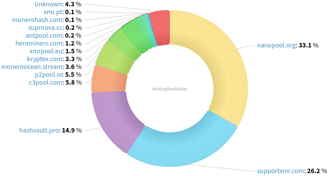
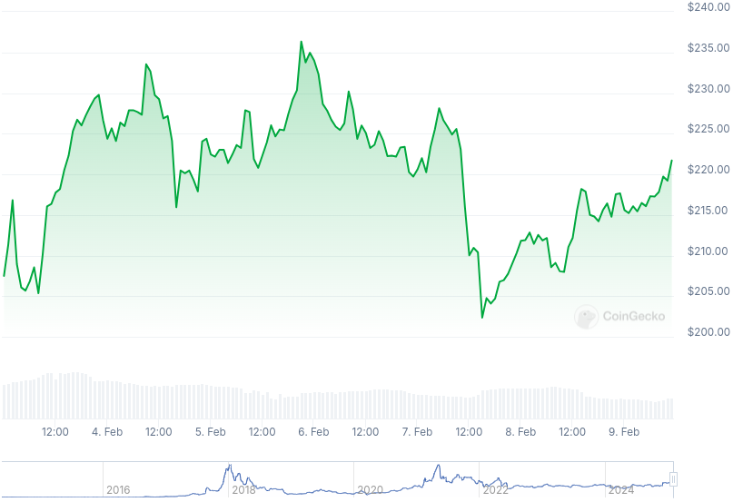

### Table of Contents:

- [Recent News](#news)
- [Upcoming Events](#events)
- [CCS Proposals](#proposals)
- [Price & Blockchain Stats](#stats)
- [Volunteer Opportunities](#volunteer)
- [Support](#support)

### Recent News {#news}

{}
Monerujo [v4.1.6](https://github.com/m2049r/xmrwallet/releases/tag/v4.1.6) (Alpha) with Exolix API updates; translation updates; default nodes updates; miscellaneous bug fixes and UI enhancements.
{}

{}
Monero Core Team member binaryFate published a draft of General Fund Transparency report which presents data until February 6, 2025 on [reddit](https://redlib.zaggy.nl/r/Monero/comments/1iixgk9/monero_general_fund_transparency_report_february/). Spreadsheet direct [download](https://downloads.getmonero.org/GF_report_February_2025.ods) (`.ods`).
{}

{}
Gupaxx [v1.8.0](https://github.com/Cyrix126/gupaxx/releases/tag/v1.8.0) including UI enhancements; new features and miscellaneous bug fixes.
{}

{}
Monero contributor hinto-janaiyo posted a Cuprate 2024 progress report on [reddit](https://redlib.zaggy.nl/r/Monero/comments/1ij2sw6/cuprate_2024_progress_report/). Blazing fast Monero daemon sync times on consumer grade hardware. Read up on the thread!
{}

### Upcoming Events {#events}

{}
Monero Tech Meeting - [#no-wallet-left-behind](irc://irc.libera.chat/#no-wallet-left-behind) IRC channel; Matrix [room](https://matrix.to/#/#no-wallet-left-behind:monero.social).
{}

{}
Cuprate Workgroup Meeting - [#cuprate](irc://irc.libera.chat/#cuprate) IRC channel; Matrix [room](https://matrix.to/#/#cuprate:monero.social).
{}

{}
Research Lab Meeting - [#monero-research-lab](irc://irc.libera.chat/#monero-research-lab) IRC channel; Matrix [room](https://matrix.to/#/#monero-research-lab:monero.social).
{}

{}
MoneroKon 5 Meeting - [#monerokon](irc://irc.libera.chat/#monerokon) IRC channel; Matrix [room](https://matrix.to/#/#monerokon:matrix.org).
{}

### CCS Proposal Ideas {#proposals}

Below you can find some CCS proposal ideas open for discussion.

{}
full time work (3 months)
{}

{}
dmvp2p: Donate Monero Via P2Pool
{}

{}
full time work (3 months)
{}

### CCS Proposals Need Funding

{}
02_part-time dev work
{}

{}
full-time development 2025Q1
{}

{}
monerotopia 2024 voiceovers and working on xmr.ru
{}

### Price & Blockchain Stats {#stats}

###### Blockchain Stats



###### XMR Blocks Distribution in last 1000 blocks

###### Price & Performance



###### XMR Price Graph

Sources: [miningpoolstats.stream](https://miningpoolstats.stream/monero); [bitinfocharts.com](https://bitinfocharts.com/monero/); [coingecko.com](https://www.coingecko.com/en/coins/monero); [localmonero.co blocks](https://localmonero.co/blocks); [haveno.markets](https://haveno.markets/).


{}
Anyone with moderate technical ability is encouraged to try to build and run Monero nightlies. Do not trust it with your Monero, but feel free to open an Issue on GitHub as problems arise. Instructions to build on your OS of choice can be found [here](https://github.com/monero-project/monero#compiling-monero-from-source). 
{}



