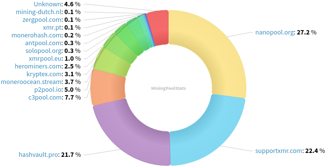
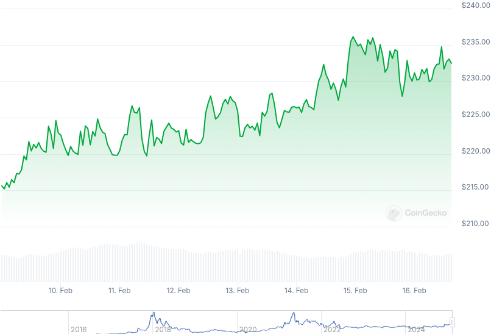

### Table of Contents:

- [Recent News](#news)
- [Upcoming Events](#events)
- [CCS Proposals](#proposals)
- [Price & Blockchain Stats](#stats)
- [Volunteer Opportunities](#volunteer)
- [Support](#support)

### Recent News {#news}

{}
Minimalist, unbloated Monero-only Android mobile wallet _Monfluo_, previously known as Mysu, released its first public release, Monfluo [v0.6.0](https://codeberg.org/acx/monfluo/releases/tag/0.6.0). You can check some screenshots in the repository. Feedback? Join the Matrix [room](https://matrix.to/#/%23monfluo%3Amonero.social?via=monero.social), or the SimpleX group [chat](https://simplex.chat/contact#/?v=2-7&smp=smp%3A%2F%2F1OwYGt-yqOfe2IyVHhxz3ohqo3aCCMjtB-8wn4X_aoY%3D%40smp11.simplex.im%2FA89PUHNXaCYLa48cSAWH5k8orgG1ebbt%23%2F%3Fv%3D1-3%26dh%3DMCowBQYDK2VuAyEAVG3M3jjFAELlA2zJtOMq--p1V0yfN252oglNp4ZR1wM%253D%26srv%3D6ioorbm6i3yxmuoezrhjk6f6qgkc4syabh7m3so74xunb5nzr4pwgfqd.onion&data=%7B%22groupLinkId%22%3A%22aSaW9b7I_yHrzvsstF-hYA%3D%3D%22%7D), which is also available via official SimpleX directory bot.
{}

{}
Another Monero-centric service was launched, meet [xmr.ax](https://xmr.ax/), a feeless Solana (SOL) to Monero (XMR) exchange, similar to defunct xmr.to from back in the days but instead of BTC, SOL. Comments? Check footer or jump in their SimpleX group [chat](https://simplex.name/rykqk97T).
{}

{}
Monero contributor rbrunner7 published a Reddit [thread](https://redlib.zaggy.nl/r/Monero/comments/1iph8fz/more_vitamins_for_monero_with_carrot_part_1/) going over the forthcoming XMR network upgrade and CARROT. Have a read!
{}

{}
Monero Talk published an X space recording for their episode 339. Douglas Tuman, John Bush, Stoic.XMR, BawdyAnarchist and others talk about whether or not the Monero community should engage in political activism to push for pro-privacy, pro-Monero policies in the U.S. Peep it: [Video](https://invidious.nikkosphere.com/watch?v=ekPWNF8smA8); [Audio](https://www.monerotalk.live/monerotalk-339).
{}

### Upcoming Events {#events}

{}
Monero Tech Meeting - [#no-wallet-left-behind](irc://irc.libera.chat/#no-wallet-left-behind) IRC channel; Matrix [room](https://matrix.to/#/#no-wallet-left-behind:monero.social).
{}

{}
Cuprate Workgroup Meeting - [#cuprate](irc://irc.libera.chat/#cuprate) IRC channel; Matrix [room](https://matrix.to/#/#cuprate:monero.social).
{}

{}
Research Lab Meeting - [#monero-research-lab](irc://irc.libera.chat/#monero-research-lab) IRC channel; Matrix [room](https://matrix.to/#/#monero-research-lab:monero.social).
{}

{}
MoneroKon 5 Meeting - [#monerokon](irc://irc.libera.chat/#monerokon) IRC channel; Matrix [room](https://matrix.to/#/#monerokon:matrix.org).
{}

### CCS Proposal Ideas {#proposals}

Below you can find some CCS proposal ideas open for discussion.

{}
Boog900 full time work on Cuprate (3 months) + January
{}

{}
Btcpayserver plugin
{}

{}
NoShore: Groundwork for on-the-go offline payments
{}

### CCS Proposals Need Funding

{}
monerotopia 2024 voiceovers and working on xmr.ru
{}

### Price & Blockchain Stats {#stats}

###### Blockchain Stats



###### XMR Blocks Distribution in last 1000 blocks

###### Price & Performance



###### XMR Price Graph

Sources: [miningpoolstats.stream](https://miningpoolstats.stream/monero); [bitinfocharts.com](https://bitinfocharts.com/monero/); [coingecko.com](https://www.coingecko.com/en/coins/monero); [localmonero.co blocks](https://localmonero.co/blocks); [haveno.markets](https://haveno.markets/).


{}
Anyone with moderate technical ability is encouraged to try to build and run Monero nightlies. Do not trust it with your Monero, but feel free to open an Issue on GitHub as problems arise. Instructions to build on your OS of choice can be found [here](https://github.com/monero-project/monero#compiling-monero-from-source). 
{}



