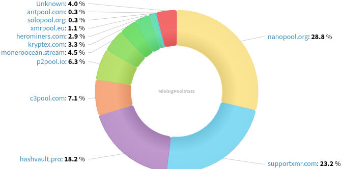
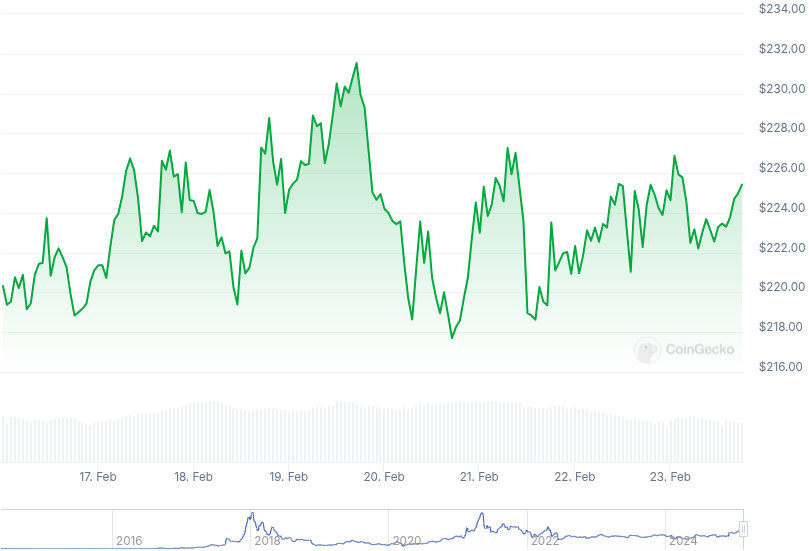

### Table of Contents:

- [Recent News](#news)
- [Upcoming Events](#events)
- [CCS Proposals](#proposals)
- [Price & Blockchain Stats](#stats)
- [Volunteer Opportunities](#volunteer)
- [Support](#support)

### Recent News {#news}

{}
Monero Research Lab contributor Rucknium has completed the 2nd milestone of his statistical CCS research [project](https://ccs.getmonero.org/proposals/Rucknium-Statistical-Research.html). Read all about it [here](https://repo.getmonero.org/monero-project/ccs-proposals/-/merge_requests/439#note_28789).
{}

{}
As well, Rucknium has released all OSPEAD documents and code after years of research. "The OSPEAD techniques suggest a new decoy distribution, which would reduce the average attack success probability to 7.6 percent, corresponding to an effective ring size of 13.2." OSPEAD [repository](https://github.com/Rucknium/OSPEAD); OSPEAD [docs](https://rucknium.github.io/OSPEAD/CCS-milestone-2/OSPEAD-docs/_book/). Reddit [thread](https://redlib.zaggy.nl/r/Monero/comments/1ivnef8/rucknium_has_published_ospead_findings_showing/).
{}

{}
Cake v4.23.2 and Monero.com v1.20.2 [released](https://github.com/cake-tech/cake_wallet/releases/tag/v4.23.2) with improvements for Zano; Ledger; Ethereum; and squashing away some bugs. Feedback? [Here](https://forum.cakewallet.com/)!
{}

{}
0xanon uploaded the _memonero_ [repository](https://codeberg.org/0xanon/memonero): "This script deterministically generates a Monero wallet from an argon2id hash of a text provided by the user. The exact same text will generate the exact same wallet, as long as you know what text you used, you can retrieve your wallet's seed with no additional information."
{}

### Upcoming Events {#events}

{}
Monero Tech Meeting - [#no-wallet-left-behind](irc://irc.libera.chat/#no-wallet-left-behind) IRC channel; Matrix [room](https://matrix.to/#/#no-wallet-left-behind:monero.social).
{}

{}
Cuprate Workgroup Meeting - [#cuprate](irc://irc.libera.chat/#cuprate) IRC channel; Matrix [room](https://matrix.to/#/#cuprate:monero.social).
{}

{}
Research Lab Meeting - [#monero-research-lab](irc://irc.libera.chat/#monero-research-lab) IRC channel; Matrix [room](https://matrix.to/#/#monero-research-lab:monero.social).
{}

{}
MoneroKon 5 Meeting - [#monerokon](irc://irc.libera.chat/#monerokon) IRC channel; Matrix [room](https://matrix.to/#/#monerokon:matrix.org).
{}

### CCS Proposal Ideas {#proposals}

Below you can find some CCS proposal ideas open for discussion.

{}
2025 Q1 Proposal
{}

{}
Btcpayserver plugin
{}

{}
full time work (3 months)
{}

### CCS Proposals Need Funding

{}
monerotopia 2024 voiceovers and working on xmr.ru
{}

### Price & Blockchain Stats {#stats}

###### Blockchain Stats



###### XMR Blocks Distribution in last 1000 blocks

###### Price & Performance



###### XMR Price Graph

Sources: [miningpoolstats.stream](https://miningpoolstats.stream/monero); [bitinfocharts.com](https://bitinfocharts.com/monero/); [coingecko.com](https://www.coingecko.com/en/coins/monero); [localmonero.co blocks](https://localmonero.co/blocks); [haveno.markets](https://haveno.markets/).


{}
Anyone with moderate technical ability is encouraged to try to build and run Monero nightlies. Do not trust it with your Monero, but feel free to open an Issue on GitHub as problems arise. Instructions to build on your OS of choice can be found [here](https://github.com/monero-project/monero#compiling-monero-from-source). 
{}



