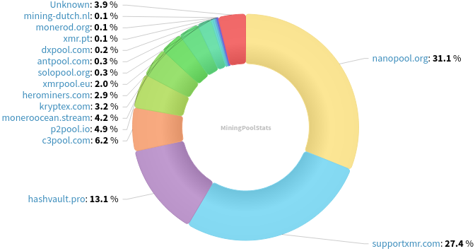
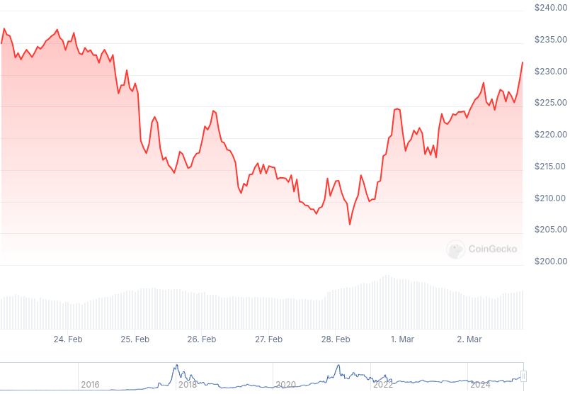

### Table of Contents:

- [Recent News](#news)
- [Upcoming Events](#events)
- [CCS Proposals](#proposals)
- [Price & Blockchain Stats](#stats)
- [Volunteer Opportunities](#volunteer)
- [Support](#support)

### Recent News {#news}

{}
P2Pool [v4.4](https://github.com/SChernykh/p2pool/releases/tag/v4.4), adding RPC-SSL support for Monero node connections; faster initial sync; and upgraded internal dependencies.
{}

{}
kerlannXmr on GitHub published the public [repository](https://github.com/kerlannXmr/EasyMonerod) of EasyNode Monero: *easy-to-make Monero node*, straightforward way to deploy a XMR node with interesting features, such as built-in Tor (both SSH and `.onion` address for remote access.)
{}

{}
xenumonero released a video [tutorial](https://iv.0x7c0.com/watch?v=69HYv21ctKU) on how to run an optimized `.onion` Monero node along with a `bitmonerod.conf` open-source configuration [file](https://github.com/xenumonero/Attack-of-the-Poisoned-Outputs/blob/main/bitmonero.conf). [Odysee](https://lbry.ramondia.net/@anti_moonboy:7/AOTPO28:f). Make sure to check and subscribe his YouTube [channel](https://iv.0x7c0.com/channel/UCiOpJdeI87TBu8FJNgRdUVA), as he keeps releasing content constantly of late!
{}

{}
[Monero Observer Blitz #39](https://monero.observer/monero-observer-blitz-february-2025/) - February 2025.
{}

### Upcoming Events {#events}

{}
Monero Tech Meeting - [#no-wallet-left-behind](irc://irc.libera.chat/#no-wallet-left-behind) IRC channel; Matrix [room](https://matrix.to/#/#no-wallet-left-behind:monero.social).
{}

{}
Cuprate Workgroup Meeting - [#cuprate](irc://irc.libera.chat/#cuprate) IRC channel; Matrix [room](https://matrix.to/#/#cuprate:monero.social).
{}

{}
Research Lab Meeting - [#monero-research-lab](irc://irc.libera.chat/#monero-research-lab) IRC channel; Matrix [room](https://matrix.to/#/#monero-research-lab:monero.social).
{}

{}
MoneroKon 5 Meeting - [#monerokon](irc://irc.libera.chat/#monerokon) IRC channel; Matrix [room](https://matrix.to/#/#monerokon:matrix.org).
{}

### CCS Proposal Ideas {#proposals}

Below you can find some CCS proposal ideas open for discussion.

{}
Monero Browser Wallet
{}

{}
Monfluo maintenance and further development (3 months)
{}

{}
CCS Coordinator
{}

### CCS Proposals Need Funding

{}
monerotopia 2024 voiceovers and working on xmr.ru
{}

### Price & Blockchain Stats {#stats}

###### Blockchain Stats



###### XMR Blocks Distribution in last 1000 blocks

###### Price & Performance



###### XMR Price Graph

Sources: [miningpoolstats.stream](https://miningpoolstats.stream/monero); [bitinfocharts.com](https://bitinfocharts.com/monero/); [coingecko.com](https://www.coingecko.com/en/coins/monero); [localmonero.co blocks](https://localmonero.co/blocks); [haveno.markets](https://haveno.markets/).


{}
Anyone with moderate technical ability is encouraged to try to build and run Monero nightlies. Do not trust it with your Monero, but feel free to open an Issue on GitHub as problems arise. Instructions to build on your OS of choice can be found [here](https://github.com/monero-project/monero#compiling-monero-from-source). 
{}



