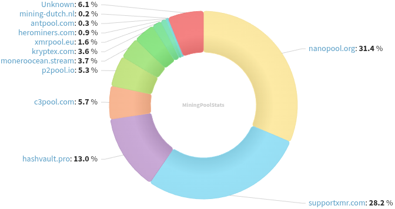
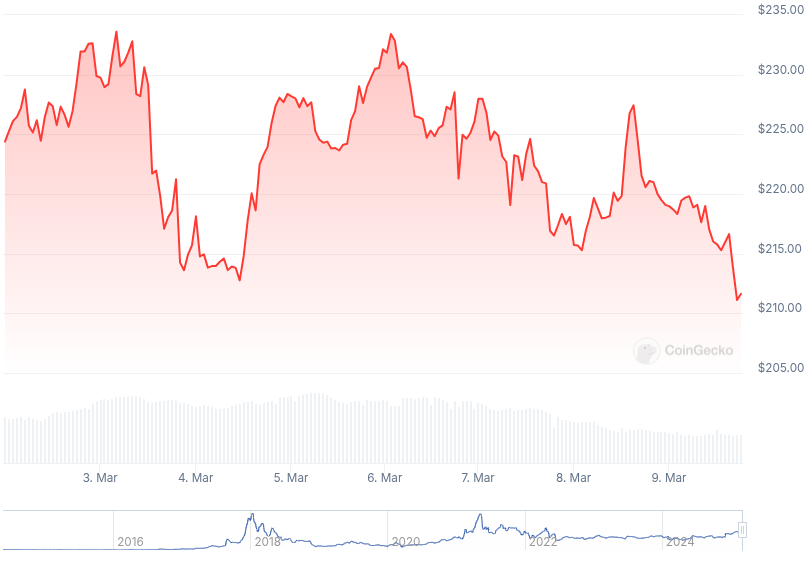

### Table of Contents:

- [Recent News](#news)
- [Upcoming Events](#events)
- [CCS Proposals](#proposals)
- [Price & Blockchain Stats](#stats)
- [Volunteer Opportunities](#volunteer)
- [Support](#support)

### Recent News {#news}

{}
Cake v4.23.3 and Monero.com v1.20.3 [Beta] [released](https://github.com/cake-tech/cake_wallet/releases/tag/v4.23.3) with UI enhancements and QoL improvements; bugs squashed away. How to join the testers [group](https://forum.cakewallet.com/t/how-to-join-beta-testing/13). Feedback? [Here](https://forum.cakewallet.com/t/v4-23-0-beta-testing/87)!
{}

{}
monerod-GUI [v1.2.0](https://github.com/everoddandeven/monerod-gui/releases/tag/v1.2.0-1) with Tor and I2P service; UI fixes and improvements; and upgrade of dependencies.
{}

{}
Automatically create a public Monero node that supports HTTPS and Tor with the following bash [scripts](https://github.com/John-Doggett/Monerod-Node-Setup-Scripts) by John-Doggett. [v0.4.0](https://github.com/John-Doggett/Monerod-Node-Setup-Scripts/releases/tag/v0.4.0).
{}

{}
Monero contributor rbrunner7 published a continuation, part 2 Reddit [thread](https://redlib.zaggy.nl/r/Monero/comments/1j745kf/more_vitamins_for_monero_with_carrot_part_2) with a chronological breakdown of all the different Monero privacy-enhancing technologies implemented on mainnet over the years, up to forthcoming CARROT. Definitely a *must-read* for the week!
{}

{}
Reddit user xmeowyz launched a new design initiative for Monero, [fud.agency](https://fud.agency/) making an open call for designers, developers, illustrators, or just people passionate about XMR and good design sensibility to reach out. [Thread](https://redlib.zaggy.nl/r/Monero/comments/1j645cb/launching_a_new_design_initiative_for_monero/); X [profile](https://nitter.net/xmeowyz).
{}

{}
**[!!]** *New service, tread with caution!* Reddit user PyLeeT announced the first true Monero casino, [xmr.gg](https://xmr.gg/), a supposedly fairly provable Monero-native gambling website. Per one of their administrators, all games are generated using the EOS blockchain. [Thread](https://redlib.zaggy.nl/r/Monero/comments/1j5oak0/we_could_never_find_a_true_monero_casino_so_we/). Recent incident [report](https://nitter.net/xmr_gg/status/1898745654991876464).
{}

{}
**[!!]** *New service, tread with caution!* [Bitania](https://bitania.to) was recently listed on _monerica.com_ directory (not a stamp of approval.) Bitania is a LocalMonero alternative that currently supports: BTC; LTC; and XMR. Zero-deposit sell ads; JavaScript-free; Tor onion service; Telegram notifications; and more. Telegram group [chat](https://t.me/+S5b9NPNbZ4YwZDFh).
{}

### Upcoming Events {#events}

{}
Monero Tech Meeting - [#no-wallet-left-behind](irc://irc.libera.chat/#no-wallet-left-behind) IRC channel; Matrix [room](https://matrix.to/#/#no-wallet-left-behind:monero.social).
{}

{}
Cuprate Workgroup Meeting - [#cuprate](irc://irc.libera.chat/#cuprate) IRC channel; Matrix [room](https://matrix.to/#/#cuprate:monero.social).
{}

{}
Research Lab Meeting - [#monero-research-lab](irc://irc.libera.chat/#monero-research-lab) IRC channel; Matrix [room](https://matrix.to/#/#monero-research-lab:monero.social).
{}

{}
MoneroKon 5 Meeting - [#monerokon](irc://irc.libera.chat/#monerokon) IRC channel; Matrix [room](https://matrix.to/#/#monerokon:matrix.org).
{}

### CCS Proposal Ideas {#proposals}

Below you can find some CCS proposal ideas open for discussion.

{}
Cuprate Arti integration and development (2 months)
{}

{}
Monfluo maintenance and further development (3 months)
{}

{}
Monero contract system
{}

### CCS Proposals Need Funding

{}
monerotopia 2024 voiceovers and working on xmr.ru
{}

### Price & Blockchain Stats {#stats}

###### Blockchain Stats



###### XMR Blocks Distribution in last 1000 blocks

###### Price & Performance



###### XMR Price Graph

Sources: [miningpoolstats.stream](https://miningpoolstats.stream/monero); [bitinfocharts.com](https://bitinfocharts.com/monero/); [coingecko.com](https://www.coingecko.com/en/coins/monero); [localmonero.co blocks](https://localmonero.co/blocks); [haveno.markets](https://haveno.markets/).


{}
Anyone with moderate technical ability is encouraged to try to build and run Monero nightlies. Do not trust it with your Monero, but feel free to open an Issue on GitHub as problems arise. Instructions to build on your OS of choice can be found [here](https://github.com/monero-project/monero#compiling-monero-from-source). 
{}



