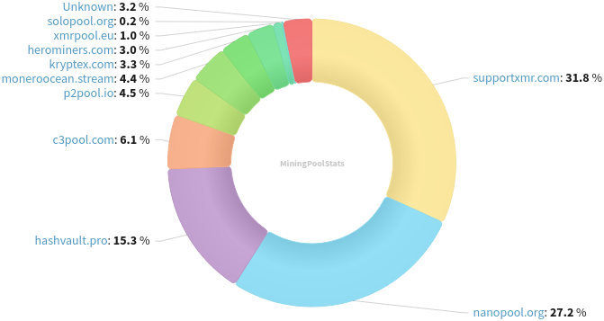
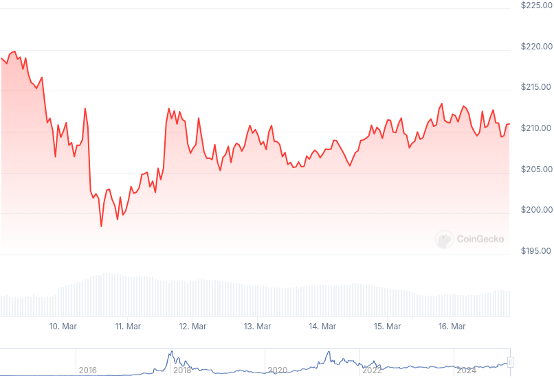

### Table of Contents:

- [Recent News](#news)
- [Upcoming Events](#events)
- [CCS Proposals](#proposals)
- [Price & Blockchain Stats](#stats)
- [Volunteer Opportunities](#volunteer)
- [Support](#support)

### Recent News {#news}

{}
Cuprate [v0.0.1](https://github.com/Cuprate/cuprate/releases/tag/cuprated-0.0.1). Cuprate is an alternative and independent Monero node implementation that is focused on being fast, user-friendly, and backwards compatible with monerod. User [book](https://user.cuprate.org/). Reddit [thread](https://redlib.zaggy.nl/r/Monero/comments/1j9k1n8/cuprate_v001_released/).
{}

{}
MAGIC Grants made Monero, Arti and I2P available for TrueNAS Scale. Blog [post](https://magicgrants.org/2025/03/11/truenas-monero-arti-i2p.html). Reddit [thread](https://redlib.zaggy.nl/r/Monero/comments/1j8yi70/monero_arti_and_i2p_apps_for_truenas_scale/).
{}

{}
Monero core team member ArticMine was on *The Crypto Show* with Duke Leto to talk about recent Rucknium's findings with OSPEAD, dissect whether it is a privacy disaster or FUD. Peep it: [video](https://iv.0x7c0.com/watch?v=YPrtBgIcKgU). Duke's blog [post](https://duke.hush.is/memos/6/) with some comments and recommendations.
{}

{}
Monero Talk chatted with Sean Bradford to talk about privacy-focused marketing initiatives; Christiniaty; Monero; and much more. Peep it: [Video](https://iv.0x7c0.com/watch?v=c7Wd3APP38U); [Audio](https://www.monerotalk.live/monerotalk-343).
{}

### Upcoming Events {#events}

{}
Monero Tech Meeting - [#no-wallet-left-behind](irc://irc.libera.chat/#no-wallet-left-behind) IRC channel; Matrix [room](https://matrix.to/#/#no-wallet-left-behind:monero.social).
{}

{}
Cuprate Workgroup Meeting - [#cuprate](irc://irc.libera.chat/#cuprate) IRC channel; Matrix [room](https://matrix.to/#/#cuprate:monero.social).
{}

{}
Research Lab Meeting - [#monero-research-lab](irc://irc.libera.chat/#monero-research-lab) IRC channel; Matrix [room](https://matrix.to/#/#monero-research-lab:monero.social).
{}

{}
MoneroKon 5 Meeting - [#monerokon](irc://irc.libera.chat/#monerokon) IRC channel; Matrix [room](https://matrix.to/#/#monerokon:matrix.org).
{}

### CCS Proposal Ideas {#proposals}

Below you can find some CCS proposal ideas open for discussion.

{}
CCS Coordinator
{}

{}
Monfluo maintenance and further development (3 months)
{}

{}
Monero Browser Wallet
{}

### CCS Proposals Need Funding

{}
monerotopia 2024 voiceovers and working on xmr.ru
{}

### Price & Blockchain Stats {#stats}

###### Blockchain Stats



###### XMR Blocks Distribution in last 1000 blocks

###### Price & Performance



###### XMR Price Graph

Sources: [miningpoolstats.stream](https://miningpoolstats.stream/monero); [bitinfocharts.com](https://bitinfocharts.com/monero/); [coingecko.com](https://www.coingecko.com/en/coins/monero); [localmonero.co blocks](https://localmonero.co/blocks); [haveno.markets](https://haveno.markets/).


{}
Anyone with moderate technical ability is encouraged to try to build and run Monero nightlies. Do not trust it with your Monero, but feel free to open an Issue on GitHub as problems arise. Instructions to build on your OS of choice can be found [here](https://github.com/monero-project/monero#compiling-monero-from-source). 
{}



