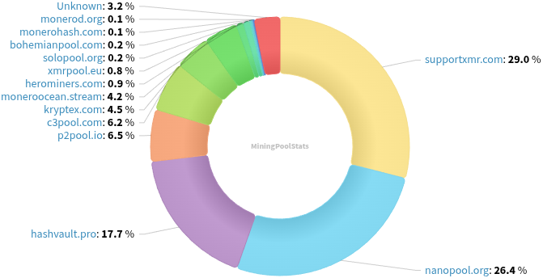
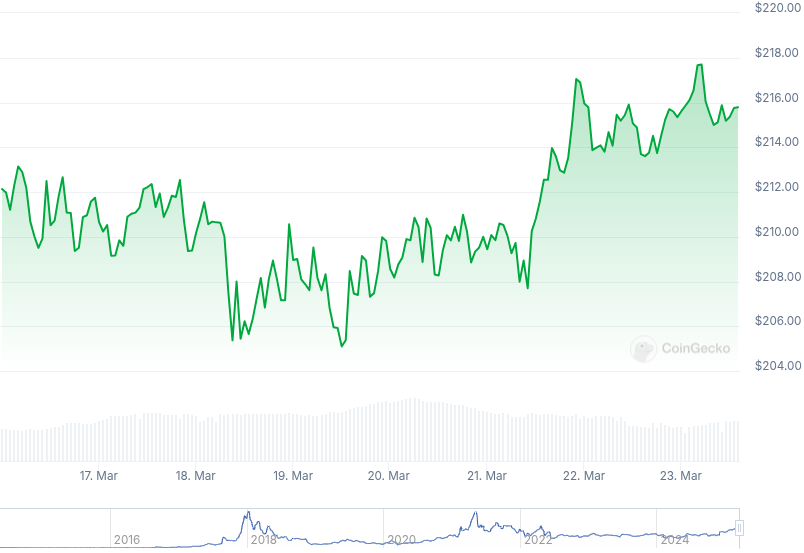

### Table of Contents:

- [Recent News](#news)
- [Upcoming Events](#events)
- [CCS Proposals](#proposals)
- [Price & Blockchain Stats](#stats)
- [Volunteer Opportunities](#volunteer)
- [Support](#support)

### Recent News {#news}

{}
XMR Remote Nodes [v0.2.1](https://github.com/ditatompel/xmr-remote-nodes/releases/tag/v0.2.1): a tool that helps you monitor your favourite Monero remote nodes by ditatompel. [xmr.ditatompel](https://xmr.ditatompel.com/).
{}

{}
ANON Wallet v1.0 [Alpha]. Downloads: [.onion](http://anonero5wmhraxqsvzq2ncgptq6gq45qoto6fnkfwughfl4gbt44swad.onion/#download); Tor-only F-Droid [repository](http://anonero5wmhraxqsvzq2ncgptq6gq45qoto6fnkfwughfl4gbt44swad.onion/fdroid/repo/). [Changelog](https://repo.getmonero.org/monero-project/ccs-proposals/-/merge_requests/447#note_29268).
{}

{}
New open source* cryptocurrency swapping service, *CypherGoat* by 4rkal. *Note*: Only the CLI [tool](https://github.com/CypherGoat/cli) is open source, web repository is empty for now. [Website](https://cyphergoat.com/).
{}

{}
Monero Talk had Derrick Broze on to talk about his crowd-funded 17-part documentary series, *The Pyramid of Power*. They go over it was originally planned as a 2.5 hours long presentation in 2018 that has grown to its current length. Gain more insight into this dissection of the parts of the pyramid that aim to rule over and manipulate our lives! Peep it: [Video](https://iv.0x7c0.com/watch?v=tGRv4ZLSbHs); [Audio](https://www.monerotalk.live/monerotalk-344). Kuno [fundraiser](https://kuno.anne.media/fundraiser/hqlc/).
{}

### Upcoming Events {#events}

{}
Monero Tech Meeting - [#no-wallet-left-behind](irc://irc.libera.chat/#no-wallet-left-behind) IRC channel; Matrix [room](https://matrix.to/#/#no-wallet-left-behind:monero.social).
{}

{}
Cuprate Workgroup Meeting - [#cuprate](irc://irc.libera.chat/#cuprate) IRC channel; Matrix [room](https://matrix.to/#/#cuprate:monero.social).
{}

{}
Research Lab Meeting - [#monero-research-lab](irc://irc.libera.chat/#monero-research-lab) IRC channel; Matrix [room](https://matrix.to/#/#monero-research-lab:monero.social).
{}

{}
MoneroKon 5 Meeting - [#monerokon](irc://irc.libera.chat/#monerokon) IRC channel; Matrix [room](https://matrix.to/#/#monerokon:matrix.org).
{}

### CCS Proposal Ideas {#proposals}

{}
Revuo Monero Maintenance (2025 Q2)
{}

{}
Monfluo maintenance and further development (3 months)
{}

{}
Btcpayserver plugin
{}

### CCS Proposals Need Funding

{}
part-time monero development (3 months) (16)
{}

{}
Cuprate Arti integration and development (2 months)
{}

{}
CCS Coordinator
{}

### Price & Blockchain Stats {#stats}

###### Blockchain Stats



###### XMR Blocks Distribution in last 1000 blocks

###### Price & Performance



###### XMR Price Graph

Sources: [miningpoolstats.stream](https://miningpoolstats.stream/monero); [bitinfocharts.com](https://bitinfocharts.com/monero/); [coingecko.com](https://www.coingecko.com/en/coins/monero); [localmonero.co blocks](https://localmonero.co/blocks); [haveno.markets](https://haveno.markets/).


{}
Anyone with moderate technical ability is encouraged to try to build and run Monero nightlies. Do not trust it with your Monero, but feel free to open an Issue on GitHub as problems arise. Instructions to build on your OS of choice can be found [here](https://github.com/monero-project/monero#compiling-monero-from-source). 
{}



