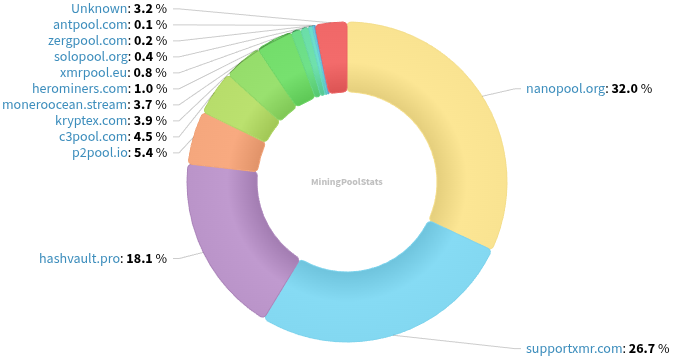
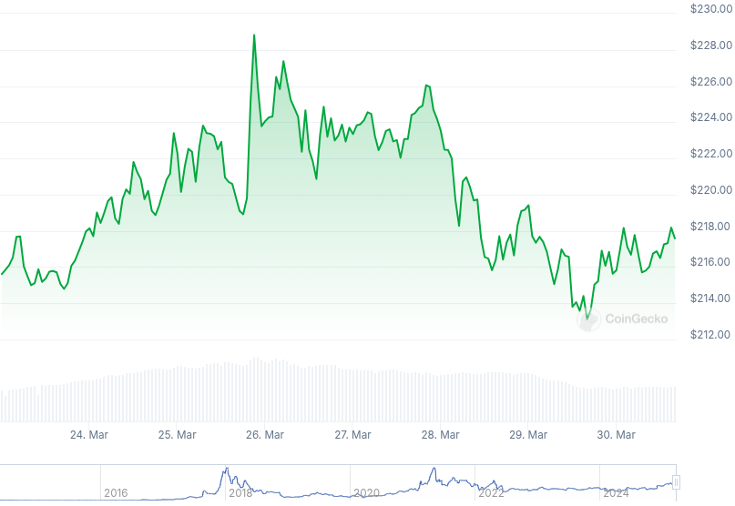

### Table of Contents:

- [Recent News](#news)
- [Upcoming Events](#events)
- [CCS Proposals](#proposals)
- [Price & Blockchain Stats](#stats)
- [Volunteer Opportunities](#volunteer)
- [Support](#support)

### Recent News {#news}

{}
Monero 0.18.4.0 'Fluorine Fermi' Release has been [tagged](https://github.com/monero-project/monero/releases/tag/v0.18.4.0). Binaries and blog post containing release notes, A.K.A. changelog, to be expected in the next few days. Reach out to your preferred node operators and wallet developers in the meantime!
{}

{}
Community members mondetta and Schmidt1024 launched [monero.eco](https://monero.eco/): a map or graph of Monero Ecosystem that aims to provide a visual overview, with web links to relevant XMR projects and services. [Repository](https://gitea.pro/schmidt1024/monero-ecosystem).
{}

{}
MRL contributor Rucknium wrote a gist with a simulation of the risk of OSPEAD DSA deployment without a hard fork. Preliminary results are found [here](https://gist.github.com/Rucknium/fb638bcb72d475eeee58757f754acbee). A newer, more fine-tuned estimate is to be expected in the forthcoming weeks.
{}

{}
Feather Wallet [v2.8.0](https://featherwallet.org/changelog/) with a slew of UI/UX enhancements; dependencies upgrades; and Monero v0.18.4.0. [Download](https://featherwallet.org/download/).
{}

{}
Cake v4.24.0 and Monero.com v1.21.0 [released](https://github.com/cake-tech/cake_wallet/releases/tag/v4.24.0) with Monero background sync (Android-only for now) and various UI enhancements, fixes. Feedback? [Here](https://forum.cakewallet.com/t/cake-wallet-introduces-decred-and-new-background-sync-for-monero-v4-24-0/151). Reddit [thread](https://redlib.zaggy.nl/r/Monero/comments/1jjplhe/cake_wallet_v4240_introduces_new_background_sync/).
{}

{}
Recently launched Monero casino website xmr.gg enters maintainance mode for 4-7 weeks. Read the full announcement [here](https://xmr.gg/read-me).
{}

{}
Monero Talk had XMRFamily on to talk about his experience as a peer-to-peer trader on LocalMonero, legal issues and potential arrests of traders. They talk about Haveno's volume; MAGIC Grants; and much more. Peep it: [Video](https://iv.0x7c0.com/watch?v=UasxQiesdUo); [Audio](https://www.monerotalk.live/monerotalk-345). Kuno [fundraiser](https://kuno.anne.media/fundraiser/hqlc/).
{}

### Upcoming Events {#events}

{}
Monero Tech Meeting - [#no-wallet-left-behind](irc://irc.libera.chat/#no-wallet-left-behind) IRC channel; Matrix [room](https://matrix.to/#/#no-wallet-left-behind:monero.social).
{}

{}
Cuprate Workgroup Meeting - [#cuprate](irc://irc.libera.chat/#cuprate) IRC channel; Matrix [room](https://matrix.to/#/#cuprate:monero.social).
{}

{}
Research Lab Meeting - [#monero-research-lab](irc://irc.libera.chat/#monero-research-lab) IRC channel; Matrix [room](https://matrix.to/#/#monero-research-lab:monero.social).
{}

{}
MoneroKon 5 Meeting - [#monerokon](irc://irc.libera.chat/#monerokon) IRC channel; Matrix [room](https://matrix.to/#/#monerokon:matrix.org).
{}

### CCS Proposal Ideas {#proposals}

Below you can find some CCS proposal ideas open for discussion.

{}
Monero Browser Wallet
{}

{}
Btcpayserver plugin
{}

### CCS Proposals Need Funding

{}
Revuo Monero maintenance (2025 Q2)
{}

### Price & Blockchain Stats {#stats}

###### Blockchain Stats



###### XMR Blocks Distribution in last 1000 blocks

###### Price & Performance



###### XMR Price Graph

Sources: [miningpoolstats.stream](https://miningpoolstats.stream/monero); [bitinfocharts.com](https://bitinfocharts.com/monero/); [coingecko.com](https://www.coingecko.com/en/coins/monero); [localmonero.co blocks](https://localmonero.co/blocks); [haveno.markets](https://haveno.markets/).


{}
Anyone with moderate technical ability is encouraged to try to build and run Monero nightlies. Do not trust it with your Monero, but feel free to open an Issue on GitHub as problems arise. Instructions to build on your OS of choice can be found [here](https://github.com/monero-project/monero#compiling-monero-from-source). 
{}



