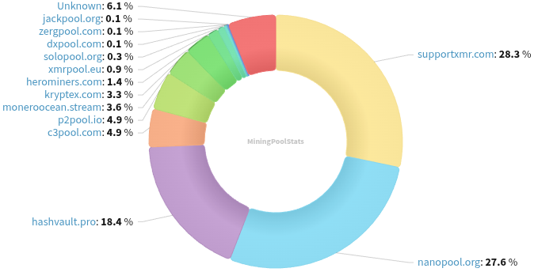
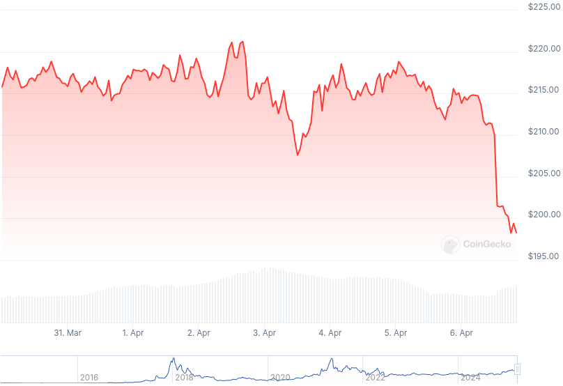

### Table of Contents:

- [Recent News](#news)
- [Upcoming Events](#events)
- [CCS Proposals](#proposals)
- [Price & Blockchain Stats](#stats)
- [Volunteer Opportunities](#volunteer)
- [Support](#support)

### Recent News {#news}

{}
Monero 0.18.4.0 'Fluorine Fermi' binaries are out. Peep their changelogs in their respective blog posts. [Command-Line Interface](https://www.getmonero.org/2025/04/05/monero-0.18.4.0-released.html); [Graphical User Interface](https://www.getmonero.org/2025/04/05/monero-GUI-0.18.4.0-released.html). Goes without saying, remember to verify hashes! Instructions in blog posts.
{}

{}
RetoSwap founder and administrator *TintedBrief* shared a pretty good number for their Haveno DEX instance, corresponding to March's volume on it: "We did ~24.9k XMR in volume in March, a 283.67% growth compared to February."
{}

{}
While we are talking about RetoSwap, did you know that people who want a faster Tor network connection while operating on the DEX, can run this [script](https://bin.nora.codes/p/l3LQVs.txt) to externally run Tor (need to install Tor on local system; command varies per operating system person happens to be working with). RetoSwap video [tutorial](https://iv.0x7c0.com/watch?v=M-C2idComHo) by Sovereign Syndicate.
{}

{}
Cake v4.25.0 and Monero.com v4.25.0 [released](https://github.com/cake-tech/cake_wallet/releases/tag/v4.25.0) with new application logo; UI enhancements and QoL improvements; performance improvements; and more. How to join the testers [group](https://forum.cakewallet.com/t/how-to-join-beta-testing/13).
{}

{}
Reddit user sukunetsiz released *Kabus*: open-source Monero marketplace script with walletless escrow. GitHub [repository](https://github.com/sukunetsiz/kabus).
{}

{}
Reddit user MoneroFox is calling for another MoneroRun this year, during the forthcoming XMR's eleventh (11th) birthday, on April 18th. Reddit [thread](https://redlib.zaggy.nl/r/Monero/comments/1jpo2f6/monerorun_on_april_18th_public_audit_of_xmr/).
{}

{}
Gambling with XMR? Another site to try your luck with Monero was announced recently, meet [monero.win](https://monero.win/). Reddit [thread](https://redlib.zaggy.nl/r/Monero/comments/1jss6ix/monerowin_minimal_accountless_xmr_casino_now_with/).
{}

{}
New cryptocurrency exchange aggregator has open sourced their web user interface and made available a Tor onion service. [Repository](https://github.com/CypherGoat/web); [.onion](http://cyphergmw4huw7jzhat3misfm5jj2m4nvafockqbj7i5rrlec6mobdid.onion/).
{}

{}
Monero Talk chatted with Joseph "the parrot" to talk about the intersection between 3D-printed guns and cryptocurrency privacy; FGC-9 and his improvements over JStark's FGC-9 model; and his upcoming MoneroKon talk. Peep it: [Video](https://iv.0x7c0.com/watch?v=9hPSiXN8yQE); [Audio](https://www.monerotalk.live/monerotalk-346). Kuno [fundraiser](https://kuno.anne.media/fundraiser/f01t/).
{}

### Upcoming Events {#events}

{}
Monero Tech Meeting - [#no-wallet-left-behind](irc://irc.libera.chat/#no-wallet-left-behind) IRC channel; Matrix [room](https://matrix.to/#/#no-wallet-left-behind:monero.social).
{}

{}
Cuprate Workgroup Meeting - [#cuprate](irc://irc.libera.chat/#cuprate) IRC channel; Matrix [room](https://matrix.to/#/#cuprate:monero.social).
{}

{}
Research Lab Meeting - [#monero-research-lab](irc://irc.libera.chat/#monero-research-lab) IRC channel; Matrix [room](https://matrix.to/#/#monero-research-lab:monero.social).
{}

{}
MoneroKon 5 Meeting - [#monerokon](irc://irc.libera.chat/#monerokon) IRC channel; Matrix [room](https://matrix.to/#/#monerokon:matrix.org).
{}

### CCS Proposal Ideas {#proposals}

Below you can find some CCS proposal ideas open for discussion.

{}
full-time feather + core development (3 months)
{}

{}
Haveno iOS and Android App
{}

{}
Btcpayserver plugin
{}

### CCS Proposals Need Funding

{}

### Price & Blockchain Stats {#stats}

###### Blockchain Stats



###### XMR Blocks Distribution in last 1000 blocks

###### Price & Performance



###### XMR Price Graph

Sources: [miningpoolstats.stream](https://miningpoolstats.stream/monero); [bitinfocharts.com](https://bitinfocharts.com/monero/); [coingecko.com](https://www.coingecko.com/en/coins/monero); [localmonero.co blocks](https://localmonero.co/blocks); [haveno.markets](https://haveno.markets/).


{}
Anyone with moderate technical ability is encouraged to try to build and run Monero nightlies. Do not trust it with your Monero, but feel free to open an Issue on GitHub as problems arise. Instructions to build on your OS of choice can be found [here](https://github.com/monero-project/monero#compiling-monero-from-source). 
{}



