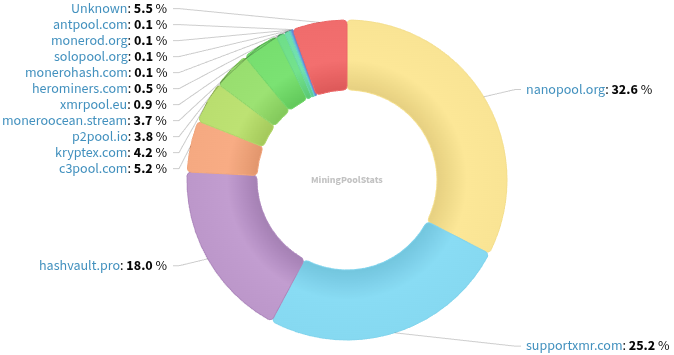

### Table of Contents:

- [Recent News](#news)
- [Upcoming Events](#events)
- [CCS Proposals](#proposals)
- [Price & Blockchain Stats](#stats)
- [Volunteer Opportunities](#volunteer)
- [Support](#support)

### Recent News {#news}

{}
FCMP++ Optimization Competition is live! Find rules; prizes; and more on [getmonero.org](https://www.getmonero.org/2025/04/05/fcmp++-contest.html). Guess what? They start accepting submissions... today, April 28th, through June 30th. Spread the word, turn in your submission.
{}

{}
Monfluo [v0.7.0](https://codeberg.org/acx/monfluo/releases/tag/0.7.0) with stability improvements; tap-to-hide balance (A.K.A. street mode); new logo; sync status and txs. status notifications; and more. F-Droid [repository](https://fdroid.monfluo.org/fdroid/repo/).
{}

{}
Reddit user atsamd21 teased a Work-In-Progress Haveno (Android) mobile application. Reddit [thread](https://redlib.zaggy.nl/r/Monero/comments/1jws0e4/haveno_mobile/); GitHub [repository](https://github.com/atsamd21/Haveno-app).
{}

{}
RetoSwap [v1.1.1](https://github.com/retoaccess1/haveno-reto/releases/tag/1.1.1) with user experience enhancements; bug fixes; and more.
{}

{}
Stack Wallet [v2.1.11](https://github.com/cypherstack/stack_wallet/releases/tag/build_265).
{}

{}
Reddit user Techtoshi shared a new web tool to create a valid OA1 TXT record for any given domain. Web [tool](https://cyphertoshi.com/openalias-generator/); Reddit [thread](https://redlib.zaggy.nl/r/Monero/comments/1jzktvy/i_made_a_simple_openalias_generator_tool/); GitHub [repository](https://github.com/Tech1k/OpenAliasGenerator).
{}

{}
Cake v4.27.0 and Monero.com v4.27.0 [released](https://github.com/cake-tech/cake_wallet/releases/tag/v4.27.0) with substantial background sync improvements; settings to have background sync feature work Wi-Fi only, charging only, among others; incoming and outgoing txs. status notifications; and more. How to join the testers [group](https://forum.cakewallet.com/t/how-to-join-beta-testing/13).
{}

{}
MAGIC Grants cryptocurrency scholarship applications are open! Undergraduate students are encouraged to apply by July 14, 2025. Details and how to apply [here](https://magicgrants.org/scholarships/scholarship-application/).
{}

{}
Monero Talk brought Seth For Privacy on to talk about Monero's 11th birthday; a walk through recent Cake Wallet's newly introduced features and improvements; FCMP++ schedule for mainnet; and more. Peep it: [Video](https://i.iii.st/watch?v=xW1ifKvI_yk); [Audio](https://www.monerotalk.live/monerotalk-348).
{}

### Upcoming Events {#events}

{}
Cuprate Workgroup Meeting - [#cuprate](irc://irc.libera.chat/#cuprate) IRC channel; Matrix [room](https://matrix.to/#/#cuprate:monero.social).
{}

{}
Research Lab Meeting - [#monero-research-lab](irc://irc.libera.chat/#monero-research-lab) IRC channel; Matrix [room](https://matrix.to/#/#monero-research-lab:monero.social).
{}

{}
MoneroKon 5 Meeting - [#monerokon](irc://irc.libera.chat/#monerokon) IRC channel; Matrix [room](https://matrix.to/#/#monerokon:matrix.org).
{}

### CCS Proposal Ideas {#proposals}

Below you can find some CCS proposal ideas open for discussion.

{}
Working at MoneroCN and Bilibili Video in the Q2 of 2025 
{}

{}
Haveno App (Cross Platform)
{}

### CCS Proposals Need Funding

{}
jeffro256 full-time development 2025Q2
{}

{}
Monero Browser Wallet
{}

{}
BTCPay Server Monero Plugin
{}

### Price & Blockchain Stats {#stats}

###### Blockchain Stats



###### XMR Blocks Distribution in last 1000 blocks

###### Price & Performance



###### XMR Price Graph

Sources: [miningpoolstats.stream](https://miningpoolstats.stream/monero); [bitinfocharts.com](https://bitinfocharts.com/monero/); [coingecko.com](https://www.coingecko.com/en/coins/monero); [localmonero.co blocks](https://localmonero.co/blocks); [haveno.markets](https://haveno.markets/).


{}
Anyone with moderate technical ability is encouraged to try to build and run Monero nightlies. Do not trust it with your Monero, but feel free to open an Issue on GitHub as problems arise. Instructions to build on your OS of choice can be found [here](https://github.com/monero-project/monero#compiling-monero-from-source). 
{}



