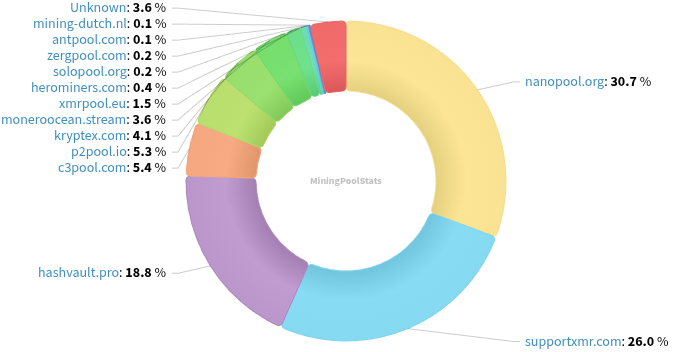
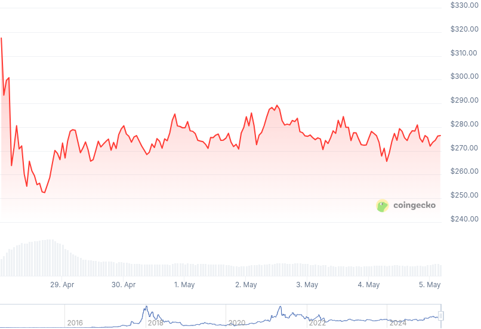

### Table of Contents:

- [Recent News](#news)
- [Upcoming Events](#events)
- [CCS Proposals](#proposals)
- [Price & Blockchain Stats](#stats)
- [Volunteer Opportunities](#volunteer)
- [Support](#support)

### Recent News {#news}

{}
Feather Wallet [v2.8.1](https://featherwallet.org/download/) with a slew of Quality of Life improvements; dependencies upgrades; and a small enhancement for Revuo's tab: a [separator](https://xcancel.com/rottenwheel1/status/1911450852746727881#m) between `News` and `Upcoming Events`. Full [changelog](https://featherwallet.org/changelog/).
{}

{}
Popular multi-coin wallet Exodus to drop XMR support on August 10, 2025. Exodus users are encouraged to import their Monero mnemonic seed into other wallets before then. Official [note](https://www.exodus.com/support/en/articles/10862085-what-should-i-do-with-my-monero-xmr-before-support-ends).
{}

{}
Monero Market to cease operations by May 14, 2025 at 00:00 UTC. X [announcement](https://nitter.net/monero_market/status/1917561427809952132); note on [site](https://moneromarket.io/). We hope to see you back around in the future!
{}

{}
P2Pool [v4.5](https://github.com/SChernykh/p2pool/releases/tag/v4.5) with a couple new features; and miscellaneous bug fixes; dependency upgrades.
{}

{}
[Monero Observer Blitz #41](https://monero.observer/monero-observer-blitz-april-2025/) - April 2025.
{}

### Upcoming Events {#events}

{}
Monero Tech Meeting - [#no-wallet-left-behind](irc://irc.libera.chat/#no-wallet-left-behind) IRC channel; Matrix [room](https://matrix.to/#/#no-wallet-left-behind:monero.social).
{}

{}
Cuprate Workgroup Meeting - [#cuprate](irc://irc.libera.chat/#cuprate) IRC channel; Matrix [room](https://matrix.to/#/#cuprate:monero.social).
{}

{}
Research Lab Meeting - [#monero-research-lab](irc://irc.libera.chat/#monero-research-lab) IRC channel; Matrix [room](https://matrix.to/#/#monero-research-lab:monero.social).
{}

{}
MoneroKon 5 Meeting - [#monerokon](irc://irc.libera.chat/#monerokon) IRC channel; Matrix [room](https://matrix.to/#/#monerokon:matrix.org).
{}

### CCS Proposal Ideas {#proposals}

Below you can find some CCS proposal ideas open for discussion.

{}
Haveno App (Cross Platform)
{}

### CCS Proposals Need Funding

{}
BTCPay Server Monero Plugin
{}

{}
Monero Browser Wallet
{}

### Price & Blockchain Stats {#stats}

###### Blockchain Stats



###### XMR Blocks Distribution in last 1000 blocks

###### Price & Performance



###### XMR Price Graph

Sources: [miningpoolstats.stream](https://miningpoolstats.stream/monero); [bitinfocharts.com](https://bitinfocharts.com/monero/); [coingecko.com](https://www.coingecko.com/en/coins/monero); [localmonero.co blocks](https://localmonero.co/blocks); [haveno.markets](https://haveno.markets/).


{}
Anyone with moderate technical ability is encouraged to try to build and run Monero nightlies. Do not trust it with your Monero, but feel free to open an Issue on GitHub as problems arise. Instructions to build on your OS of choice can be found [here](https://github.com/monero-project/monero#compiling-monero-from-source). 
{}



