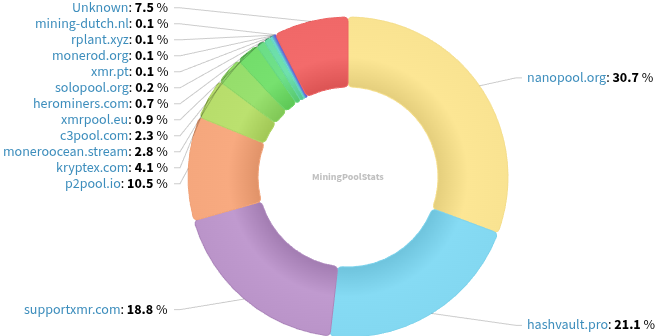
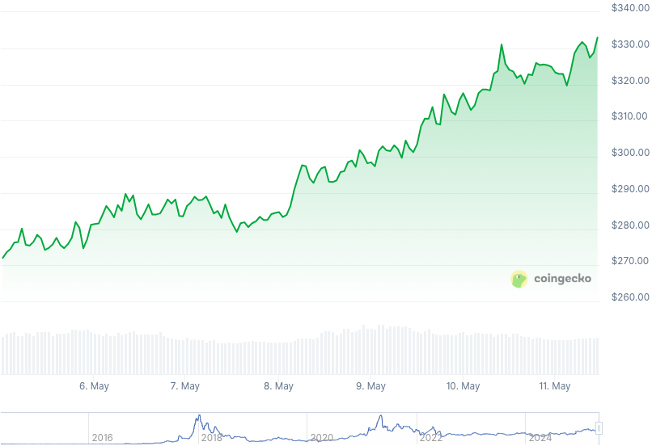

### Table of Contents:

- [Recent News](#news)
- [Upcoming Events](#events)
- [CCS Proposals](#proposals)
- [Price & Blockchain Stats](#stats)
- [Volunteer Opportunities](#volunteer)
- [Support](#support)

### Recent News {#news}

{}
New tutorial: How to convert Monero (XMR) to other cryptocurrencies using Haveno - RetoSwap. [.onion](http://blog.nowherejezfoltodf4jiyl6r56jnzintap5vyjlia7fkirfsnfizflqd.onion/opsec/haveno-crypto/index.html). In this case how to convert XMR to LTC is showcased, as an example.
{}

{}
A brand-new, slick Monero blockchain explorer called [monerowat.ch](https://monerowat.ch/) has joined the set of available, online tools to look at the XMR blocks and have some metrics along the way. It is **beta** and there's no public repository link on site, not open source for the time being.
{}

{}
Cuprate [v0.3.0](https://github.com/Cuprate/cuprate/releases/tag/cuprated-0.0.3) with a few bug fixes and new features included. Reddit [thread](https://redlib.zaggy.nl/r/Monero/comments/1khbfm2/cuprate_v003_released).
{}

{}
Seth for Privacy and Max spoke together for Monero Monthly 05. Some of the topics: Cake Wallet new releases and features; XMR's 11th birthday; Exodus removing XMR support later this year; and much more. [Audio](https://serve.podhome.fm/episodepage/ugmf/stolen-funds-shutdowns-monero-monthly-05). Ungovernable Misfits [podcast](https://www.ungovernablemisfits.com/).
{}

{}
Monero Talk brought both Riccardo Spagni (fluffypony) and Naveen Jain, ex-maintainer of Monero and co-founders of Tari, to talk about Tari going mainnet; highlighting user-friendliness and accesibility for end users via Tari universe; merge mining with XMR making it break new all-time highs; and more. Peep it: [Video](https://nyc1.iv.ggtyler.dev/watch?v=E1nc3b5c7NE); [Audio](https://www.monerotalk.live/monerotalk-350).
{}

### Upcoming Events {#events}

{}
Monero Tech Meeting - [#no-wallet-left-behind](irc://irc.libera.chat/#no-wallet-left-behind) IRC channel; Matrix [room](https://matrix.to/#/#no-wallet-left-behind:monero.social).
{}

{}
Cuprate Workgroup Meeting - [#cuprate](irc://irc.libera.chat/#cuprate) IRC channel; Matrix [room](https://matrix.to/#/#cuprate:monero.social).
{}

{}
Research Lab Meeting - [#monero-research-lab](irc://irc.libera.chat/#monero-research-lab) IRC channel; Matrix [room](https://matrix.to/#/#monero-research-lab:monero.social).
{}

{}
MoneroKon 5 Meeting - [#monerokon](irc://irc.libera.chat/#monerokon) IRC channel; Matrix [room](https://matrix.to/#/#monerokon:matrix.org).
{}

### CCS Proposal Ideas {#proposals}

Below you can find some CCS proposal ideas open for discussion.

{}
Haveno App (Cross Platform)
{}

### CCS Proposals Need Funding

{}
BTCPay Server Monero Plugin
{}

{}
Monero Browser Wallet
{}

### Price & Blockchain Stats {#stats}

###### Blockchain Stats



###### XMR Blocks Distribution in last 1000 blocks

###### Price & Performance



###### XMR Price Graph

Sources: [miningpoolstats.stream](https://miningpoolstats.stream/monero); [bitinfocharts.com](https://bitinfocharts.com/monero/); [coingecko.com](https://www.coingecko.com/en/coins/monero); [localmonero.co blocks](https://localmonero.co/blocks); [haveno.markets](https://haveno.markets/).


{}
Anyone with moderate technical ability is encouraged to try to build and run Monero nightlies. Do not trust it with your Monero, but feel free to open an Issue on GitHub as problems arise. Instructions to build on your OS of choice can be found [here](https://github.com/monero-project/monero#compiling-monero-from-source). 
{}



