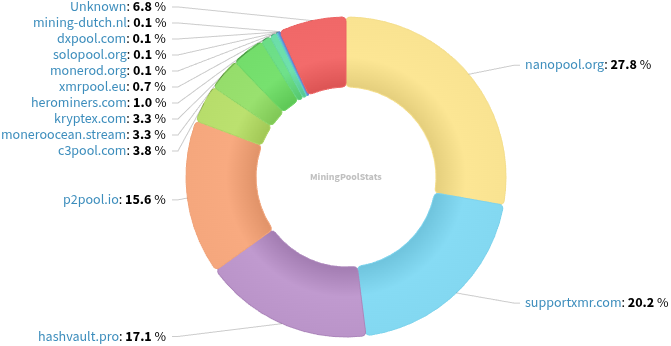

### Table of Contents:

- [Recent News](#news)
- [Upcoming Events](#events)
- [CCS Proposals](#proposals)
- [Price & Blockchain Stats](#stats)
- [Volunteer Opportunities](#volunteer)
- [Support](#support)

### Recent News {#news}

{}
P2Pool developer and long-standing Monero contributor sech1 posted a new Public Service Announcement on P2Pool donations and development of the mining software moving forward. Reddit [thread](https://redlib.zaggy.nl/r/MoneroMining/comments/1kkmm7r/psa_on_p2pool_donations_and_going_forward_with/). TL;DR if you aren't already merge mining Tari with v4.6 onwards, P2Pool will merge mine Tari and profits will fund P2Pool development and maintenance.
{}

{}
Gupaxx [v1.10.0](https://github.com/Cyrix126/gupaxx/releases/tag/v1.10.0), updating to P2Pool v4.5 and enabling support for brand-new P2Pool Nano [sidechain](https://xmrvsbeast.com/p2pool/sidechains.html). Reddit [thread](https://redlib.zaggy.nl/r/MoneroMining/comments/1kjpini/new_nano_p2pool_sidechain_for_mini_refugees/). *Note:* Expect a new release soon, upgrading to P2Pool v4.6.
{}

{}
P2Pool [v4.6](https://github.com/SChernykh/p2pool/releases/tag/v4.6) including the necessary changes for the donation and development PSA posted on Reddit; Tari merge mining support; and QoL fixes and improvements.
{}

{}
Cake v4.28.0 and Monero.com v4.28.0 ``[Beta]`` [released](https://github.com/cake-tech/cake_wallet/releases/tag/v4.28.0) with Bitcoin payjoin support; Monero enhancements; and QoL UI fixes, improvements. How to join the testers [group](https://forum.cakewallet.com/t/how-to-join-beta-testing/13).
{}

{}
The Monero network's total hashrate broke a new all-time-high reaching **5.03** GH/s yesterday, May 17th, 2025. You can see it for yourself by zooming into the last few weeks on Revuo Moneroj's [chart](https://moneroj.net/hashrate/). This may be partially justified with recent Tari mainnet launch, since they are merge mining XMR along the way.
{}

{}
Very impressive RetoSwap milestones reached and new things in place for everyone: no trading fees until end of year; exploding volume metrics; mobile application; and bi-weekly giveaways. Reddit [thread](https://redlib.zaggy.nl/r/Monero/comments/1knuw8s/big_retoswap_milestones_zero_fees_our_first/).
{}

{}
Monero Talk chatted with technical analyst NorthstarCharts, to talk about gold; Bitcoin; and Monero; much more. Peep it: [Video](https://inv.nadeko.net/watch?v=P82WBWCu3p0); [Audio](https://www.monerotalk.live/monerotalk-351).
{}

### Upcoming Events {#events}

{}
Monero Tech Meeting - [#no-wallet-left-behind](irc://irc.libera.chat/#no-wallet-left-behind) IRC channel; Matrix [room](https://matrix.to/#/#no-wallet-left-behind:monero.social).
{}

{}
Cuprate Workgroup Meeting - [#cuprate](irc://irc.libera.chat/#cuprate) IRC channel; Matrix [room](https://matrix.to/#/#cuprate:monero.social).
{}

{}
Research Lab Meeting - [#monero-research-lab](irc://irc.libera.chat/#monero-research-lab) IRC channel; Matrix [room](https://matrix.to/#/#monero-research-lab:monero.social).
{}

{}
MoneroKon 5 Meeting - [#monerokon](irc://irc.libera.chat/#monerokon) IRC channel; Matrix [room](https://matrix.to/#/#monerokon:matrix.org).
{}

### CCS Proposal Ideas {#proposals}

Below you can find some CCS proposal ideas open for discussion.

{}
Haveno App (Cross Platform)
{}

### CCS Proposals Need Funding

{}
BTCPay Server Monero Plugin
{}

{}
Monero Browser Wallet
{}

### Price & Blockchain Stats {#stats}

###### Blockchain Stats



###### XMR Blocks Distribution in last 1000 blocks

###### Price & Performance



###### XMR Price Graph

Sources: [miningpoolstats.stream](https://miningpoolstats.stream/monero); [bitinfocharts.com](https://bitinfocharts.com/monero/); [coingecko.com](https://www.coingecko.com/en/coins/monero); [localmonero.co blocks](https://localmonero.co/blocks); [haveno.markets](https://haveno.markets/).


{}
Anyone with moderate technical ability is encouraged to try to build and run Monero nightlies. Do not trust it with your Monero, but feel free to open an Issue on GitHub as problems arise. Instructions to build on your OS of choice can be found [here](https://github.com/monero-project/monero#compiling-monero-from-source). 
{}



