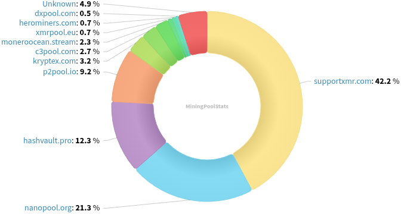
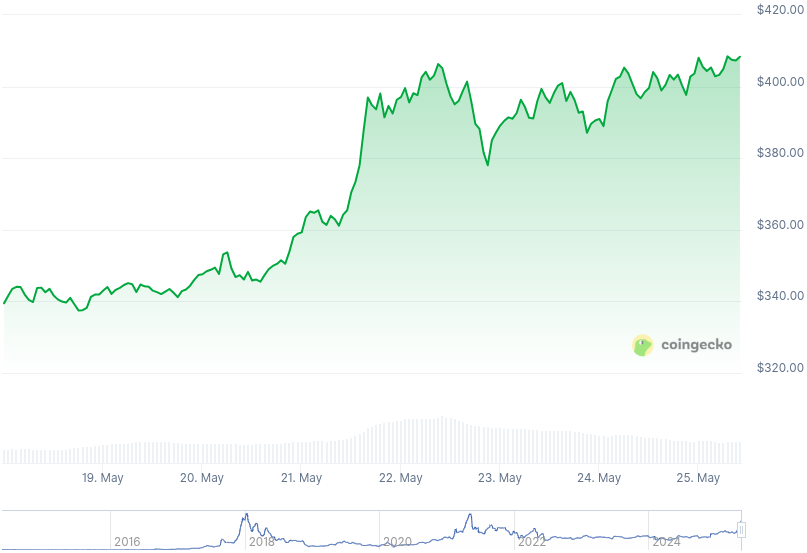

### Table of Contents:

- [Recent News](#news)
- [Upcoming Events](#events)
- [CCS Proposals](#proposals)
- [Price & Blockchain Stats](#stats)
- [Volunteer Opportunities](#volunteer)
- [Support](#support)

### Recent News {#news}

{}
Gupax [v1.3.11](https://github.com/hinto-janai/gupax/releases/tag/v1.3.11) with a new self-hosted remote node by Hinto added; a small UI fix; P2Pool sync status fixes. Upgrades bundled P2Pool to latest v4.6.
{}

{}
Stack Wallet [v2.2.0](https://github.com/cypherstack/stack_wallet/releases/tag/build_271), adding duress PIN feature for mobile application; Monero local nodes to bypass Tor option; many ETH fixes; and more.
{}

{}
Monero community member X3nu, A.K.A. Anti Moonboy, released his *Darknet Market Maximalism* manifesto: a rallying cry for the peer-to-peer cash advocate. Read the [text](https://antimoonboy.com/darknetmarketmaximalism/) or peep the [audio](https://antimoonboy.com/audio/darknetmarketmaximalism.mp3). A couple new t-shirt designs along with this were [unveiled](https://antimoonboy.com/merch/) as well!
{}

{}
We are giving away three (3) General Admission tickets for MoneroKon 5 in Prague, Czech Republic next month. Participate if you are on X by doing what the [tweet](https://nitter.net/revuoxmr/status/1924956257649062103) says. Picking the winners very soon!
{}

### Upcoming Events {#events}

{}
Monero Tech Meeting - [#no-wallet-left-behind](irc://irc.libera.chat/#no-wallet-left-behind) IRC channel; Matrix [room](https://matrix.to/#/#no-wallet-left-behind:monero.social).
{}

{}
Cuprate Workgroup Meeting - [#cuprate](irc://irc.libera.chat/#cuprate) IRC channel; Matrix [room](https://matrix.to/#/#cuprate:monero.social).
{}

{}
Research Lab Meeting - [#monero-research-lab](irc://irc.libera.chat/#monero-research-lab) IRC channel; Matrix [room](https://matrix.to/#/#monero-research-lab:monero.social).
{}

{}
MoneroKon 5 Meeting - [#monerokon](irc://irc.libera.chat/#monerokon) IRC channel; Matrix [room](https://matrix.to/#/#monerokon:matrix.org).
{}

### CCS Proposal Ideas {#proposals}

Below you can find some CCS proposal ideas open for discussion.

{}
Haveno App (Cross Platform)
{}

### CCS Proposals Need Funding

{}
BTCPay Server Monero Plugin
{}

{}
Monero Browser Wallet
{}
### Price & Blockchain Stats {#stats}

###### Blockchain Stats



###### XMR Blocks Distribution in last 1000 blocks

###### Price & Performance



###### XMR Price Graph

Sources: [miningpoolstats.stream](https://miningpoolstats.stream/monero); [bitinfocharts.com](https://bitinfocharts.com/monero/); [coingecko.com](https://www.coingecko.com/en/coins/monero); [localmonero.co blocks](https://localmonero.co/blocks); [haveno.markets](https://haveno.markets/).


{}
Anyone with moderate technical ability is encouraged to try to build and run Monero nightlies. Do not trust it with your Monero, but feel free to open an Issue on GitHub as problems arise. Instructions to build on your OS of choice can be found [here](https://github.com/monero-project/monero#compiling-monero-from-source). 
{}



