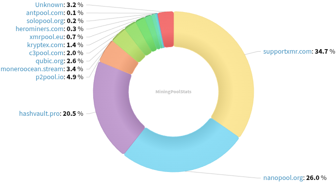

### Table of Contents:

- [Recent News](#news)
- [Upcoming Events](#events)
- [CCS Proposals](#proposals)
- [Price & Blockchain Stats](#stats)
- [Volunteer Opportunities](#volunteer)
- [Support](#support)

### Recent News {#news}

{}
Stumbled upon an interesting read on Monero spy nodes, that includes an interactive XMR remote nodes map where you can see all publicly accessible peers in the p2p network, including one in [Antarctica](https://nitter.net/rottenwheel1/status/1929376801962271204)! Article: [.onion](http://maldomapyy5d5wn7l36mkragw3nk2fgab6tycbjlpsruch7kdninhhid.onion/); [Map](http://maldomapyy5d5wn7l36mkragw3nk2fgab6tycbjlpsruch7kdninhhid.onion/map/).
{}

{}
P2Pool [v4.7](https://github.com/SChernykh/p2pool/releases/tag/v4.7) integrating P2Pool-nano sidechain support; miscellaneous bug fixes; and dependencies upgrades.
{}

{}
Cake v5.0.1 and Monero.com v5.0.1 [released](https://github.com/cake-tech/cake_wallet/releases/tag/v5.0.1) with hot fixes from prior major version bump release (v5.0). Feedback? [Here](https://forum.cakewallet.com/).
{}

{}
Monero Wallet SDK [v1.0.0](https://github.com/mollyim/monero-wallet-sdk/releases/tag/v1.0.0) for Android. Read up more on what this is [here](https://repo.getmonero.org/monero-project/ccs-proposals/-/merge_requests/388#note_30159). GitHub [repository](https://github.com/mollyim/monero-wallet-sdk).
{}

{}
Reddit user Previous_Two_8222 published a teaser of a *work-in-progress* mobile XMR miner based on XMRig but heavily optimized for ARM architectures. Find out more about AIDRig in this [thread](https://redlib.zaggy.nl/r/MoneroMining/comments/1kzr5tf/wip_aidrig_experimental_android_monero_miner_with/). No git repository yet, no source code.
{}

{}
Open source, brand-new Monero flyer for news available in English, German, French and Portugese: [usexmr.com](https://usexmr.com/); GitHub [repository](https://github.com/schmidt1024/monero-flyer). Do you want to see this in your native language? Submit a PR per README's instructions in repository!
{}

{}
RetoSwap reached $50M volume, more than 1k trades in the month of May and is running a MoneroKon 5 giveaway! Reddit [thread](https://redlib.zaggy.nl/r/Monero/comments/1kyz31m/retoswap_hits_50m_volume_over_1000_trades_in_may/).
{}

{}
**[!!]** *New service, tread with caution!* Another week, another KYC-free Monero gambling site surfaces, meet [webetxmr.com](https://webetxmr.com/).
{}

{}
gnuteardrops is looking for some XMR to keep crafting images until January 2027. goal: 60 XMR. Visit [monero.graphics](https://monero.graphics/) and check the archive if you haven't, feel free to send some XMR their way if you like what you see. They have contributed graphic design labor to Revuo Monero in the past! Find out more in their `About` [section](https://monero.graphics/about).
{}

{}
[Monero Observer Blitz #42](https://monero.observer/monero-observer-blitz-may-2025/) - May 2025.
{}

### Upcoming Events {#events}

{}
Monero Tech Meeting - [#no-wallet-left-behind](irc://irc.libera.chat/#no-wallet-left-behind) IRC channel; Matrix [room](https://matrix.to/#/#no-wallet-left-behind:monero.social).
{}

{}
Cuprate Workgroup Meeting - [#cuprate](irc://irc.libera.chat/#cuprate) IRC channel; Matrix [room](https://matrix.to/#/#cuprate:monero.social).
{}

{}
Research Lab Meeting - [#monero-research-lab](irc://irc.libera.chat/#monero-research-lab) IRC channel; Matrix [room](https://matrix.to/#/#monero-research-lab:monero.social).
{}

{}
MoneroKon 5 Meeting - [#monerokon](irc://irc.libera.chat/#monerokon) IRC channel; Matrix [room](https://matrix.to/#/#monerokon:matrix.org).
{}

### CCS Proposal Ideas {#proposals}

Below you can find some CCS proposal ideas open for discussion.

{}
selsta part-time monero development (3 months) (17)
{}

### CCS Proposals Need Funding

{}
BTCPay Server Monero Plugin
{}

{}
Monero Browser Wallet
{}

### Price & Blockchain Stats {#stats}

###### Blockchain Stats



###### XMR Blocks Distribution in last 1000 blocks

###### Price & Performance



###### XMR Price Graph

Sources: [miningpoolstats.stream](https://miningpoolstats.stream/monero); [bitinfocharts.com](https://bitinfocharts.com/monero/); [coingecko.com](https://www.coingecko.com/en/coins/monero); [localmonero.co blocks](https://localmonero.co/blocks); [haveno.markets](https://haveno.markets/).


{}
Anyone with moderate technical ability is encouraged to try to build and run Monero nightlies. Do not trust it with your Monero, but feel free to open an Issue on GitHub as problems arise. Instructions to build on your OS of choice can be found [here](https://github.com/monero-project/monero#compiling-monero-from-source). 
{}



