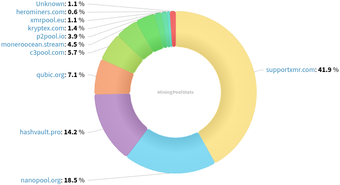
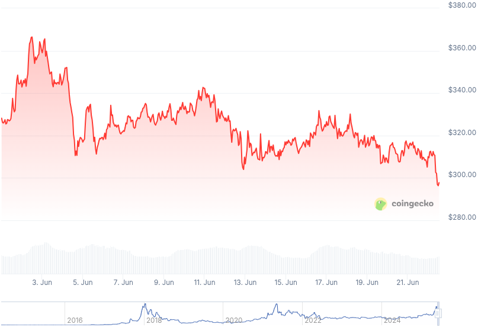

### Table of Contents:

- [Recent News](#news)
- [Upcoming Events](#events)
- [CCS Proposals](#proposals)
- [Price & Blockchain Stats](#stats)
- [Volunteer Opportunities](#volunteer)
- [Support](#support)

### Recent News {#news}

{}
Stack Wallet [v2.2.2](https://github.com/cypherstack/stack_wallet/releases/tag/build_274).
{}

{}
XMRig [v6.23.0](https://github.com/xmrig/xmrig/releases/tag/v6.23.0).
{}

{}
Haveno DEX [v1.1.2](https://github.com/haveno-dex/haveno/releases/tag/v1.1.2) with a great UI/UX [overhaul](https://nitter.net/monerobull/status/1931722953298788694); several bug fixes; and quality of life improvements. As usual, RetoSwap followed suit with their [v1.1.2](https://github.com/retoaccess1/haveno-reto/releases/tag/1.1.2) release.
{}

{}
X profile Cyberleaktv [shared](https://nitter.net/Cyberleaktv/status/1931928513696739679) a new guide to [mine Monero](https://cyberleaktv.github.io/monero-mining-guide/) securely in 2025. Walks you through: wallet setup; node config; XMRig; cold storage; and more.
{}

{}
P2Pool [v4.8](https://github.com/SChernykh/p2pool/releases/tag/v4.8). "A number of security issues were found and fixed in the console commands code. It is recommended to update to v4.8." You heard him, go update it!
{}

{}
Monerujo [v4.1.7](https://github.com/m2049r/xmrwallet/releases/tag/v4.1.7) with some bug fixes.
{}

{}
Monfluo [v0.8.0](https://codeberg.org/acx/monfluo/releases/tag/0.8.0), upgrading Monero to v0.18.4.0; integrating OpenAlias; and... many more quality of life improvements; miscellaneous bug fixes.
{}

{}
[MoneroKon](https://www.monerokon.org/) 5 unfortunately came to an end. Expect videos (and slides, maybe? Ask around!) of all individual talks in... two weeks!^(tm) Thanks to everyone who showed up, it was a wonderful weekend, as it is tradition by now.
{}

{}
Monero Talk talked to Diego "rehrar" Salazar and Luke Szramowski, both from CypherStack, to check in on the status of FCMP++, as CypherStack has been completing some peer reviews for the Monero Research Lab; Stack Wallet features; CypherStack role in all this. Peep it: [Video](https://inv.nadeko.net/watch?v=Wak-CICRi9s); [Audio](https://www.monerotalk.live/monerotalk-353).
{}

### Upcoming Events {#events}

{}
Monero Tech Meeting - [#no-wallet-left-behind](irc://irc.libera.chat/#no-wallet-left-behind) IRC channel; Matrix [room](https://matrix.to/#/#no-wallet-left-behind:monero.social).
{}

{}
Cuprate Workgroup Meeting - [#cuprate](irc://irc.libera.chat/#cuprate) IRC channel; Matrix [room](https://matrix.to/#/#cuprate:monero.social).
{}

{}
Research Lab Meeting - [#monero-research-lab](irc://irc.libera.chat/#monero-research-lab) IRC channel; Matrix [room](https://matrix.to/#/#monero-research-lab:monero.social).
{}

### CCS Proposal Ideas {#proposals}

Below you can find some CCS proposal ideas open for discussion.

{}
Monero Network Simulation Tool
{}

{}
full-time development (3 months)
{}

{}
Monfluo maintenance and further development 2025Q3
{}

### CCS Proposals Need Funding

{}
BTCPay Server Monero Plugin
{}

{}
Monero Browser Wallet
{}

{}
part-time monero development (3 months) (17)
{}

### Price & Blockchain Stats {#stats}

###### Blockchain Stats



###### XMR Blocks Distribution in last 1000 blocks

###### Price & Performance



###### XMR Price Graph

Sources: [miningpoolstats.stream](https://miningpoolstats.stream/monero); [bitinfocharts.com](https://bitinfocharts.com/monero/); [coingecko.com](https://www.coingecko.com/en/coins/monero); [localmonero.co blocks](https://localmonero.co/blocks); [haveno.markets](https://haveno.markets/).


{}
Anyone with moderate technical ability is encouraged to try to build and run Monero nightlies. Do not trust it with your Monero, but feel free to open an Issue on GitHub as problems arise. Instructions to build on your OS of choice can be found [here](https://github.com/monero-project/monero#compiling-monero-from-source). 
{}



