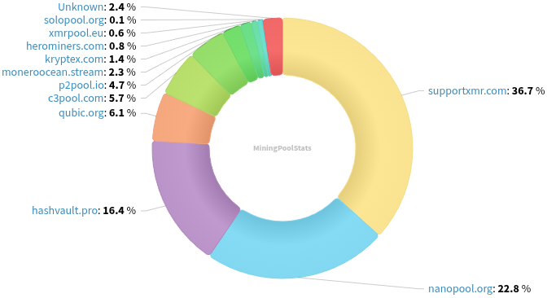
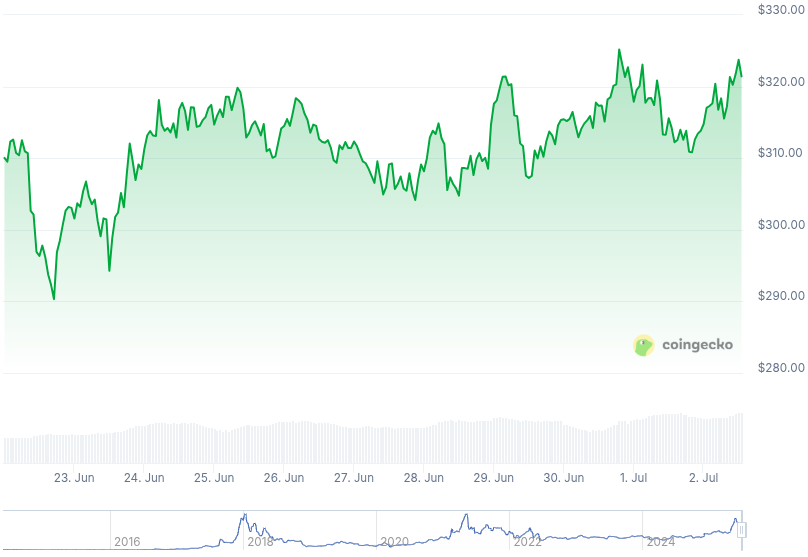

### Table of Contents:

- [Recent News](#news)
- [Upcoming Events](#events)
- [CCS Proposals](#proposals)
- [Price & Blockchain Stats](#stats)
- [Volunteer Opportunities](#volunteer)
- [Support](#support)

### Recent News {#news}

{}
P2Pool [v4.8.1](https://github.com/SChernykh/p2pool/releases/tag/v4.8.1) with important security fixes for sidechains; and a Stratum API bug fix.
{}

{}
Nihilist, from nowhere.moe, a Tor-only collective, published a new blog post: *"Agorism - Why should I price goods and services in Monero directly?"* Find it [here](http://blog.nowherejezfoltodf4jiyl6r56jnzintap5vyjlia7fkirfsnfizflqd.onion/opsec/priceinxmr/) `.onion link`.
{}

{}
fullmetalScience announced NoShore is ready! It's a set of tools that would allow for offline XMR payments to happen in physical settings. Lemmy [thread](https://monero.town/post/6228265); Initial closed CCS [proposal](https://repo.getmonero.org/monero-project/ccs-proposals/-/merge_requests/525). [xmr.zone/noshore](https://xmr.zone/noshore/).
{}

{}
Cake v5.1.0 and Monero.com v5.1.0 [released](https://github.com/cake-tech/cake_wallet/releases/tag/v5.1.1) with built-in Tor daemon integration; dEURO support; and several, various UI enhancements, fixes. Reddit [thread](https://redlib.privacyredirect.com/r/Monero/comments/1lq2lv9/cake_wallet_v510_brings_native_tor_integration/).
{}

{}
Support XMRBazaar's ongoing fundraiser and get cool badges as perks! All details on their [website](https://xmrbazaar.com/fundraiser)! Circular economies are paramount for a thriving and healthy Monero ecosystem. Reddit [thread](https://redlib.privacyredirect.com/r/Monero/comments/1ll64u4/support_xmrbazaars_mission_to_grow_the_monero/).
{}

{}
[Monero Observer Blitz #43](https://monero.observer/monero-observer-blitz-june-2025/) - June 2025.
{}

{}
All [MoneroKon 5](https://www.monerokon.org/) remote talks have been uploaded and are publicly available to watch at home via the Monero Community Workgroup YouTube [channel](https://inv.nadeko.net/channel/UCKxLNPJeEjPXOke55i5AIXA). OSPEAD, remote spy nodes, inside FCMP++ and more. Have a <del>watch</del> look!
{}

{}
Monero Talk brought cryptographic engineer Sean Coughlin on to chat about "Grease", his proposed layer 2 payment channel protocol for Monero. Recently presented at MoneroKon 5 in Prague as well. Recording forthcoming. Peep it: [Video](https://inv.nadeko.net/watch?v=QZV5GXzmIR8); [Audio](https://www.monerotalk.live/monerotalk-354).
{}

### Upcoming Events {#events}

{}
MoneroKon 5 Meeting (After-Event Wrap-up) - [#monerokon](irc://irc.libera.chat/#monerokon) IRC channel; Matrix [room](https://matrix.to/#/#monerokon:matrix.org).
{}

### CCS Proposal Ideas {#proposals}

Below you can find some CCS proposal ideas open for discussion.

{}
2025 Q3 Proposal
{}

{}
Revuo Monero Maintenance (2025 Q3)
{}

{}
Monfluo maintenance and further development 2025Q3
{}

### CCS Proposals Need Funding

{}

### Price & Blockchain Stats {#stats}

###### Blockchain Stats



###### XMR Blocks Distribution in last 1000 blocks

###### Price & Performance



###### XMR Price Graph

Sources: [miningpoolstats.stream](https://miningpoolstats.stream/monero); [bitinfocharts.com](https://bitinfocharts.com/monero/); [coingecko.com](https://www.coingecko.com/en/coins/monero); [localmonero.co blocks](https://localmonero.co/blocks); [haveno.markets](https://haveno.markets/).


{}
Anyone with moderate technical ability is encouraged to try to build and run Monero nightlies. Do not trust it with your Monero, but feel free to open an Issue on GitHub as problems arise. Instructions to build on your OS of choice can be found [here](https://github.com/monero-project/monero#compiling-monero-from-source). 
{}



