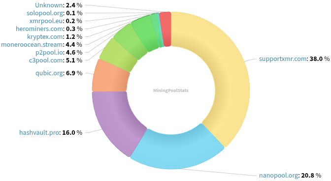
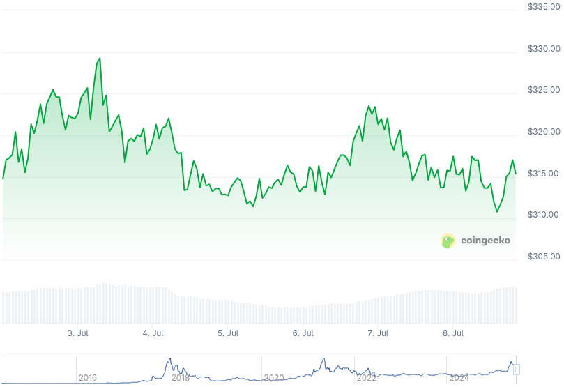

### Table of Contents:

- [Recent News](#news)
- [Upcoming Events](#events)
- [CCS Proposals](#proposals)
- [Price & Blockchain Stats](#stats)
- [Volunteer Opportunities](#volunteer)
- [Support](#support)

### Recent News {#news}

{}
New opinion article on Mises Institute's _Mises Wire_, mentions Monero and its privacy characteristics a handful of times. Have a [read](https://mises.org/mises-wire/privacy-and-fungibility-forgotten-virtues-sound-money). Author's [substack](https://michaelsmilano.substack.com/).
{}

{}
New month? New Monero Monthly by Ungovernable Misfits with Max and Seth for Privacy. Tune into _Traceability Truth Hurts_ for Monero Monthly 007. [Audio](https://serve.podhome.fm/episodepage/ugmf/traceability-truth-hurts-monero-monthly-07); [Website](https://www.ungovernablemisfits.com/). [XMRChat](https://xmrchat.com/ugmf).
{}

{}
Monero Talk chatted with philosopher and engineer, Deki Zedd. They talk about the intersection between Ayn Rand's objectivism and cryptocurrency, especifically Monero's ethos; political events; Bitcoin's weaknesses; and more. He recently presented a talk on the topic at MoneroKon 5 in Prague. Peep it: [Video](https://www.youtube.com/watch?v=S3MkdtklDLQ); [Audio](https://www.monerotalk.live/monerotalk-355).
{}

### Upcoming Events {#events}

{}
Research Lab Meeting - [#monero-research-lab](irc://irc.libera.chat/#monero-research-lab) IRC channel; Matrix [room](https://matrix.to/#/#monero-research-lab:monero.social).
{}

{}
Community Workgroup Meeting - [#monero-community](irc://irc.libera.chat/#monero-community) IRC channel; Matrix [room](https://matrix.to/#/#monero-community:monero.social).
{}

### CCS Proposal Ideas {#proposals}

Below you can find some CCS proposal ideas open for discussion.

{}
2025 Q3 Proposal
{}

{}
Revuo Monero Maintenance (2025 Q3)
{}

{}
Monfluo maintenance and further development 2025Q3
{}

### CCS Proposals Need Funding

{}

### Price & Blockchain Stats {#stats}

###### Blockchain Stats



###### XMR Blocks Distribution in last 1000 blocks

###### Price & Performance



###### XMR Price Graph

Sources: [miningpoolstats.stream](https://miningpoolstats.stream/monero); [bitinfocharts.com](https://bitinfocharts.com/monero/); [coingecko.com](https://www.coingecko.com/en/coins/monero); [localmonero.co blocks](https://localmonero.co/blocks); [haveno.markets](https://haveno.markets/).


{}
Anyone with moderate technical ability is encouraged to try to build and run Monero nightlies. Do not trust it with your Monero, but feel free to open an Issue on GitHub as problems arise. Instructions to build on your OS of choice can be found [here](https://github.com/monero-project/monero#compiling-monero-from-source). 
{}



