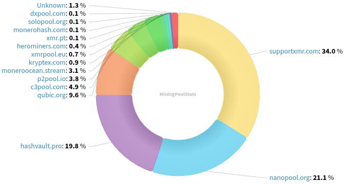
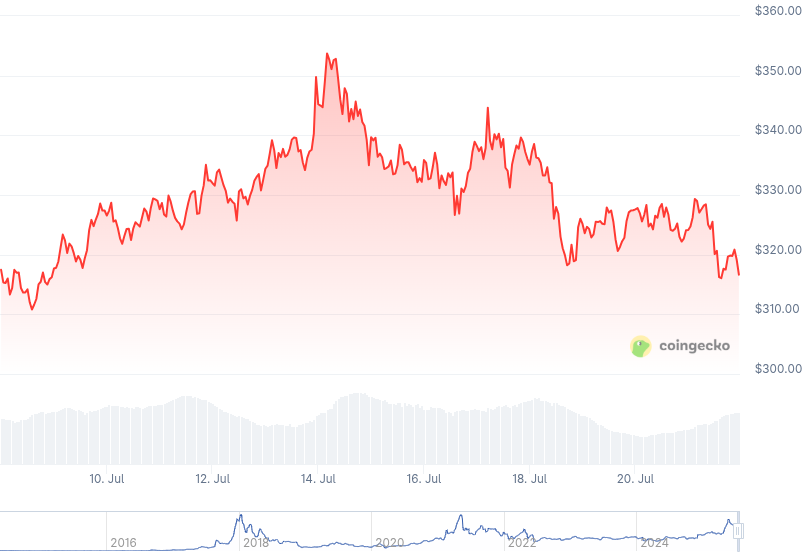

### Table of Contents:

- [Recent News](#news)
- [Upcoming Events](#events)
- [CCS Proposals](#proposals)
- [Price & Blockchain Stats](#stats)
- [Volunteer Opportunities](#volunteer)
- [Support](#support)

### Recent News {#news}

{}
Monero 0.18.4.1 'Fluorine Fermi' Point Release has been tagged, binaries should become available in the following days. [CLI](https://github.com/monero-project/monero/releases/tag/v0.18.4.1); [GUI](https://github.com/monero-project/monero-gui/releases/tag/v0.18.4.1).
{}

{}
UnstoppableSwap? More like _eigenwallet_ moving forward! UnstoppableSwap decided to, with GUI v3.0.0-beta release, rebrand to [eigenwallet.org](https://eigenwallet.org/), XMR + BTC wallet, with atomic swaps, multi-platform, Tor support, _grease_, the shiny XMR L2 planned. X [announcement](https://xcancel.com/UnstoppableSwap/status/1942862020916703650).
{}

{}
Cake v5.1.2 and Monero.com v5.1.2 [Beta] [released](https://github.com/cake-tech/cake_wallet/releases/tag/v5.1.2) with new CakePay mobile UI; several bug fixes; and a _sweep_all-like_ feature for XMR swaps: now you can exchange your entire Monero balance for other cryptocurrencies. How to join the beta [group](https://forum.cakewallet.com/t/how-to-join-beta-testing/13).
{}

{}
Cuprated [v0.0.5](https://github.com/Cuprate/cuprate/releases/tag/cuprated-0.0.5) 'Molybdenite'. Reddit [thread](https://redlib.privacyredirect.com/r/Monero/comments/1m1sm7a/cuprate_v005_released).
{}

{}
Mining enthusiast secondcreek has revamped his website and built a mining profitability calculator that has been tested by XMR and Tari developers for accuracy, according to him. Have a look over at [secondcreek.ca](https://secondcreek.ca/). [Calculator](https://secondcreek.ca/calc/?kh=100). Save it to your notes and share it with Monero miners!
{}

{}
The more, the merrier, [Dawnswap](https://www.dawnswap.com/), new Haveno network has recently [launched](https://lemmy.cafe/post/20524977). GitHub [repository](https://github.com/dawn-collective/haveno-dawn/); Haveno Dawn [v1.1.2](https://github.com/dawn-collective/haveno-dawn/releases/tag/v1.1.2).
{}

{}
Did you know there's a _work-in-progress_ Haveno mobile application that now works while you have Tor up and running in another application such as InviZible, or Orbot. GitHub [repository](https://github.com/atsamd21/Haveno-app). Nostr [note](https://njump.me/nevent1qvzqqqqqqypzq3j7ky6qf4epnnv3c2623flrpzk5uzduz2vdczx9amy996dltksfqqsghpyw5fs64g9yh0wldghgaq3x8mv3w98h54nawtvquxlfpfwsrmqe8zyf0).
{}

{}
Basses shared with us a paper on _Scaling privacy-preserving cryptocurrencies with toxic decoys_. "...the storage space can be reduced by approximately 60% while maintaining the same degree of privacy." [Article](https://crypto.unibe.ch/2025/07/11/decoys.html). [Paper](https://eprint.iacr.org/2025/1124).
{}

{}
P2Pool [v4.9](https://github.com/SChernykh/p2pool/releases/tag/v4.9) with release binaries now **reproducible!** Other stuff as well, check changelog on GitHub.
{}

{}
GitHub user mtoni2 released a GUI client to mine using P2Pool written in Python called _P2PMinerGUI_. GitHub [repository](https://github.com/mtoni2/P2PMinerGUI). Monero Space forum [thread](https://forum.monero.space/t/p2pminergui-p2p-monero-mining-system-with-python-gui/2059).
{}

{}
Alex Anarcho had a conversation with xenu from the Antimoonboy podcast to talk about his manifesto: _Darknet Market Maximalism_ and the cypherpunk vision. [Audio](https://alexanarcho.live/podcast/147). English episodes RSS [feed](http://www.alexanarcho.live/feed/rss/en).
{}

{}
Monero Talk spoke with legal expert Zach Shapiro, about... well, uh, cryptocurrency legislation! Shocking, right? Shapiro runs a crypto-focused law firm and is involved with the Bitcoin Policy Institute and Peer-to-Peer Rights Foundation. Peep it: [Video](https://inv.nadeko.net/watch?v=WRBHMbKY0Sc); [Audio](https://www.monerotalk.live/monerotalk-357).
{}

### Upcoming Events {#events}

{}
Cuprate Workgroup Meeting - [#cuprate](irc://irc.libera.chat/#cuprate) IRC channel; Matrix [room](https://matrix.to/#/#cuprate:monero.social).
{}

{}
Research Lab Meeting - [#monero-research-lab](irc://irc.libera.chat/#monero-research-lab) IRC channel; Matrix [room](https://matrix.to/#/#monero-research-lab:monero.social).
{}

{}
MoneroKon 6 Meeting - [#monerokon](irc://irc.libera.chat/#monerokon) IRC channel; Matrix [room](https://matrix.to/#/#monerokon:matrix.org).
{}

### CCS Proposal Ideas {#proposals}

Below you can find some CCS proposal ideas open for discussion.

{}
MoneroOS Resurrection
{}

{}
EVM Atomic Swaps
{}

{}
full-time development (3 months)
{}

### CCS Proposals Need Funding

{}

### Price & Blockchain Stats {#stats}

###### Blockchain Stats



###### XMR Blocks Distribution in last 1000 blocks

###### Price & Performance



###### XMR Price Graph

Sources: [miningpoolstats.stream](https://miningpoolstats.stream/monero); [bitinfocharts.com](https://bitinfocharts.com/monero/); [coingecko.com](https://www.coingecko.com/en/coins/monero); [localmonero.co blocks](https://localmonero.co/blocks); [haveno.markets](https://haveno.markets/).


{}
Anyone with moderate technical ability is encouraged to try to build and run Monero nightlies. Do not trust it with your Monero, but feel free to open an Issue on GitHub as problems arise. Instructions to build on your OS of choice can be found [here](https://github.com/monero-project/monero#compiling-monero-from-source). 
{}



