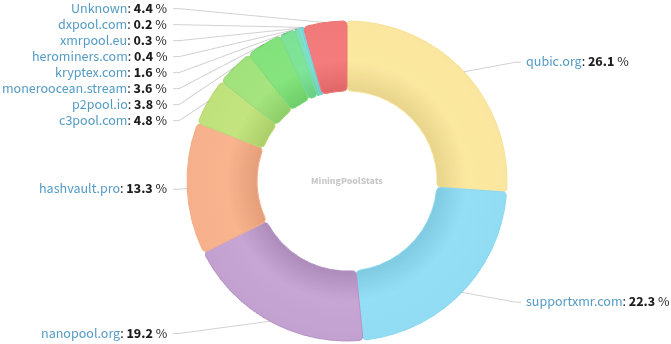
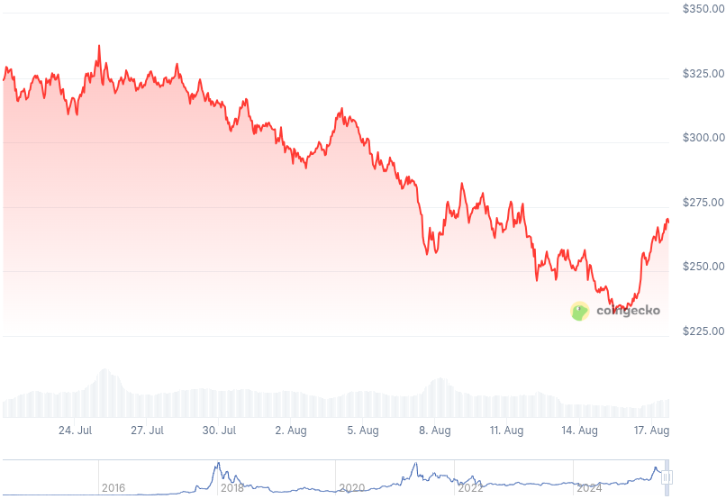

### Table of Contents:

- [Recent News](#news)
- [Upcoming Events](#events)
- [CCS Proposals](#proposals)
- [Price & Blockchain Stats](#stats)
- [Volunteer Opportunities](#volunteer)
- [Support](#support)

### Recent News {#news}

{}
Monero 0.18.4.1 'Fluorine Fermi' Point Release binaries have been released. [CLI](https://www.getmonero.org/2025/07/25/monero-0.18.4.1-released.html); [GUI](https://www.getmonero.org/2025/07/25/monero-GUI-0.18.4.1-released.html). Remember to verify hashes; how-to guides at the bottom of each blog post. As well, you may compile Monero from [source](https://github.com/monero-project/monero#compiling-monero-from-source).
{}

{}
Stack Wallet [v2.3.2](https://github.com/cypherstack/stack_wallet/releases/tag/build_282).
{}

{}
Rough draft of Rucknium's web app for Monero consensus monitoring: [moneroconsensus.info](https://moneroconsensus.info/). X [thread](https://xcancel.com/MoneroResearchL/status/1951659427737546919).
{}

{}
Haveno DEX [v1.2.0](https://github.com/haveno-dex/haveno/releases/tag/v1.2.0) upgrading to latest Monero v0.18.4.1; lowering the minimum trade amount to 0.05 XMR; and several other UI/UX bug fixes, enhancements. Consequently, RetoSwap [v1.2.0](https://github.com/retoaccess1/haveno-reto/releases/tag/1.2.1-1); and Haveno Dawn [v1.2.0a](https://github.com/dawn-collective/haveno-dawn/releases/tag/v1.2.0a).
{}

{}
As our summer 2025 gets spicy thanks to a nym that goes by Qubic, VPS provider SporeStack published a new blog post: [_Save Monero from Qubic!_](https://sporestack.com/blog/posts/2025-08-11-save-monero-from-qubic.html) Visit [savemonero.info](https://savemonero.info/) for additional information.
{}

{}
Our good friends over at RIAT Institute have released their piece on recent Qubic's shenanigans and the Monero network, dissecting what the heck really is going on. Have a read [here](https://riat.at/qubic-attack-on-xmr-monero-no-51-attack-proven/).
{}

{}
Monero contributor and one of the main RandomX coders, tevador, has an open issue in the Monero Research Lab repository, going over the possible PoW mining protocol changes to combat pool centralization (and build further resilience against attacks like Qubic's). Have a [read](https://github.com/monero-project/research-lab/issues/98).
{}

{}
[My goodness gracious](https://redlib.privacyredirect.com/r/Monero/comments/1msyrku/case_closed/), did it take him that long?
{}

{}
[moneroj.net](https://moneroj.net/), the XMR charts website, goes fully Free-Libre Open Source Software, with GPLv3 license and all. Welcome to the small set of Revuo Tools! [Repository](https://github.com/worldwideward/moneroj); Reddit [thread](https://redlib.privacyredirect.com/r/Monero/comments/1mrsd9k/remember_that_charts_site_monerojnet_is_now_fully/).
{}

{}
[Monero Observer Blitz #44](https://monero.observer/monero-observer-blitz-july-2025/) - July 2025.
{}

{}
New month? New Monero Monthly by Ungovernable Misfits with Max and Seth for Privacy. Tune into _Monero Under Attack_ for Monero Monthly 008. [Audio](https://serve.podhome.fm/episodepage/ugmf/monero-under-attack-monero-monthly-08); [Website](https://www.ungovernablemisfits.com/). [XMRChat](https://xmrchat.com/ugmf).
{}

{}
Monero Talk spoke with XMR Core Team member and scalability connoisseur, Francisco 'ArticMine' Cabañas about... you may have a hunch! Qubic's recent block reorganizations; merge mining; proof of useful work Shocking, right? Shapiro runs a crypto-focused law firm and is involved with the Bitcoin Policy Institute and Peer-to-Peer Rights Foundation. Peep it: [Video](https://inv.nadeko.net/watch?v=x3zoblcGaFU); [Audio](https://www.monerotalk.live/monerotalk-358). Last but not least, they also had xenu from Darknet Market Maximalism manifesto, the 'antimoonboy' on, to discuss the how to strengthen the Monero network amid attacks. Review: [Video](https://inv.nadeko.net/watch?v=VWRMkRyduj8); [Audio](https://www.monerotalk.live/monerotalk-359).
{}

### Upcoming Events {#events}

{}
Monero Tech Meeting - [#no-wallet-left-behind](irc://irc.libera.chat/#no-wallet-left-behind) IRC channel; Matrix [room](https://matrix.to/#/#no-wallet-left-behind:monero.social).
{}

{}
Cuprate Workgroup Meeting - [#cuprate](irc://irc.libera.chat/#cuprate) IRC channel; Matrix [room](https://matrix.to/#/#cuprate:monero.social).
{}

{}
Research Lab Meeting - [#monero-research-lab](irc://irc.libera.chat/#monero-research-lab) IRC channel; Matrix [room](https://matrix.to/#/#monero-research-lab:monero.social).
{}

{}
Community Workgroup Meeting - [#monero-community](irc://irc.libera.chat/#monero-community) IRC channel; Matrix [room](https://matrix.to/#/#monero-community:monero.social).
{}

{}
MoneroKon 6 Meeting - [#monerokon](irc://irc.libera.chat/#monerokon) IRC channel; Matrix [room](https://matrix.to/#/#monerokon:matrix.org).
{}

### CCS Proposal Ideas {#proposals}

Below you can find some CCS proposal ideas open for discussion.

{}
Full-time development (3 months)
{}

{}
Full-time development (4 months)
{}

{}
Full-time development 2025Q3
{}

### CCS Proposals Need Funding

{}
Part-time work on Monfluo 2025Q3
{}

{}
Revuo Monero maintenance (2025 Q3)
{}

{}
Rucknium Research II	
{}

### Price & Blockchain Stats {#stats}

###### Blockchain Stats



###### XMR Blocks Distribution in last 1000 blocks

###### Price & Performance



###### XMR Price Graph

Sources: [miningpoolstats.stream](https://miningpoolstats.stream/monero); [bitinfocharts.com](https://bitinfocharts.com/monero/); [coingecko.com](https://www.coingecko.com/en/coins/monero); [localmonero.co blocks](https://localmonero.co/blocks); [haveno.markets](https://haveno.markets/).


{}
Anyone with moderate technical ability is encouraged to try to build and run Monero nightlies. Do not trust it with your Monero, but feel free to open an Issue on GitHub as problems arise. Instructions to build on your OS of choice can be found [here](https://github.com/monero-project/monero#compiling-monero-from-source). 
{}



