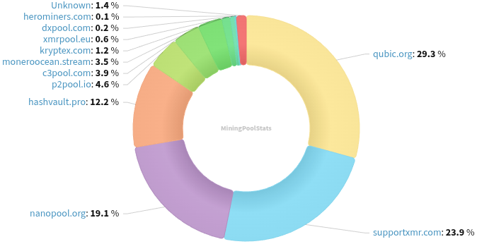
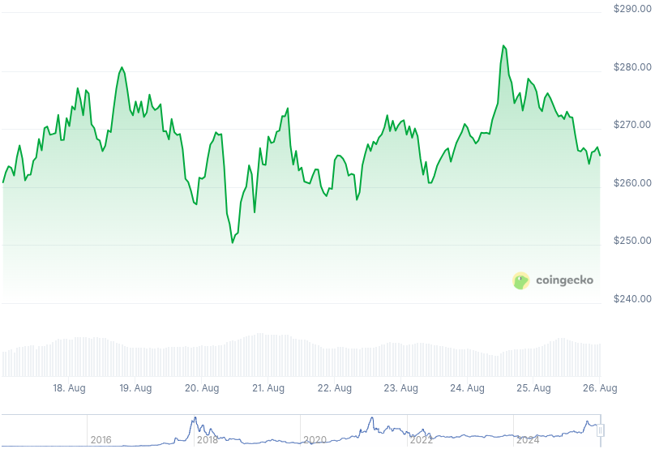

### Table of Contents:

- [Recent News](#news)
- [Upcoming Events](#events)
- [CCS Proposals](#proposals)
- [Price & Blockchain Stats](#stats)
- [Volunteer Opportunities](#volunteer)
- [Support](#support)

### Recent News {#news}

{}
Monero 0.18.4.2 'Fluorine Fermi' Point Release has been tagged. [CLI](https://github.com/monero-project/monero/releases/tag/v0.18.4.2); [GUI](https://github.com/monero-project/monero-gui/releases/tag/v0.18.4.2). Binaries for both CLI and GUI should become available in the next few days. As well, you may compile Monero from [source](https://github.com/monero-project/monero#compiling-monero-from-source) in the meantime.
{}

{}
Previous Monero Core Team member and XMR lead maintainer for its initial years, Riccardo 'fluffypony' Spagni created a new MRL issue going over _Detective Mining_ PoW hardening proposal amidst all ongoing discussion post-Qubic "attack". Have a read and chime in if you have anything to add [here](https://github.com/monero-project/research-lab/issues/140). Hat tip to @AJ_1337 on X. X [thread](https://xcancel.com/AJ__1337/status/1957367000306442411).
{}

{}
Monero contributor known for his sci-fi XMR-centric stories, the 'No Wallet Left Behind' initiative for smooth wallet(s) migration from CLSAG addresses to FCMP++ feat CARROT addresses, rbrunner7, has a brand-new Reddit thread titled _Everything you ever wanted to know about hashrates, or, what is all the fuss about 51%?_ Find it [here](https://redlib.privacyredirect.com/r/Monero/comments/1mwe2cz/everything_you_ever_wanted_to_know_about/).
{}

{}
Another day, another one bites the dust for Monero. In this case, it was Kraken and Canada, eh? Reddit [thread](https://redlib.privacyredirect.com/r/Monero/comments/1mvi8tm/kraken_canada_has_just_delisted_monero/). CoinCards X [thread](https://xcancel.com/CoinCards/status/1958625635766870316) on the matter.
{}

{}
P2Pool [v4.9.1](https://github.com/SChernykh/p2pool/releases/tag/v4.9.1), a small point release upgrading dependencies; and fixing a Tari-related bug.
{}

{}
Cake v5.3.0 and Monero.com v5.3.0 [Beta] [released](https://github.com/cake-tech/cake_wallet/releases/tag/v5.3.0) with DOGE support; silent payments improvements; and a bunch of UI/UX, QoL enhancements all over. How to join the testers [group](https://forum.cakewallet.com/t/how-to-join-beta-testing/13). Feedback? Right there in the forum; create a new thread, or leave a reply if someone has beaten you to it!
{}

{}
Gupaxx development goes "on-the-go" and Kuno! Peep the new, ongoing Kuno fundraiser to sustain Gupaxx maintenance and further development [here](https://kuno.anne.media/fundraiser/dsrr/). GitHub [repository](https://github.com/Cyrix126/gupaxx).
{}

{}
Our good friend from RIAT, parasew, put up a call in a Reddit [thread](https://redlib.privacyredirect.com/r/Monero/comments/1mwd7sz/moneroresponse_initiative_to_identify_call_out/) to pile up all XMR FUD and help reach out to make corrections where necessary. Help if you can, every bit helps! GitHub [repository](https://github.com/riatlabs/monero-response).
{}

### Upcoming Events {#events}

{}
Cuprate Workgroup Meeting - [#cuprate](irc://irc.libera.chat/#cuprate) IRC channel; Matrix [room](https://matrix.to/#/#cuprate:monero.social).
{}

{}
Research Lab Meeting - [#monero-research-lab](irc://irc.libera.chat/#monero-research-lab) IRC channel; Matrix [room](https://matrix.to/#/#monero-research-lab:monero.social).
{}

{}
MoneroKon 6 Meeting - [#monerokon](irc://irc.libera.chat/#monerokon) IRC channel; Matrix [room](https://matrix.to/#/#monerokon:matrix.org).
{}

### CCS Proposal Ideas {#proposals}

Below you can find some CCS proposal ideas open for discussion.

{}
EVM Atomic Swaps
{}

{}
Finality Layer Book
{}

{}
monero konferenco 2025 voice-over and working on xmr.ru
{}

### CCS Proposals Need Funding

{}
Full-time 2025 q3
{}

### Price & Blockchain Stats {#stats}

###### Blockchain Stats



###### XMR Blocks Distribution in last 1000 blocks

###### Price & Performance



###### XMR Price Graph

Sources: [miningpoolstats.stream](https://miningpoolstats.stream/monero); [bitinfocharts.com](https://bitinfocharts.com/monero/); [coingecko.com](https://www.coingecko.com/en/coins/monero); [localmonero.co blocks](https://localmonero.co/blocks); [haveno.markets](https://haveno.markets/).


{}
Anyone with moderate technical ability is encouraged to try to build and run Monero nightlies. Do not trust it with your Monero, but feel free to open an Issue on GitHub as problems arise. Instructions to build on your OS of choice can be found [here](https://github.com/monero-project/monero#compiling-monero-from-source). 
{}



