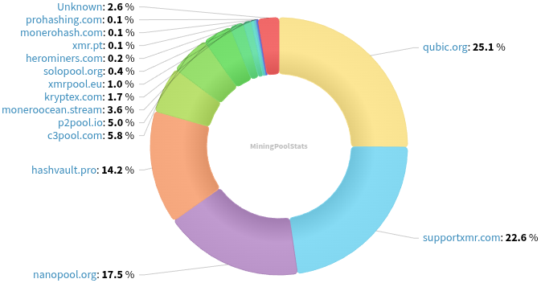
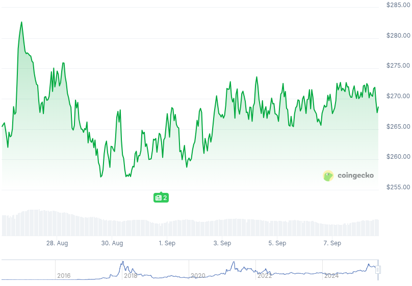

### Table of Contents:

- [Recent News](#news)
- [Upcoming Events](#events)
- [CCS Proposals](#proposals)
- [Price & Blockchain Stats](#stats)
- [Volunteer Opportunities](#volunteer)
- [Support](#support)

### Recent News {#news}

{}
Monero 0.18.4.2 'Fluorine Fermi' Point Release binaries have been released. [CLI](https://www.getmonero.org/2025/08/26/monero-0.18.4.2-released.html); [GUI](https://www.getmonero.org/2025/08/26/monero-GUI-0.18.4.2-released.html). Remember to **verify** hashes; how-to guides at the bottom of each blog post. As well, you may compile Monero from [source](https://github.com/monero-project/monero#compiling-monero-from-source). X [thread](https://xcancel.com/hundehausen/status/1960379828831387723).
{}

{}
Someone going by NathanRizza on GitHub is building an app called *Monero Watchman* that will send the user a notification in case of chain reorganizations occuring in the Monero network so that users can add hashrate if they can, to help strenghten the network. GitHub [repository](https://github.com/NathanRizza/monero-watchman). [Bounty](https://bounties.monero.social/posts/203/0-429m-a-monero-attack-alert-app).
{}

{}
Cuprated [v0.0.6](https://github.com/Cuprate/cuprate/releases/tag/cuprated-0.0.6) with native Tor support, allowing users to connect to peers anonymously. Reddit [thread](https://redlib.privacyredirect.com/r/Monero/comments/1nbi7fa/cuprate_v006_released/).
{}

{}
We have a new, right, new issue from tevador on *Publish or Perish - "Raising tx fees is the best way to disincentivize empty blocks. Based on my research, this would be the most efficient PoW-only solution."* GitHub [issue](https://github.com/monero-project/research-lab/issues/144) (discussion).
{}

{}
Monerod-GUI [v1.3.1](https://github.com/everoddandeven/monerod-gui/releases/tag/v1.3.1) with P2Pool; XMRig integrations. Background mining; blockchain explorer; UI refactoring; and more.
{}

{}
BawdyAnarchist releases *Monero PoW Simulator*: a modular simulation environment to test countermeasures against selfish mining strategies. GitHub [repository](https://github.com/BawdyAnarchist/Monero-Simulator). Reddit [thread].
{}

{}
RetoSwap breaks $100M volume in total trading volume to date! If you want to try your luck at guessing total completed trades on the EUR pair by September 12th, they are giving away $100 worth of XMR to celebrate. Reddit [thread](https://redlib.privacyredirect.com/r/Monero/comments/1n9343q/retoswap_smashes_100m_volume_time_for_another/) with all details.
{}

{}
**[!!]** *New service, tread with caution!* New Revuo? New XMR service, meet [xmr.cards](https://xmr.cards/), where you can buy gift cards for 2000+ different brands, in 60+ countries. They don't require KYC and support Tor for enhanced anonymity. Reddit [thread](https://redlib.privacyredirect.com/r/Monero/comments/1n8grhi/ann_xmrcards_buy_gift_cards_with_monero_no_kyc/). `.onion` [mirror](http://xmrcards7pb5dnj5dfbnueigmzwgujwlo5zhd6f3vnlhay6qlbd3dzid.onion/).
{}

{}
WebWipe is hosting another Monero and Privacy meetup, this time in Nashville, Tennessee, on September 20th. Reddit [thread](https://redlib.privacyredirect.com/r/Monero/comments/1n9mb37/monero_and_privacy_meetup_september_20th/); [Luma](https://luma.com/hgwmfy6m).
{}

{}
New month? New Monero Monthly by Ungovernable Misfits with Max and Seth for Privacy. Tune into _Security under the microscope_ for Monero Monthly 009. [Audio](https://serve.podhome.fm/episodepage/ugmf/security-under-the-microscope-monero-monthly-09); [Website](https://www.ungovernablemisfits.com/). [XMRChat](https://xmrchat.com/ugmf).
{}

{}
[Monero Observer Blitz #45](https://monero.observer/monero-observer-blitz-august-2025/) - August 2025.
{}

{}
Monero Talk chatted with Brazilian writer and privacy advocated, Vinny Barbosa, about the ongoing shenanigans with Qubic's XMR mining attack to the network and its possible mitigating paths that have surfaced recently. Check it out: [Video](https://inv.nadeko.net/watch?v=5wpVcq8e5vs); [Audio](https://www.monerotalk.live/monerotalk-360). As well, MT brought Dr. K, a proof-of-work researcher with 8+ years of experience, to talk about... you know what. Peep it: [Video](https://inv.nadeko.net/watch?v=bRpZxxDHAiY); [Audio](https://www.monerotalk.live/monerotalk-361).
{}

### Upcoming Events {#events}

{}
Cuprate Workgroup Meeting - [#cuprate](irc://irc.libera.chat/#cuprate) IRC channel; Matrix [room](https://matrix.to/#/#cuprate:monero.social).
{}

{}
Research Lab Meeting - [#monero-research-lab](irc://irc.libera.chat/#monero-research-lab) IRC channel; Matrix [room](https://matrix.to/#/#monero-research-lab:monero.social).
{}

{}
MoneroKon 6 Meeting - [#monerokon](irc://irc.libera.chat/#monerokon) IRC channel; Matrix [room](https://matrix.to/#/#monerokon:matrix.org).
{}

### CCS Proposal Ideas {#proposals}

Below you can find some CCS proposal ideas open for discussion.

{}
Finaly Layer Book
{}

{}
MoneroOS Resurrection
{}

{}
Part-time monero development (3 months) (18) 
{}

### CCS Proposals Need Funding

{}
Full-time work (3 months)
{}

{}
Full-time development (4 months)
{}

{}
Full-time development 2025Q3
{}

### Price & Blockchain Stats {#stats}

###### Blockchain Stats



###### XMR Blocks Distribution in last 1000 blocks

###### Price & Performance



###### XMR Price Graph

Sources: [miningpoolstats.stream](https://miningpoolstats.stream/monero); [bitinfocharts.com](https://bitinfocharts.com/monero/); [coingecko.com](https://www.coingecko.com/en/coins/monero); [localmonero.co blocks](https://localmonero.co/blocks); [haveno.markets](https://haveno.markets/).


{}
Anyone with moderate technical ability is encouraged to try to build and run Monero nightlies. Do not trust it with your Monero, but feel free to open an Issue on GitHub as problems arise. Instructions to build on your OS of choice can be found [here](https://github.com/monero-project/monero#compiling-monero-from-source). 
{}



