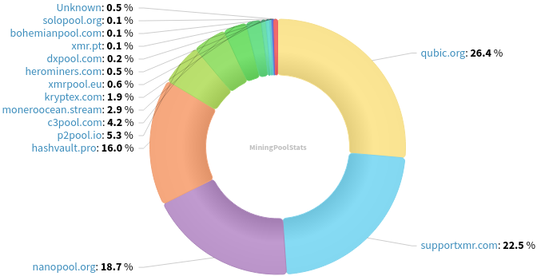
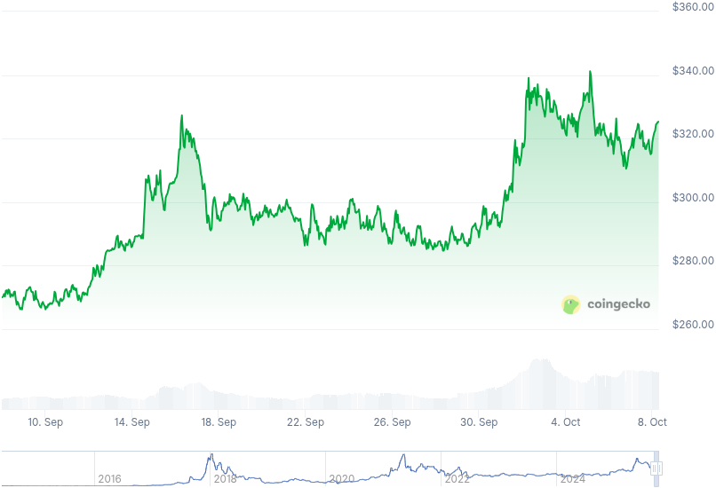

### Table of Contents:

- [Recent News](#news)
- [Upcoming Events](#events)
- [CCS Proposals](#proposals)
- [Price & Blockchain Stats](#stats)
- [Volunteer Opportunities](#volunteer)
- [Support](#support)

### Recent News {#news}

{}
P2Pool [v4.11](https://github.com/SChernykh/p2pool/releases/tag/v4.11) with subaddress support and important bug fixes. Relevant Reddit [thread](https://redlib.privacyredirect.com/r/Monero/comments/1ncde8h/psa_p2pool_v410_update_will_speed_up_the_whole/) on v4.10, still applies moving forward.
{}

{}
There was an 18-block blockchain reorg. Unofficial Monero Research Lab X profile shared additional [information](https://xcancel.com/MoneroResearchL/status/1967336540037636427) on it. DataHoarder shared a timeline of Monero 18-block reorg on September 14th, 2025 on [GitHub](https://github.com/WeebDataHoarder/Monero-Timeline-Sep14).
{}

{}
Above is a bit too technical, right? Rucknium will take good care of us with his recent blog post on the infamous block reorg. Find it [here](https://rucknium.me/posts/monero-18-block-reorg/).
{}

{}
Unfortunately, we had to say farewell to KYC-free CEX _TradeOgre_. An important one to fall, especially for the Monero community. Mostly CryptoNight PoW coins used to be listed in there. So long, and thank you! Read up on the news [here](https://rcmp.ca/en/news/2025/09/rcmp-executes-record-seizure-more-56-million-dollars-cryptocurrency).
{}

{}
Our friends over at RetoSwap had some issues with the now legacy SimpleX chat room and had to remake. PGP-signed message from one of their administrators [here](https://paste.debian.net/1400038/).
{}

{}
RetoSwap [v1.2.2](https://github.com/retoaccess1/haveno-reto/releases/tag/1.2.2-reto) with important bug fixes.
{}

{}
Serai DEX [published](https://serai.exchange/2025/09/26/dkg-evrf-security-proofs.html) the security proofs of their robust one-round, robust threshold DKG.
{}

{}
Guess what? There's a FCMP++ & CARROT stressnet alpha available now! Yes, now. GitHub [repository](https://github.com/seraphis-migration/monero/releases/tag/v0.19.0.0-alpha.1.1). Reddit [thread](https://redlib.privacyredirect.com/r/Monero/comments/1nsuctt/fcmp_carrot_alpha_stressnet_v1/). X [thread](https://xcancel.com/moneroresearchl/status/1972377892509368588).
{}

{}
Now... it gets better! There is already a FCMP++ & CARROT testnet **faucet**! Find it over at [faucet.xmr.pt](https://faucet.xmr.pt/)! GitHub [repository](https://github.com/kic0/FCMP--Testnet-Faucet).
{}

{}
Tevador shared a new selfish mining mitigation as a soft-fork. _Share or Perish_. GitHub [repository](https://github.com/monero-project/research-lab/issues/146).
{}

{}
Gupaxx [v1.11.7](https://github.com/Cyrix126/gupaxx/releases/tag/v1.11.7) with a couple bug fixes and bumping P2Pool module.
{}

{}
**[!!]** *New service, tread with caution!* There is a new p2p, CEX similar to LocalMonero, called _Global Monero_. Exchange fiat<=>XMR with others, directly. Have a look at [globalmonero.co](https://globalmonero.co/).
{}

{}
MyMonero to cease operations on January 6, 2026 and passing on its stewardship to Cake Wallet. X [thread](https://xcancel.com/MyMonero/status/1975258102770671680). MyMonero [announcement](https://mymonero.com/?announcement=1); Cake Wallet blog [post](https://blog.cakewallet.com/announcing-mymoneros-sunset-and-stewardship-transition-to-cake-wallet/).
{}

{}
[Monero Observer Blitz #46](https://monero.observer/monero-observer-blitz-september-2025/) - September 2025.
{}

{}
Monero Talk had a guy who needs no extra bells and whistles, jeffro256, to talk about the Monero FCMP++ & CARROT stressnet launch on October 3.Check it out: [Video](https://inv.nadeko.net/watch?v=4Ju1RM3CtAo); [Audio](https://www.monerotalk.live/monerotalk-363). 
{}

### Upcoming Events {#events}

{}
Research Lab Meeting - [#monero-research-lab](irc://irc.libera.chat/#monero-research-lab) IRC channel; Matrix [room](https://matrix.to/#/#monero-research-lab:monero.social).
{}

{}
Community Workgroup Meeting - [#monero-community](irc://irc.libera.chat/#monero-community) IRC channel; Matrix [room](https://matrix.to/#/#monero-community:monero.social).
{}

### CCS Proposal Ideas {#proposals}

Below you can find some CCS proposal ideas open for discussion.

{}
Revuo Monero Maintenance (2025 Q4)
{}

{}
Part-time work on Monfluo 2025Q4
{}

{}
Full time work on Cuprate (3 months)
{}

### CCS Proposals Need Funding

{}

### Price & Blockchain Stats {#stats}

###### Blockchain Stats



###### XMR Blocks Distribution in last 1000 blocks

###### Price & Performance



###### XMR Price Graph

Sources: [miningpoolstats.stream](https://miningpoolstats.stream/monero); [bitinfocharts.com](https://bitinfocharts.com/monero/); [coingecko.com](https://www.coingecko.com/en/coins/monero); [localmonero.co blocks](https://localmonero.co/blocks); [haveno.markets](https://haveno.markets/).


{}
Anyone with moderate technical ability is encouraged to try to build and run Monero nightlies. Do not trust it with your Monero, but feel free to open an Issue on GitHub as problems arise. Instructions to build on your OS of choice can be found [here](https://github.com/monero-project/monero#compiling-monero-from-source). 
{}



