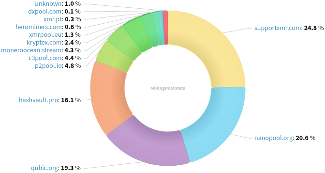
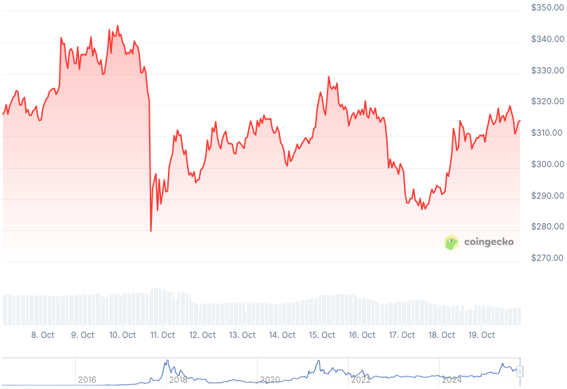

### Table of Contents:

- [Recent News](#news)
- [Upcoming Events](#events)
- [CCS Proposals](#proposals)
- [Price & Blockchain Stats](#stats)
- [Volunteer Opportunities](#volunteer)
- [Support](#support)

### Recent News {#news}

{}
Monero 0.18.4.3 'Fluorine Fermi' Point Release binaries have been released. [CLI](https://www.getmonero.org/2025/10/08/monero-0.18.4.3-released.html); [GUI](https://www.getmonero.org/2025/10/08/monero-GUI-0.18.4.3-released.html). Remember to verify hashes; how-to guides at the bottom of each blog post. As well, you may compile Monero from [source](https://github.com/monero-project/monero#compiling-monero-from-source). **Highly recommended release that enhances protection against spy nodes.**
{}

{}
Monero Multisig... GUI? Yep. Looks nice, to say the least. Reddit [thread](https://redlib.privacyredirect.com/r/Monero/comments/1o0fdqw/monero_multisig_gui/). Have a proper look over [here](https://freigeist-m.github.io/monero-multisig-gui/).
{}

{}
Monfluo Wallet [v0.9.1](https://codeberg.org/acx/monfluo/releases/tag/0.9.1), shipping Monero v0.18.4.3 point release before all other XMR mobile wallets.
{}

{}
Cuprated [v0.0.7](https://github.com/Cuprate/cuprate/releases/tag/cuprated-0.0.7). Reddit [thread](https://redlib.privacyredirect.com/r/Monero/comments/1o4pk49/cuprate_v007_released).
{}

{}
Cake v5.5.0 and Monero.com v5.5.0 [released](https://github.com/cake-tech/cake_wallet/releases/tag/v5.5.0) adding a couple new hardware wallets supported on Cake, namely BitBox02 and Trezor (Android-only for now) and bringing back the Monero orange color with other brand-new accent colors and major enhancements to the UI/UX. Blog [post](https://blog.cakewallet.com/your-cake-wallet-just-got-a-serious-upgrade-trezor-bitbox-base-the-look-youve-been-asking-for/). Reddit [thread](https://redlib.privacyredirect.com/r/Monero/comments/1o9erw7/your_cake_wallet_just_got_a_serious_upgrade/).
{}

{}
First Exodus, now MyMonero: MyMonero will be ceasing operations on January 6, 2026, and has passed the stewardship baton to Cake Wallet. One of the first wallet services ever for Monero. Thank you for such consistency, legends! Reddit [thread](https://redlib.privacyredirect.com/r/Monero/comments/1nzq8p1/announcement_mymonero_is_sunsetting_stewardship/); blog [post](https://blog.cakewallet.com/announcing-mymoneros-sunset-and-stewardship-transition-to-cake-wallet/).
{}

{}
Apparently, after everyone was complaining about the kewbit debacle and the Haveno mobile companion application, now that there's one being actively worked on, it's lacking testers. Got some spare time? Go help atsamd21 test the Haveno mobile application, open issues, provide feedback. [Repository](https://github.com/atsamd21/Haveno-app). _"Currently only for Android. When installing, use the standalone option, not remote as at the moment neither Haveno nor Retoswap support syncing."_
{}

{}
After 2-year break, a new version of monero-rpc Rust package has been [released](https://github.com/monero-rs/monero-rpc-rs/releases/tag/v0.5.0).
{}

{}
WebWipe is hosting one of their now popular Monero and Privacy meetups, this time in Austin, Texas, on November 1. Reddit [thread](https://redlib.privacyredirect.com/r/Monero/comments/1o6p7m0/monero_and_privacy_meetup_november_1st_austin_tx/). [Luma](https://luma.com/5mkhiph0).
{}

{}
MoneroTopia by Monero Talk, goes back to Mexico city, at the same spot: _Huerto Roma Verde_ but instead of November, it's in February, 12-15. X [thread](https://nitter.tiekoetter.com/monerotopia/status/1979190664802832593); buy your [ticket](https://monerotopia.com/product-category/monerotopia2026ticket/).
{}

{}
New month? New Monero Monthly by Ungovernable Misfits with Max and Seth for Privacy. Tune into _Stressnet Begins_ for Monero Monthly 010. [Audio](https://serve.podhome.fm/episodepage/ugmf/stressnet-begins-monero-monthly-10); [Website](https://www.ungovernablemisfits.com/). [XMRChat](https://xmrchat.com/ugmf).
{}

{}
Monero Talk talked to the popular Juraj Bednar, to discuss the thing everyone seems to be talking about given certain momentum... _Zcash vs. Monero_. Check it out: [Video](https://inv.nadeko.net/watch?v=WDlHUQjJ_84); [Audio](https://www.monerotalk.live/monerotalk-364).
{}

### Upcoming Events {#events}

{}
Monero Tech Meeting - [#no-wallet-left-behind](irc://irc.libera.chat/#no-wallet-left-behind) IRC channel; Matrix [room](https://matrix.to/#/#no-wallet-left-behind:monero.social).
{}

{}
Cuprate Workgroup Meeting - [#cuprate](irc://irc.libera.chat/#cuprate) IRC channel; Matrix [room](https://matrix.to/#/#cuprate:monero.social).
{}

{}
Research Lab Meeting - [#monero-research-lab](irc://irc.libera.chat/#monero-research-lab) IRC channel; Matrix [room](https://matrix.to/#/#monero-research-lab:monero.social).
{}

{}
Community Workgroup Meeting - [#monero-community](irc://irc.libera.chat/#monero-community) IRC channel; Matrix [room](https://matrix.to/#/#monero-community:monero.social).
{}

### CCS Proposal Ideas {#proposals}

Below you can find some CCS proposal ideas open for discussion.

{}
Part-time work on Monfluo 2025Q4
{}

{}
XMR Support Thorchain
{}

{}
Monero Konferenco 2025 voice-over and working on xmr.ru 
{}

### CCS Proposals Need Funding

{}
Full time work on Cuprate (3 months)
{}

### Price & Blockchain Stats {#stats}

###### Blockchain Stats



###### XMR Blocks Distribution in last 1000 blocks

###### Price & Performance



###### XMR Price Graph

Sources: [miningpoolstats.stream](https://miningpoolstats.stream/monero); [bitinfocharts.com](https://bitinfocharts.com/monero/); [coingecko.com](https://www.coingecko.com/en/coins/monero); [localmonero.co blocks](https://localmonero.co/blocks); [haveno.markets](https://haveno.markets/).


{}
Anyone with moderate technical ability is encouraged to try to build and run Monero nightlies. Do not trust it with your Monero, but feel free to open an Issue on GitHub as problems arise. Instructions to build on your OS of choice can be found [here](https://github.com/monero-project/monero#compiling-monero-from-source). 
{}



