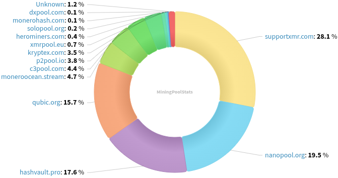
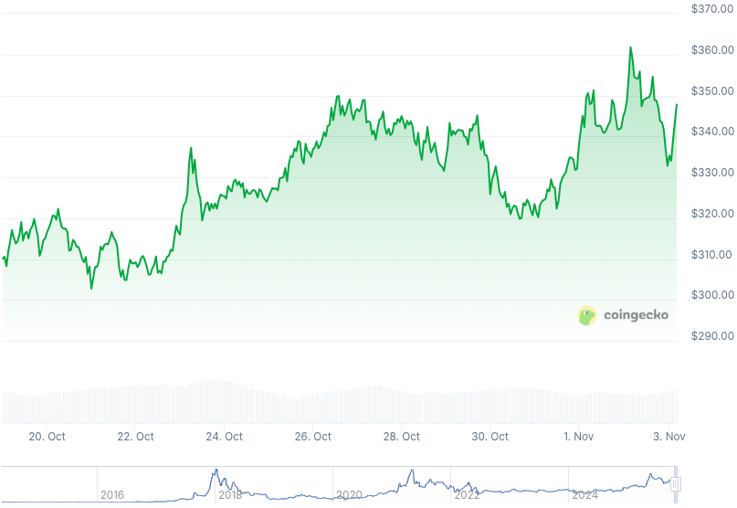

### Table of Contents:

- [Recent News](#news)
- [Upcoming Events](#events)
- [CCS Proposals](#proposals)
- [Price & Blockchain Stats](#stats)
- [Volunteer Opportunities](#volunteer)
- [Support](#support)

### Recent News {#news}

{}
Haveno Mobile (Android) [v0.4.12.0](https://github.com/atsamd21/Haveno-app/releases/tag/v0.4.12.0) with a fix for crash using remote mode; and adding localnet address to wallet `init`. Work in Progress: repository is set up for the public test network/stagenet.
{}

{}
Stack Wallet [v2.4.1](https://github.com/cypherstack/stack_wallet/releases/tag/build_292) including a fix for edge cases where the use of built-in Tor daemon would freeze the application. Flatpak added for GNU/Linux users; feedback appreciated.
{}

{}
MyMonero, biggest light, XMR wallet, will be shutting doors in January 2026, introduce... Skylight by MAGIC Grants: a light wallet, with built-in Tor daemon, no more waiting to sync up to current block height, and more. [Website](https://skylight.magicgrants.org/); [Repository](https://github.com/magicgrants/skylight-wallet). _Note_: A reddit thread with GitHub releases for mobile is expected in the following days.
{}

{}
Cake v5.5.2 and Monero.com v5.5.2 [released](https://github.com/cake-tech/cake_wallet/releases/tag/v5.5.2) with miscellaneous quality-of-life bug fixes.
{}

{}
Monfluo Wallet [v0.9.2](https://codeberg.org/acx/monfluo/releases/tag/0.9.2), fixing some quirks around the edges, implementing tap-to-copy amounts, and hold-to-enable _street mode_, A.K.A. all amounts get redacted by repeated `######` symbols.
{}

{}
Monero contributor and retired (for now, hopefully!) real-life XMR-centric events organizer, ajs-xmr, has released XMRPoS [v1.3](https://github.com/MoneroKon/XMRpos/releases/tag/v1.3-release) for Android. Yes, it is a Monero Point of Sale (POS) Android application. F-Droid [repository](https://xmrpos.twed.org/fdroid/). Matrix [room](https://matrix.to/#/#xmrpos-dev:matrix.org). X [announcement](https://xcancel.com/MoneroKon/status/1982487541086671039).
{}

{}
MoneroKon has released jeffro256's MoneroKon 5 talk: _Planned and speculative block changes in Monero_. X [announcement](https://xcancel.com/MoneroKon/status/1983576553033224588); [Audio/video](https://inv.nadeko.net/watch?v=Khr3Jo4CrcM).
{}

{}
Monero Talk brought the Stack Wallet team on: CEO Diego Salazar, Brandon A.K.A. _Surae_ Godell, and Luke to deliberate on FCMP++ vs. ZCash privacy-related features the thing everyone seems to be talking about given certain momentum... _Zcash vs. Monero_. Check it out: [Video](https://inv.nadeko.net/watch?v=qQXhT98-bYc); [Audio](https://www.monerotalk.live/monerotalk-366). 
{}

### Upcoming Events {#events}

{}
Monero Tech Meeting - [#no-wallet-left-behind](irc://irc.libera.chat/#no-wallet-left-behind) IRC channel; Matrix [room](https://matrix.to/#/#no-wallet-left-behind:monero.social).
{}

{}
Cuprate Workgroup Meeting - [#cuprate](irc://irc.libera.chat/#cuprate) IRC channel; Matrix [room](https://matrix.to/#/#cuprate:monero.social).
{}

{}
Research Lab Meeting - [#monero-research-lab](irc://irc.libera.chat/#monero-research-lab) IRC channel; Matrix [room](https://matrix.to/#/#monero-research-lab:monero.social).
{}

{}
MoneroKon 6 {TBD} Meeting - [#monerokon](irc://irc.libera.chat/#monerokon) IRC channel; Matrix [room](https://matrix.to/#/#monerokon:matrix.org).
{}

{}
Community Workgroup Meeting - [#monero-community](irc://irc.libera.chat/#monero-community) IRC channel; Matrix [room](https://matrix.to/#/#monero-community:monero.social).
{}

### CCS Proposal Ideas {#proposals}

Below you can find some CCS proposal ideas open for discussion.

{}
Part-time work on Monfluo 2025Q4
{}

{}
Getmonero.org Redesign Implementation
{}

{}
Full-time on daemon & fcmp
{}

### CCS Proposals Need Funding

{}
Full time work on Cuprate (3 months)
{}

### Price & Blockchain Stats {#stats}

###### Blockchain Stats



###### XMR Blocks Distribution in last 1000 blocks

###### Price & Performance



###### XMR Price Graph

Sources: [miningpoolstats.stream](https://miningpoolstats.stream/monero); [bitinfocharts.com](https://bitinfocharts.com/monero/); [coingecko.com](https://www.coingecko.com/en/coins/monero); [localmonero.co blocks](https://localmonero.co/blocks); [haveno.markets](https://haveno.markets/).


{}
Anyone with moderate technical ability is encouraged to try to build and run Monero nightlies. Do not trust it with your Monero, but feel free to open an Issue on GitHub as problems arise. Instructions to build on your OS of choice can be found [here](https://github.com/monero-project/monero#compiling-monero-from-source). 
{}



